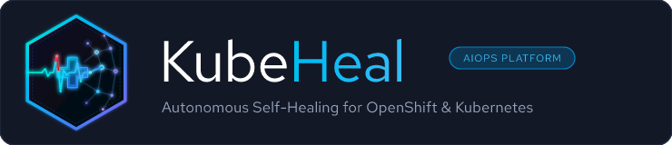

# KubeHeal Brand Identity & Asset Guide

<p align="center">
  
</p>

## Overview

**KubeHeal** is the open-source AIOps self-healing platform for Red Hat OpenShift and Kubernetes. This directory contains the official brand assets, vector source files, rendered raster outputs, and packaging specifications for use across repositories, documentation, GitHub, and OperatorHub.

---

## Visual Metaphor & Anatomy

The KubeHeal emblem represents the fusion of cloud-native infrastructure, proactive observability, autonomous remediation, and artificial intelligence:

```
                  ┌──────────────────────────────┐
                  │      Kubernetes / OCP Node   │
                  │   Hexagonal Cluster Container│
                  └──────────────┬───────────────┘
                                 │
         ┌───────────────────────┼───────────────────────┐
         ▼                       ▼                       ▼
┌──────────────────┐   ┌───────────────────┐   ┌──────────────────┐
│  Telemetry &     │   │   Self-Healing    │   │  AI / ML Brain   │
│  Vital Pulse     │──▶│   First-Aid Cross │──▶│  Neural Synapse  │
│  (ECG Heartbeat) │   │  (Deterministic)  │   │  (Predictive)    │
└──────────────────┘   └───────────────────┘   └──────────────────┘
         │                                               │
         └───────────── Red Hat Crimson Peak ────────────┘
                         (Alert Signal)
```

1. **The Hexagonal Node**: A rounded cybernetic hexagon representing a Kubernetes worker/control-plane node with a glowing perimeter track.
2. **The Vital Sign Pulse**: An ECG telemetry line entering from the left, representing real-time metric streams, event logs, and continuous cluster health monitoring.
3. **The OpenShift Crimson Peak**: A vital alert spike highlighted in OpenShift ruby red (`#EE0000`), signaling anomaly detection.
4. **The Healing Cross**: The central anchor representing deterministic runbooks, automated remediation, and cluster restoration.
5. **The Neural Network Lattice**: Expanding from the cross into a constellation of intelligent synaptic nodes and data channels, representing ML models (Isolation Forest, LSTM) and predictive analytics.

---

## Official Color Palette

| Color Name | Hex Code | RGB | Role / Semantic Meaning |
|---|---|---|---|
| **Deep Space Navy** | `#070C1B` | `rgb(7, 12, 27)` | Primary dark canvas & emblem background |
| **Self-Healing Cyan** | `#00F5D4` | `rgb(0, 245, 212)` | Telemetry baseline, recovery, vitality |
| **Neon Electric Blue** | `#00BAF2` | `rgb(0, 186, 242)` | Dynamic transition, network telemetry |
| **Cobalt Intelligence** | `#3B82F6` | `rgb(59, 130, 246)` | Core AI nodes, structural connections |
| **Neural Indigo** | `#8B5CF6` | `rgb(139, 92, 246)` | Deep ML layers, prediction graph |
| **OpenShift Crimson** | `#EE0000` | `rgb(238, 0, 0)` | Alert spike, OpenShift heritage accent |
| **Pure Slate White** | `#F8FAFC` | `rgb(248, 250, 252)` | Primary logotype ("Kube") & high contrast |
| **Muted Slate Gray** | `#94A3B8` | `rgb(148, 163, 184)` | Secondary subtitles & technical metadata |

---

## Typography

- **Primary Logotype**: **Red Hat Text** (Bold / 800 weight)
- **Technical Subtitles & Badges**: **Red Hat Text** (Medium / 500 & 600 weight)
- **Fallback Web Stack**: `-apple-system, BlinkMacSystemFont, "Segoe UI", Roboto, Helvetica, Arial, sans-serif`

---

## Directory Structure & Asset Inventory

```
assets/branding/
├── svg/
│   ├── kubeheal-icon.svg             # Master 500x500 square vector icon
│   ├── kubeheal-logo-horizontal.svg  # Dark card horizontal logo (740x160)
│   ├── kubeheal-logo-dark.svg        # Dark card horizontal logo (740x160)
│   ├── kubeheal-logo-light.svg       # Light card horizontal logo (740x160)
│   ├── kubeheal-banner.svg           # GitHub social card banner (1280x640)
│   └── favicon.svg                   # Lightweight favicon vector (64x64)
├── png/
│   ├── kubeheal-icon-500x500.png     # Master square PNG (OperatorHub & GitHub Avatar)
│   ├── kubeheal-icon-256x256.png     # Mid-scale square PNG
│   ├── kubeheal-icon-128x128.png     # Operator catalog tile PNG
│   ├── kubeheal-icon-64x64.png       # Small avatar / component PNG
│   ├── kubeheal-logo-horizontal.png  # Rendered horizontal dark banner (740px)
│   ├── kubeheal-logo-light.png       # Rendered horizontal light banner (740px)
│   ├── kubeheal-social-preview.png   # Rendered 1280x640 GitHub preview card
│   └── favicon.png                   # 32x32 browser tab icon
└── operator/
    └── kubeheal-operator-icon-base64.txt # Raw base64 data string for CSV spec.icon
```

---

## Integration Guidelines

### 1. GitHub Organization Avatar
- Use `png/kubeheal-icon-500x500.png`.
- The emblem is centered with safe padding designed for both square and circular masks.

### 2. GitHub Social Preview Card (Open Graph)
- Go to repository **Settings** -> **General** -> **Social preview**.
- Upload `png/kubeheal-social-preview.png` (1280x640 px).

### 3. README Headers
Add to the top of project `README.md`:

```html
<p align="center">
  <picture>
    <source media="(prefers-color-scheme: dark)" srcset="assets/branding/png/kubeheal-logo-horizontal.png">
    <source media="(prefers-color-scheme: light)" srcset="assets/branding/png/kubeheal-logo-light.png">
    
  </picture>
</p>
```

### 4. OperatorHub / OLM ClusterServiceVersion
In `config/manifests/bases/*.clusterserviceversion.yaml` and `bundle/manifests/*.clusterserviceversion.yaml`:

```yaml
spec:
  displayName: KubeHeal AIOps Self-Healing Platform
  icon:
  - base64data: "<PASTE_CONTENT_FROM_operator/kubeheal-operator-icon-base64.txt>"
    mediatype: image/png
```

### 5. MkDocs Documentation Portal
In `mkdocs.yml`:

```yaml
theme:
  name: material
  logo: assets/branding/png/kubeheal-icon-128x128.png
  favicon: assets/branding/png/favicon.png
```
