# C4 Level 2: Container Diagram

## Overview

This diagram zooms into the Self-Healing Platform and shows the major deployable containers (services, applications, data stores) and how they communicate. Each box represents a separately deployable unit running inside the OpenShift cluster.

**Audience**: Technical leads, architects, and senior developers who need to understand the platform's internal structure and data flow.

## Container Diagram

```mermaid
flowchart TD
    %% External Actors
    PE["👤 Platform Engineer"]
    DS["👤 Data Scientist"]
    LS["💬 OpenShift Lightspeed"]

    subgraph platform["Self-Healing Platform"]
        direction TB

        subgraph orchestration["Orchestration Layer"]
            CE["🔧 Coordination Engine
            Go binary
            Orchestrates hybrid
            deterministic + AI healing.
            REST API on port 8080."]

            MCP["🔌 MCP Server
            Go binary
            Model Context Protocol
            server for Lightspeed
            integration."]
        end

        subgraph ml["ML / AI Layer"]
            WB["📓 Jupyter Workbench
            StatefulSet
            Interactive notebooks for
            data collection, model
            training, and analysis."]

            AD["🤖 Anomaly Detector
            KServe InferenceService
            Isolation Forest model.
            CPU-based inference."]

            PA["🧠 Predictive Analytics
            KServe InferenceService
            LSTM model for
            failure prediction.
            GPU-trained."]
        end

        subgraph cicd["CI/CD Layer"]
            ARGO["🔄 ArgoCD
            (hub-gitops)
            GitOps controller.
            Syncs cluster state
            from Git repository."]

            TEK["⚙️ Tekton Pipelines
            Model training,
            health checks, and
            deployment validation.
            26 validation checks."]
        end

        subgraph data["Data and Storage Layer"]
            S3["🪣 S3 Object Storage
            AWS S3 or NooBaa
            Model artifacts,
            training data, and
            inference results."]

            PVC["💾 Persistent Volumes
            gp3-csi / CephFS
            Workbench data and
            model working storage."]

            ESO["🔐 External Secrets
            Operator
            Syncs credentials from
            external secret stores."]
        end
    end

    %% External Systems
    PROM["📊 Prometheus
    Cluster metrics
    and alerts"]

    GH["🐙 GitHub
    Git repository
    (source of truth)"]

    K8S["🔴 OpenShift
    Kubernetes API"]

    %% Actor connections
    PE -->|"Deploys, monitors"| ARGO
    DS -->|"Trains models"| WB
    LS <-->|"MCP protocol"| MCP

    %% Internal connections
    CE -->|"HTTP inference
    requests"| AD
    CE -->|"HTTP inference
    requests"| PA
    CE -->|"Kubernetes API
    remediation actions"| K8S
    CE -->|"Reads cluster
    metrics"| PROM

    MCP -->|"REST API
    /api/v1/*"| CE
    MCP -->|"HTTP inference"| AD
    MCP -->|"HTTP inference"| PA
    MCP -->|"Reads metrics"| PROM

    WB -->|"Saves trained
    models"| S3
    WB -->|"Reads/writes
    notebook data"| PVC
    WB -->|"Queries
    metrics"| PROM

    TEK -->|"Executes training
    notebooks"| WB
    TEK -->|"Uploads model
    artifacts"| S3
    TEK -->|"Restarts predictor
    pods"| AD
    TEK -->|"Restarts predictor
    pods"| PA

    AD -->|"Loads model
    from S3"| S3
    PA -->|"Loads model
    from S3"| S3

    ARGO -->|"Syncs manifests"| GH
    ARGO -->|"Applies resources"| K8S

    ESO -->|"Populates secrets
    for S3, Git"| S3

    %% Styling
    classDef actor fill:#08427B,color:#fff,stroke:#08427B
    classDef container fill:#1168BD,color:#fff,stroke:#1168BD
    classDef mlcontainer fill:#2E7D32,color:#fff,stroke:#2E7D32
    classDef infracontainer fill:#E65100,color:#fff,stroke:#E65100
    classDef datacontainer fill:#6A1B9A,color:#fff,stroke:#6A1B9A
    classDef external fill:#999999,color:#fff,stroke:#999999

    class PE,DS actor
    class CE,MCP container
    class WB,AD,PA mlcontainer
    class ARGO,TEK infracontainer
    class S3,PVC,ESO datacontainer
    class PROM,GH,K8S,LS external
```

## Container Inventory

### Orchestration Layer

| Container | Technology | Port | Purpose |
|-----------|-----------|------|---------|
| **Coordination Engine** | Go binary (`quay.io/takinosh/openshift-coordination-engine`) | 8080 (API), 9090 (metrics) | Central orchestrator for the hybrid self-healing approach. Routes known issues to deterministic rules and novel anomalies to AI models. |
| **MCP Server** | Go binary (`quay.io/takinosh/openshift-cluster-health-mcp`) | 8080 | Model Context Protocol server that bridges OpenShift Lightspeed with the platform's capabilities. |

### ML / AI Layer

| Container | Technology | Port | Purpose |
|-----------|-----------|------|---------|
| **Jupyter Workbench** | StatefulSet (RHOAI notebook image) | 8888 | Interactive development environment for data collection, model training, and experimentation. 30+ notebooks across 8 categories. |
| **Anomaly Detector** | KServe InferenceService (sklearn) | 8080 | Isolation Forest model for real-time anomaly detection. CPU-based. Trained weekly via Tekton CronJob. |
| **Predictive Analytics** | KServe InferenceService (sklearn/LSTM) | 8080 | Predictive failure model using historical patterns. GPU-trained, CPU-served. Trained weekly via Tekton CronJob. |

### CI/CD Layer

| Container | Technology | Port | Purpose |
|-----------|-----------|------|---------|
| **ArgoCD (hub-gitops)** | OpenShift GitOps 1.15.4 | 443 | GitOps controller managing all platform resources. Syncs from GitHub, applies manifests using sync waves. |
| **Tekton Pipelines** | OpenShift Pipelines 1.17.2 | N/A | Two model training pipelines (CPU and GPU), deployment validation pipeline with 26 checks, CronJob-triggered weekly training. |

### Data and Storage Layer

| Container | Technology | Purpose |
|-----------|-----------|---------|
| **S3 Object Storage** | AWS S3 (ROSA) or NooBaa (ODF) | Stores trained model artifacts, training data, and inference results. Three buckets: `model-storage`, `training-data`, `inference-results`. |
| **Persistent Volumes** | gp3-csi (EBS) / CephFS (ODF) | Workbench data (20Gi RWO), model working storage (10Gi RWX on HA, RWO on SNO), GPU model storage (10Gi RWO). |
| **External Secrets Operator** | ESO + SecretStore | Syncs S3 credentials, Git credentials, and other secrets from external stores into Kubernetes Secrets. |

## Data Flow Summary

| Flow | Path | Protocol |
|------|------|----------|
| **Alert ingestion** | Prometheus -> Coordination Engine | HTTP (Prometheus API) |
| **Anomaly inference** | Coordination Engine -> KServe models | HTTP (KServe v1 predict API) |
| **Remediation execution** | Coordination Engine -> OpenShift API | HTTPS (Kubernetes API) |
| **Model training** | Tekton -> Jupyter Workbench -> S3 | Notebook execution, S3 API |
| **Model serving** | S3 -> KServe InferenceService | S3 API (model loading) |
| **GitOps sync** | GitHub -> ArgoCD -> OpenShift API | HTTPS (Git pull), HTTPS (K8s apply) |
| **Natural language** | Lightspeed -> MCP Server -> Coordination Engine | MCP protocol, HTTP REST |

## Notes

- The Coordination Engine is the central hub: it receives alerts from Prometheus, queries ML models for analysis, and executes remediation through the Kubernetes API.
- KServe InferenceServices run as RawDeployment mode (not serverless) with stable ClusterIP services for reliable internal routing.
- Tekton Pipelines handle model training independently from ArgoCD sync, preventing deployment blocking during long-running training jobs (ADR-053).
- The External Secrets Operator is mandatory for all deployments (ADR-026). It populates S3 credentials and other sensitive configuration.
