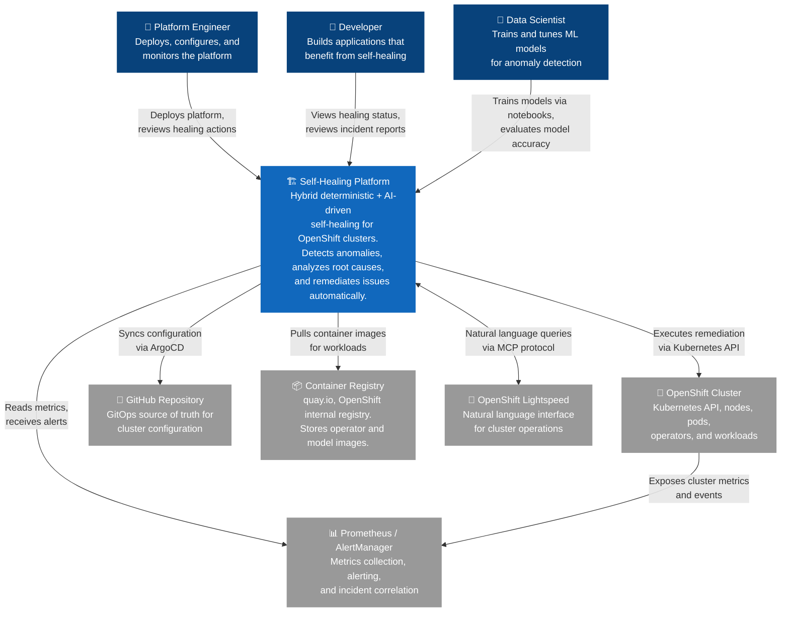

# C4 Level 1: System Context Diagram

## Overview

This diagram shows the OpenShift AI Ops Self-Healing Platform as a single system and identifies the external actors and systems that interact with it. It answers the question: "What does this platform do, and who or what does it talk to?"

**Audience**: Stakeholders, architects, operations leadership, and anyone needing a high-level understanding of the system boundary.

## System Context

## Legend

| Shape | Color | Meaning |
|-------|-------|---------|
| Dark blue | `#08427B` | Human actors (users of the platform) |
| Medium blue | `#1168BD` | The Self-Healing Platform (system under design) |
| Grey | `#999999` | External systems (not owned by this platform) |

## Actors

| Actor | Role | Primary Interactions |
|-------|------|---------------------|
| **Platform Engineer** | Deploys and configures the platform, reviews automated healing actions, manages cluster infrastructure | Deployment, configuration, monitoring dashboards |
| **Developer** | Builds applications running on the cluster, views self-healing status and incident reports | Incident reports, healing history, application health |
| **Data Scientist** | Trains and tunes ML models (Isolation Forest, LSTM) using Jupyter notebooks, evaluates model accuracy | Jupyter Workbench, model training pipelines, KServe |

## External Systems

| System | Technology | Integration |
|--------|-----------|-------------|
| **OpenShift Cluster** | Kubernetes API, OpenShift operators | Remediation actions, workload management |
| **Prometheus / AlertManager** | OpenShift Monitoring stack | Metrics ingestion, alert-driven triggers |
| **GitHub Repository** | Git, ArgoCD sync | GitOps source of truth for all configuration |
| **Container Registry** | quay.io, OpenShift internal registry | Operator images, model serving images, workbench images |
| **OpenShift Lightspeed** | MCP protocol (Model Context Protocol) | Natural language cluster operations interface |

## Notes

- The Self-Healing Platform runs entirely within an OpenShift cluster but is shown as a separate box to clarify the boundary between "the platform" and "the cluster it heals."
- Prometheus and AlertManager are part of the OpenShift Monitoring stack but are called out separately because they serve as the primary data source for all ML models.
- The MCP integration with OpenShift Lightspeed is bidirectional: Lightspeed can query the platform for status, and the platform can surface recommendations through Lightspeed.
