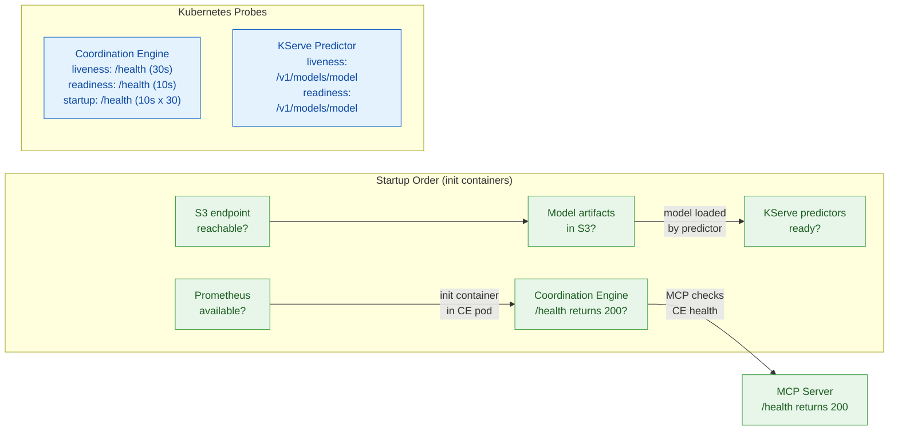
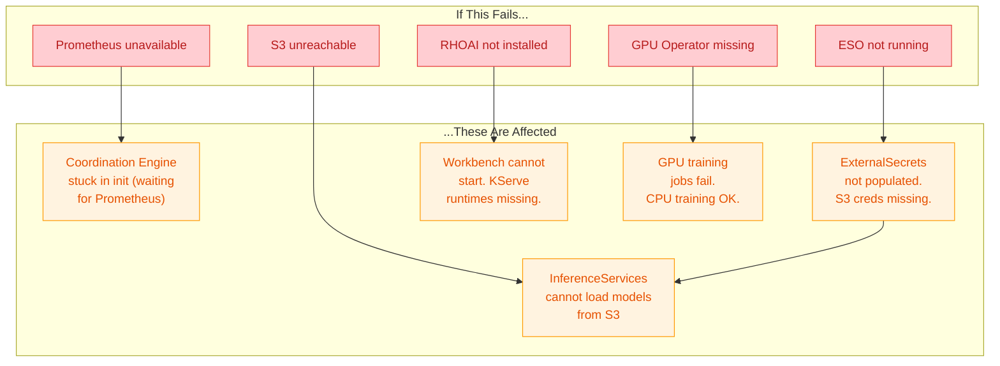

# Component and Operator Dependency Graph

## Overview

This diagram shows the dependency relationships between all operators, components, and infrastructure services in the Self-Healing Platform. It identifies the installation order (sync waves), health check dependencies, and which components must be healthy before others can start.

**Audience**: Platform engineers, operations teams, and architects who need to understand deployment ordering and troubleshoot dependency failures.

## Operator Dependency Graph

```mermaid
flowchart TD
    subgraph tier0["Tier 0: OpenShift Platform (Pre-installed)"]
        OCP["OpenShift 4.19-4.22
        Kubernetes API, etcd,
        controllers, scheduler"]

        OLM["Operator Lifecycle
        Manager (OLM)
        Manages operator installs"]

        MON["OpenShift Monitoring
        Prometheus, AlertManager,
        Grafana"]
    end

    subgraph tier1["Tier 1: Foundation Operators (Wave -1)"]
        GITOPS["OpenShift GitOps 1.15.4
        ArgoCD controller
        (hub-gitops instance)"]

        PIPE["OpenShift Pipelines 1.17.2
        Tekton controller,
        webhook, dashboard"]

        ESO["External Secrets
        Operator
        SecretStore, ExternalSecret"]

        RHOAI["Red Hat OpenShift AI 2.22.2
        Dashboard, KServe,
        notebook controller"]

        GPU["NVIDIA GPU
        Operator 24.9.2
        Device plugin, drivers"]
    end

    subgraph tier2["Tier 2: Platform Operators (Wave -1)"]
        JNV["Jupyter Notebook
        Validator Operator 1.0.6
        NotebookValidationJob CRD"]

        VP["Validated Patterns
        Operator
        Pattern CRD"]
    end

    subgraph tier3["Tier 3: Storage (Wave 0-1)"]
        ODF["OpenShift Data Foundation
        (optional, SNO: MCG-only)
        NooBaa, CephFS"]

        S3_SVC["S3 Object Storage
        AWS S3 (ROSA) or
        NooBaa (ODF)"]

        PVCS["PersistentVolumeClaims
        workbench-data (20Gi)
        model-storage (10Gi)
        model-storage-gpu (10Gi)"]
    end

    subgraph tier4["Tier 4: Secrets and Config (Wave 0-1)"]
        SS["SecretStore
        (kubernetes-secret-store)"]

        ES["ExternalSecrets
        model-storage-config
        git-credentials"]

        CM["ConfigMaps
        Platform configuration"]
    end

    subgraph tier5["Tier 5: Core Workloads (Wave 2)"]
        CE["Coordination Engine
        Go binary, port 8080"]

        MCP_SRV["MCP Server
        Go binary, port 8080"]

        WB_SRV["Jupyter Workbench
        StatefulSet"]

        KSERVE_RT["KServe ServingRuntimes
        sklearn, tensorflow"]

        AD_SRV["anomaly-detector
        InferenceService"]

        PA_SRV["predictive-analytics
        InferenceService"]
    end

    subgraph tier6["Tier 6: CI/CD (Wave 3)"]
        TEK_PIPE["Tekton Pipelines
        model-training (CPU)
        model-training (GPU)
        deployment-validation"]

        TEK_TASK["Tekton Tasks (6)
        run-notebook, health-check,
        restart-isvc, test-endpoint,
        copy-gpu-model, run-notebook-gpu"]

        TEK_CRON["CronJobs
        weekly-anomaly-detector
        weekly-predictive-analytics"]
    end

    subgraph tier7["Tier 7: Monitoring (Wave 4)"]
        PROM_RULE["PrometheusRules
        Alert definitions"]

        SVC_MON["ServiceMonitors
        coordination-engine,
        mcp-server"]

        GRAF_DASH["Grafana Dashboards"]

        NVJ_JOBS["NotebookValidation
        Jobs"]
    end

    %% Tier 0 dependencies
    OCP --> OLM
    OCP --> MON

    %% Tier 1 dependencies
    OLM --> GITOPS
    OLM --> PIPE
    OLM --> ESO
    OLM --> RHOAI
    OLM --> GPU

    %% Tier 2 dependencies
    OLM --> JNV
    OLM --> VP

    %% Tier 3 dependencies
    OCP --> ODF
    ODF --> S3_SVC
    OCP --> PVCS

    %% Tier 4 dependencies
    ESO --> SS
    SS --> ES
    OCP --> CM

    %% Tier 5 dependencies
    ES --> CE
    MON --> CE
    RHOAI --> WB_SRV
    RHOAI --> KSERVE_RT
    KSERVE_RT --> AD_SRV
    KSERVE_RT --> PA_SRV
    S3_SVC --> AD_SRV
    S3_SVC --> PA_SRV
    PVCS --> WB_SRV
    ES --> MCP_SRV

    %% Tier 6 dependencies
    PIPE --> TEK_PIPE
    TEK_PIPE --> TEK_TASK
    TEK_PIPE --> TEK_CRON
    JNV --> TEK_TASK

    %% Tier 7 dependencies
    MON --> PROM_RULE
    MON --> SVC_MON
    MON --> GRAF_DASH
    JNV --> NVJ_JOBS

    %% Cross-tier runtime dependencies
    CE -.->|"inference"| AD_SRV
    CE -.->|"inference"| PA_SRV
    MCP_SRV -.->|"REST API"| CE
    TEK_CRON -.->|"triggers"| TEK_PIPE
    TEK_TASK -.->|"uses"| WB_SRV

    classDef t0 fill:#E0E0E0,color:#212121,stroke:#9E9E9E
    classDef t1 fill:#E65100,color:#fff,stroke:#BF360C
    classDef t2 fill:#F57C00,color:#fff,stroke:#E65100
    classDef t3 fill:#1565C0,color:#fff,stroke:#0D47A1
    classDef t4 fill:#6A1B9A,color:#fff,stroke:#4A148C
    classDef t5 fill:#2E7D32,color:#fff,stroke:#1B5E20
    classDef t6 fill:#00838F,color:#fff,stroke:#006064
    classDef t7 fill:#880E4F,color:#fff,stroke:#AD1457

    class OCP,OLM,MON t0
    class GITOPS,PIPE,ESO,RHOAI,GPU t1
    class JNV,VP t2
    class ODF,S3_SVC,PVCS t3
    class SS,ES,CM t4
    class CE,MCP_SRV,WB_SRV,KSERVE_RT,AD_SRV,PA_SRV t5
    class TEK_PIPE,TEK_TASK,TEK_CRON t6
    class PROM_RULE,SVC_MON,GRAF_DASH,NVJ_JOBS t7
```

## Health Check Dependency Chain

Components use init containers and startup probes to wait for their dependencies before starting.

## Installation Order Summary

| Sync Wave | Resources | Depends On | Wait Condition |
|-----------|-----------|------------|----------------|
| **Wave -1** | GPU Operator, ESO, Notebook Validator | OLM | CSV phase = Succeeded |
| **Wave 0** | Namespace, ServiceAccount, RBAC, ConfigMaps, SecretStore | Operators installed | Resources exist |
| **Wave 1** | PVCs, ObjectBucketClaim, ExternalSecrets, S3 Bucket Setup | Namespace, SecretStore | PVC bound, Secrets populated |
| **Wave 2** | Coordination Engine, MCP Server, Workbench, InferenceServices, ServingRuntimes, BuildConfigs | PVCs, Secrets, RHOAI, KServe | Deployments available, pods ready |
| **Wave 3** | Tekton Pipelines, Tasks, CronJobs, Pipeline RBAC | Pipelines operator, Wave 2 workloads | Pipeline resources created |
| **Wave 4** | NotebookValidationJobs, PrometheusRules, ServiceMonitors, Dashboards, Validation Pipeline | All previous waves | Monitoring active |

## Failure Impact Analysis

## Notes

- **Dashed lines** in the main dependency graph represent runtime dependencies (HTTP calls between services), while **solid lines** represent deployment dependencies (must exist before the next resource can be created).
- **The Coordination Engine** has the most dependencies: it requires Prometheus (init container), KServe models (for inference), and secrets (for configuration). If any of these are unavailable, the engine degrades gracefully.
- **ODF is optional on ROSA** (ADR-062). When using native AWS S3, the ODF operator and NooBaa components are not deployed. The S3 Bucket Setup job creates the bucket directly via the AWS API.
- **GPU Operator failure** is non-blocking for CPU-based workloads. The anomaly-detector model trains and serves on CPU only. Only the predictive-analytics model requires GPU for training.
- **ExternalSecrets Operator** is mandatory (ADR-026). If it fails, S3 credentials are not populated, and all model-related workloads will be unable to access the object store.
