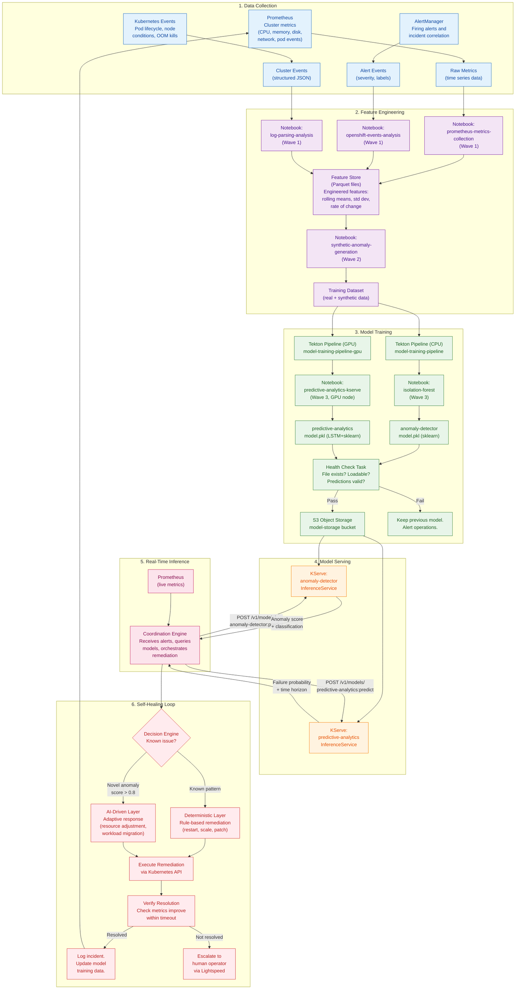
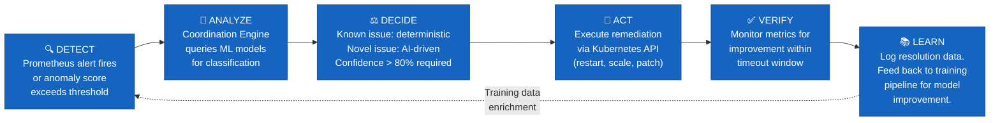
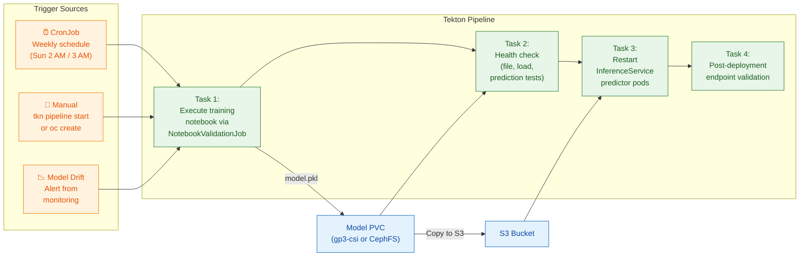
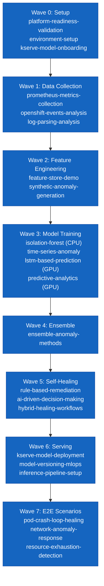

# Data Flow and ML Pipeline Diagram

## Overview

This diagram traces the flow of data through the Self-Healing Platform, from raw metrics collection through model training and inference, to automated remediation. It covers four primary flows: metrics collection, model training, real-time inference, and the self-healing feedback loop.

**Audience**: Data scientists, ML engineers, and platform developers who need to understand how data moves through the system.

## End-to-End Data Flow

## Self-Healing Decision Loop (Detailed)

## Training Pipeline Data Flow

## Notebook Wave Dependencies

Training notebooks execute in a strict order defined by ArgoCD sync waves. Each wave depends on the outputs of the previous wave.

## Notes

- **Prometheus is the primary data source** for all ML models. Metrics are scraped every 30 seconds and retained for 30 days.
- **Synthetic data augmentation** (Wave 2) supplements real cluster metrics during initial deployment when historical data is limited.
- **Health checks are mandatory** before deploying a new model. If validation fails, the previous model remains active and operations staff receive an alert.
- **The self-healing loop is closed**: resolution data feeds back into the training pipeline, enabling the models to improve their accuracy over time.
- **GPU training uses a separate PVC** (`model-storage-gpu-pvc` on gp3-csi) because GPU nodes may lack CephFS drivers. A copy task moves artifacts to the shared storage after training completes.
- **Feature engineering** can produce up to 3,264 features (24 hours x 136 metrics) for the predictive-analytics model when `featureEngineering.enabled: true`.
