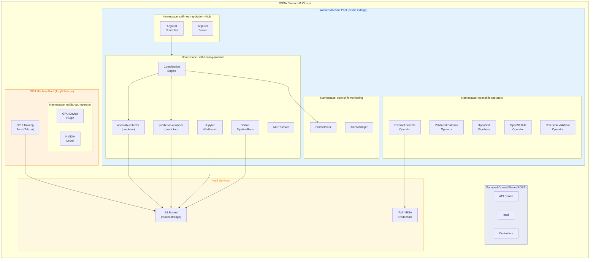
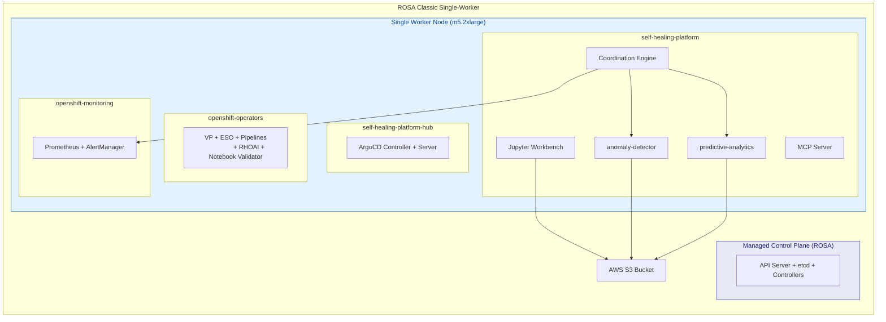
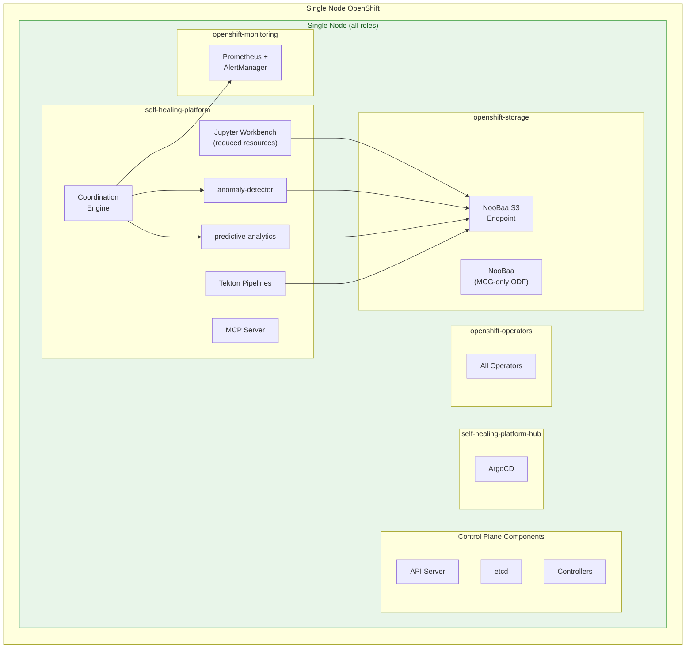
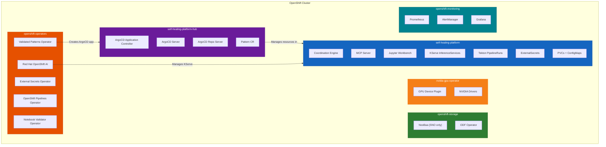

# Deployment Topology Diagrams

## Overview

These diagrams show how the Self-Healing Platform is deployed across different OpenShift cluster topologies. Each topology has different node configurations, storage backends, and resource constraints.

**Audience**: Platform engineers, operations teams, and architects planning cluster provisioning and capacity.

## Topology 1: ROSA HA (Primary Target)

ROSA Classic with 3 or more worker nodes and an optional GPU machine pool. This is the recommended production deployment (ADR-062).

### ROSA HA Key Characteristics

| Property | Value |
|----------|-------|
| **Worker Nodes** | 3+ (m5.2xlarge or larger) |
| **GPU Nodes** | 1+ g5.2xlarge (optional machine pool) |
| **Storage Backend** | AWS S3 (native, `objectStore.backend: aws-s3`) |
| **PVC Storage Class** | gp3-csi (EBS) |
| **Node Scaling** | `rosa create machinepool` (Machine Pools, not MachineSets) |
| **Namespaces** | self-healing-platform, self-healing-platform-hub, openshift-operators, openshift-monitoring, nvidia-gpu-operator |
| **ODF Required** | No (uses native AWS S3) |

---

## Topology 2: ROSA Single-Worker

ROSA Classic with a single worker node, suitable for development, testing, and demos.

### ROSA Single-Worker Key Characteristics

| Property | Value |
|----------|-------|
| **Worker Nodes** | 1 (m5.2xlarge or larger) |
| **GPU** | Limited (single node) |
| **Storage Backend** | AWS S3 (native) |
| **PVC Storage Class** | gp3-csi (EBS) |
| **Use Case** | Development, testing, demos |
| **ODF Required** | No |

---

## Topology 3: SNO (Single Node OpenShift)

All roles (control-plane, worker, infrastructure) run on a single physical or virtual machine. Uses MCG-only ODF for S3 object storage when not on AWS.

### SNO Key Characteristics

| Property | Value |
|----------|-------|
| **Nodes** | 1 (all roles: control-plane, worker) |
| **CPU** | 8+ cores (16+ recommended) |
| **RAM** | 32+ GB (64+ recommended) |
| **Storage Backend** | NooBaa S3 via MCG-only ODF (`objectStore.backend: noobaa`) |
| **PVC Storage Class** | gp3-csi (no CephFS available) |
| **ODF Mode** | MCG-only (NooBaa without Ceph daemons) |
| **Use Case** | Edge, development, testing |
| **Configuration** | `cluster.topology: sno` in `values-hub.yaml` |

---

## Namespace Layout (All Topologies)

## Topology Comparison

| Feature | ROSA HA | ROSA Single-Worker | SNO |
|---------|---------|-------------------|-----|
| **Nodes** | 3+ workers (managed) | 1 worker (managed) | 1 (all roles) |
| **Control Plane** | ROSA-managed | ROSA-managed | Co-located |
| **Storage Backend** | AWS S3 | AWS S3 | NooBaa (MCG) |
| **PVC Class** | gp3-csi | gp3-csi | gp3-csi |
| **GPU Support** | Dedicated machine pool | Limited | Single node |
| **Node Scaling** | Machine Pools | Machine Pools | N/A |
| **ODF Required** | No | No | MCG-only |
| **Production Ready** | Yes | Dev/test | Edge/dev |

## Notes

- **ROSA is the primary deployment target** (ADR-062). IPI, baremetal, and other platforms are community-supported.
- On ROSA clusters, the platform auto-detects the managed environment and skips MachineSet operations. Use `rosa create machinepool` for GPU nodes.
- SNO deployments require explicit `cluster.topology: sno` in `values-hub.yaml` and use gp3-csi for all PVCs (no CephFS available).
- The `self-healing-platform-hub` namespace contains a namespaced ArgoCD instance with cluster-admin permissions (ADR-030). This is separate from the default `openshift-gitops` namespace.
