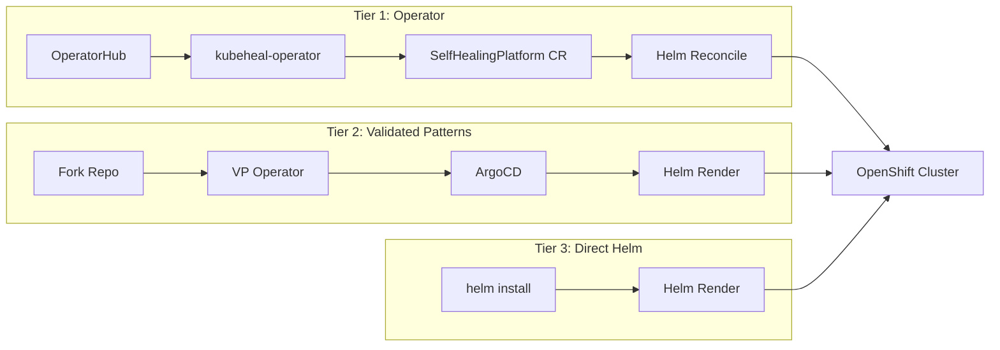
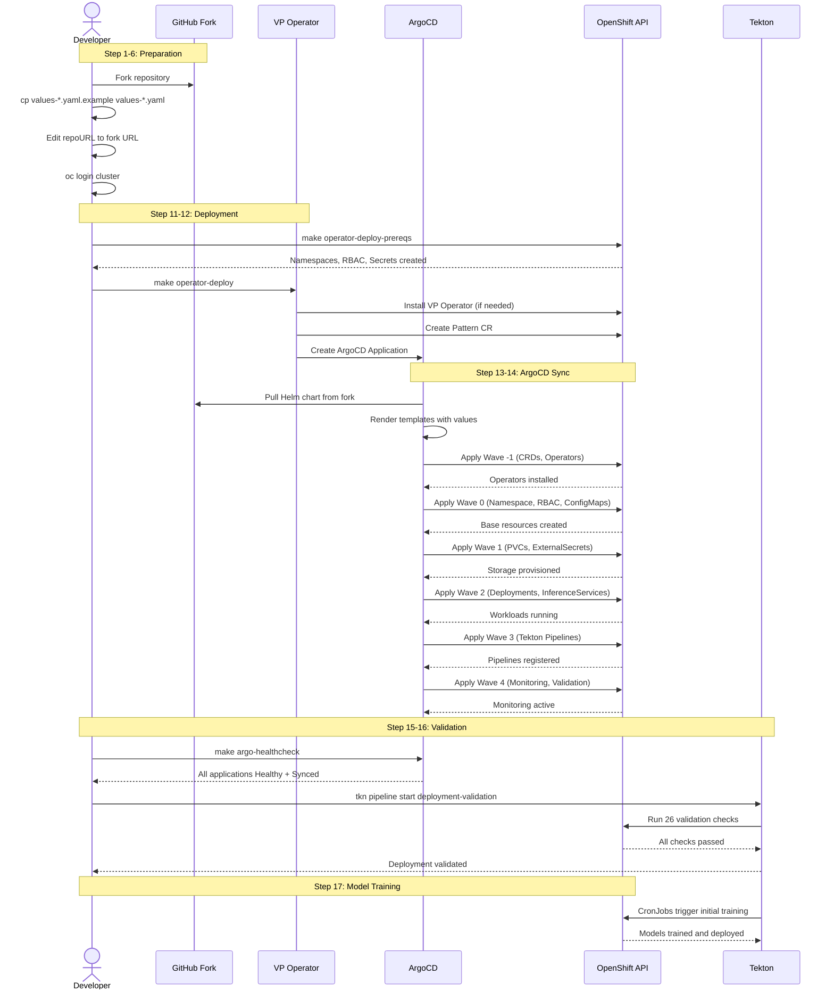
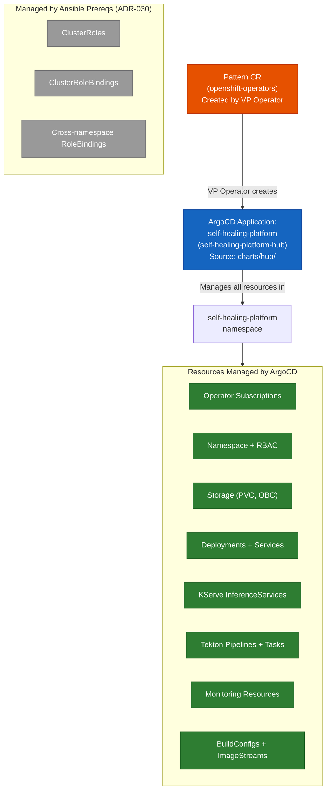

# GitOps and Deployment Workflow Diagram

## Overview

This diagram shows how code changes flow from a developer's commit through the GitOps pipeline to a running cluster. It covers the Validated Patterns Operator, ArgoCD sync waves, and the Tekton validation pipeline.

**Audience**: Platform engineers, developers, and DevOps teams who deploy or maintain the platform.

## Three-Tier Distribution Overview

The platform supports three installation methods. All three converge on the same Helm chart.

The diagram below covers the Tier 2 (Validated Patterns) flow in detail.

## GitOps Deployment Flow

```mermaid
flowchart TD
    subgraph dev["Developer Workflow"]
        D1["👤 Developer
        forks repository"]

        D2["📝 Edit values files
        values-global.yaml
        values-hub.yaml"]

        D3["🔒 pre-commit hooks
        detect-secrets
        trailing-whitespace
        large file check"]

        D4["📤 git push
        to GitHub fork"]
    end

    subgraph operator["Validated Patterns Operator"]
        VP1["VP Operator installed
        in openshift-operators"]

        VP2["Pattern CR created
        pointing to Git fork"]

        VP3["Operator creates
        ArgoCD Application
        in hub namespace"]
    end

    subgraph argocd["ArgoCD (hub-gitops)"]
        AG1["ArgoCD detects
        Git changes"]

        AG2["Helm template
        rendering
        (charts/hub/)"]

        AG3["Resource sync
        with sync waves"]
    end

    subgraph waves["Sync Wave Execution Order"]
        SW_NEG["Wave -1
        CRDs, Operators
        (GPU, Pipelines,
        ESO, RHOAI)"]

        SW0["Wave 0
        Namespace, RBAC,
        ServiceAccounts,
        ConfigMaps, Secrets"]

        SW1["Wave 1
        PVCs, Storage,
        ObjectBucketClaim,
        ExternalSecrets"]

        SW2["Wave 2
        Deployments:
        Coordination Engine,
        MCP Server,
        InferenceServices"]

        SW3["Wave 3
        Tekton Pipelines,
        Tasks, CronJobs"]

        SW4["Wave 4
        NotebookValidation
        Jobs, Monitoring,
        Dashboards"]
    end

    subgraph validation["Post-Deployment Validation"]
        V1["Tekton Pipeline:
        deployment-validation
        (26 checks)"]

        V2["Prerequisites ✓
        Operators ✓
        Storage ✓
        Models ✓
        Engine ✓
        Monitoring ✓"]
    end

    D1 --> D2 --> D3 --> D4

    D4 -->|"make operator-deploy"| VP1
    VP1 --> VP2 --> VP3

    VP3 --> AG1 --> AG2 --> AG3

    AG3 --> SW_NEG --> SW0 --> SW1 --> SW2 --> SW3 --> SW4

    SW4 --> V1 --> V2

    classDef devstep fill:#E3F2FD,color:#0D47A1,stroke:#1565C0
    classDef opstep fill:#FFF3E0,color:#E65100,stroke:#F57C00
    classDef argostep fill:#E8F5E9,color:#1B5E20,stroke:#2E7D32
    classDef wavestep fill:#F3E5F5,color:#4A148C,stroke:#7B1FA2
    classDef valstep fill:#FCE4EC,color:#880E4F,stroke:#C2185B

    class D1,D2,D3,D4 devstep
    class VP1,VP2,VP3 opstep
    class AG1,AG2,AG3 argostep
    class SW_NEG,SW0,SW1,SW2,SW3,SW4 wavestep
    class V1,V2 valstep
```

## Deployment Sequence (Detailed)

## Sync Wave Details

```mermaid
flowchart LR
    subgraph neg1["Wave -1: Operators"]
        O1["NVIDIA GPU Operator"]
        O2["External Secrets Operator"]
        O3["Notebook Validator Operator"]
    end

    subgraph w0["Wave 0: Foundation"]
        F1["Namespace"]
        F2["ServiceAccount"]
        F3["RBAC (Roles,
        RoleBindings)"]
        F4["ConfigMaps"]
        F5["SecretStore"]
    end

    subgraph w1["Wave 1: Storage"]
        S1["PVCs (workbench-data,
        model-storage,
        model-storage-gpu)"]
        S2["ObjectBucketClaim"]
        S3["ExternalSecrets
        (model-storage-config)"]
        S4["S3 Bucket Setup
        Job"]
    end

    subgraph w2["Wave 2: Workloads"]
        W1["Coordination Engine
        Deployment + Service"]
        W2["MCP Server
        Deployment + Service"]
        W3["Jupyter Workbench
        StatefulSet"]
        W4["KServe InferenceServices
        + Stable Services"]
        W5["KServe ServingRuntimes"]
        W6["sklearn-xgboost
        BuildConfig"]
    end

    subgraph w3["Wave 3: Pipelines"]
        P1["Tekton Training Pipelines
        (CPU + GPU)"]
        P2["Tekton Tasks (6 tasks)"]
        P3["Training CronJobs
        (weekly schedule)"]
        P4["Pipeline RBAC"]
    end

    subgraph w4["Wave 4: Monitoring"]
        M1["NotebookValidation
        Jobs"]
        M2["PrometheusRules"]
        M3["ServiceMonitors"]
        M4["Grafana Dashboards"]
        M5["Deployment Validation
        Pipeline"]
    end

    neg1 --> w0 --> w1 --> w2 --> w3 --> w4

    classDef op fill:#E65100,color:#fff,stroke:#BF360C
    classDef found fill:#1565C0,color:#fff,stroke:#0D47A1
    classDef stor fill:#2E7D32,color:#fff,stroke:#1B5E20
    classDef work fill:#6A1B9A,color:#fff,stroke:#4A148C
    classDef pipe fill:#00838F,color:#fff,stroke:#006064
    classDef mon fill:#880E4F,color:#fff,stroke:#AD1457

    class O1,O2,O3 op
    class F1,F2,F3,F4,F5 found
    class S1,S2,S3,S4 stor
    class W1,W2,W3,W4,W5,W6 work
    class P1,P2,P3,P4 pipe
    class M1,M2,M3,M4,M5 mon
```

## ArgoCD Application Hierarchy

## Notes

- **Hybrid Management Model (ADR-030)**: ArgoCD runs in namespaced mode within `self-healing-platform-hub`. It manages resources in `self-healing-platform` but cannot create cluster-scoped resources (ClusterRoles, ClusterRoleBindings). Those are deployed by Ansible prereqs.
- **Pre-commit hooks** run automatically on `git commit` and `git push` to scan for secrets, trailing whitespace, and large files.
- **Sync waves** ensure resources deploy in dependency order. Operators must be installed before workloads can reference their CRDs.
- **Model training is decoupled from ArgoCD** (ADR-053). ArgoCD deploys the Tekton pipelines, but training runs independently via CronJobs or manual triggers.
- **The VP Operator** watches the Pattern CR and creates the ArgoCD Application. If the Git source changes, ArgoCD detects the diff and re-syncs.
