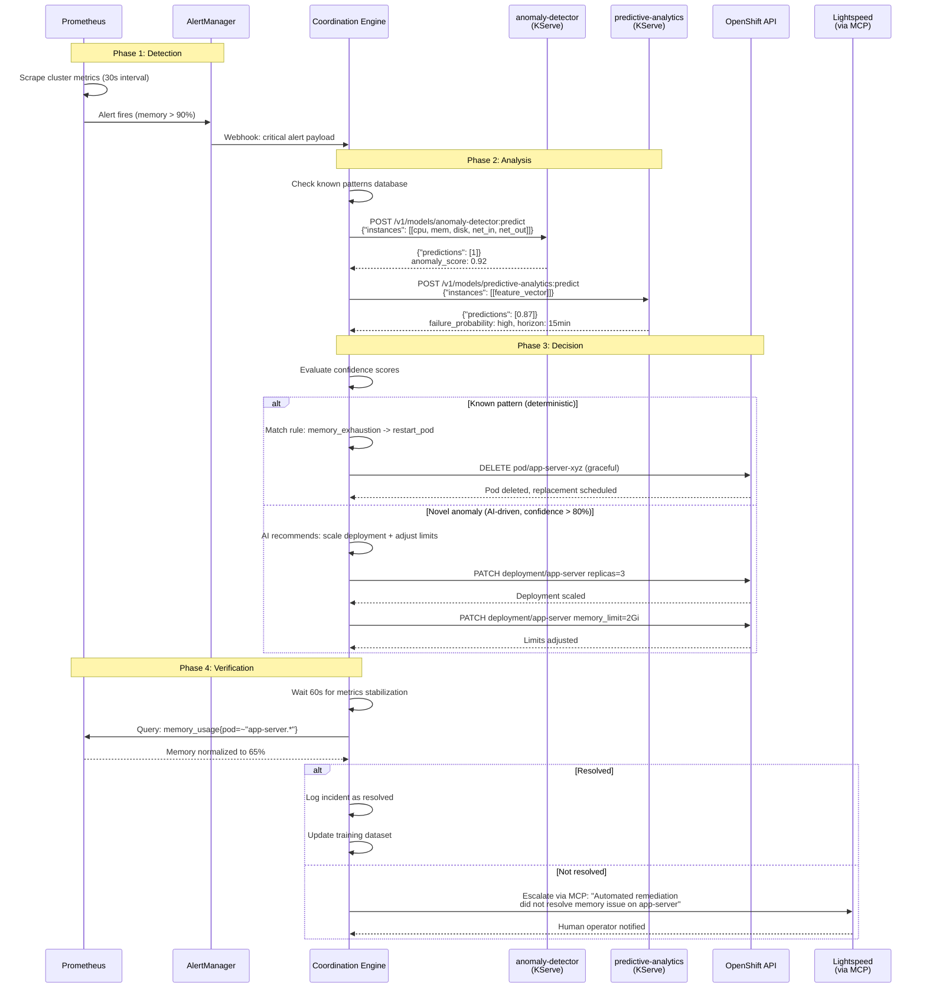
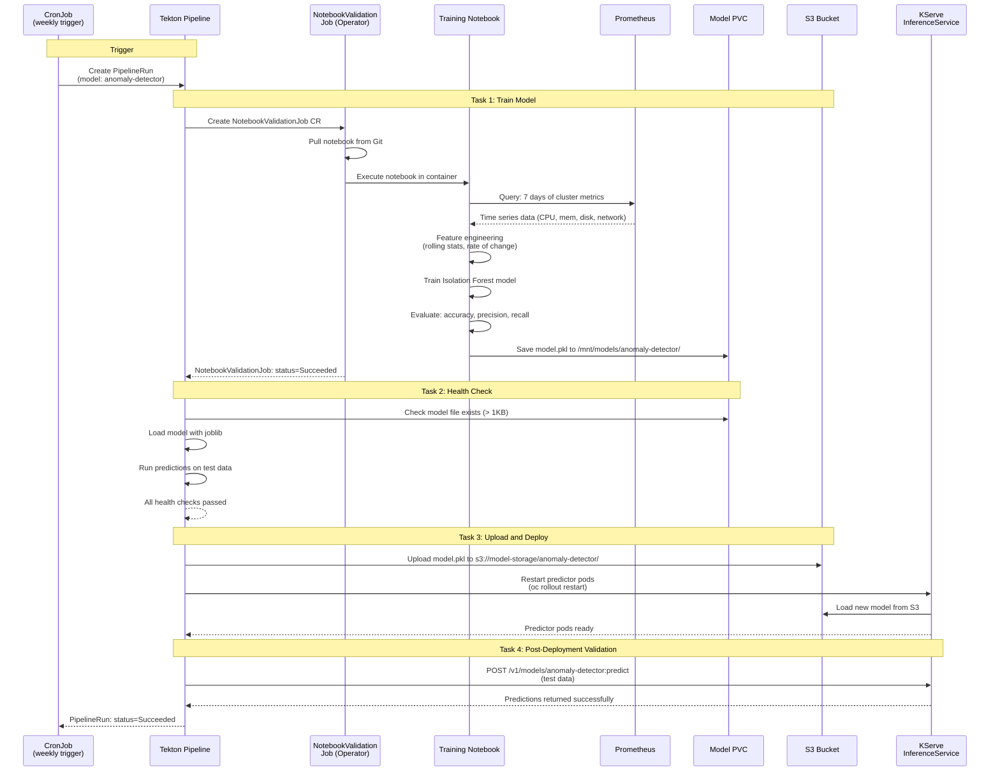
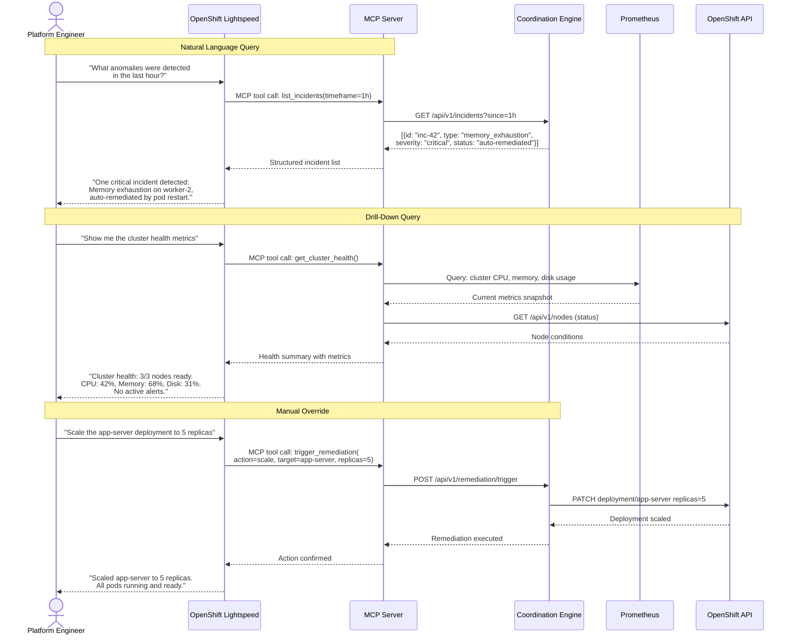
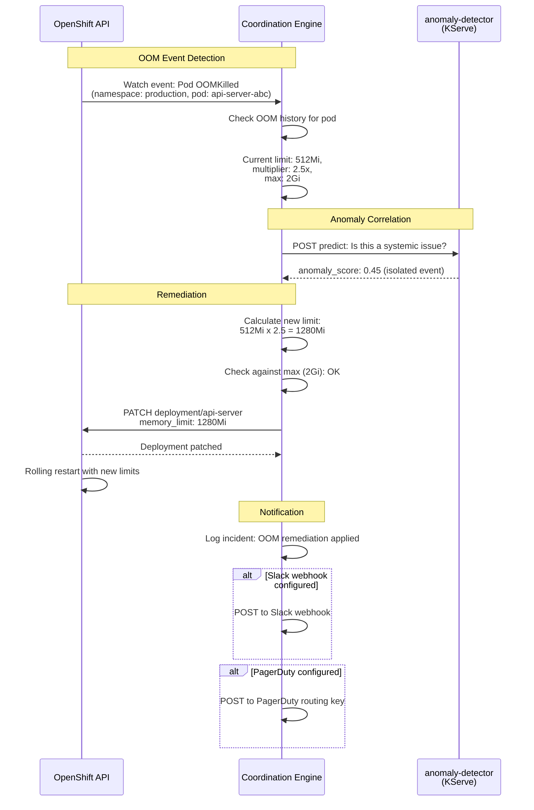

# Self-Healing Sequence Diagrams

## Overview

These sequence diagrams show the time-ordered interactions between components during the platform's core workflows: anomaly detection and remediation, model training, and incident response.

**Audience**: Developers, SREs, and ML engineers who need to understand the runtime behavior of the self-healing system.

## Sequence 1: Anomaly Detection and Remediation

This sequence shows what happens when the platform detects an anomaly and automatically remediates it.

## Sequence 2: Model Training Pipeline

This sequence shows the end-to-end model training flow triggered by a Tekton CronJob.

## Sequence 3: Incident Response with Lightspeed

This sequence shows how a human operator interacts with the platform through OpenShift Lightspeed using the MCP protocol.

## Sequence 4: OOM Kill Detection and Auto-Remediation

This sequence shows the coordination engine's OOM remediation feature (v1.2.0), which automatically adjusts memory limits for pods that are repeatedly OOM-killed.

## Notes

- **Confidence threshold**: The coordination engine requires a minimum 80% confidence score before executing AI-driven remediation. Below this threshold, the issue is escalated to a human operator.
- **Deterministic rules take priority**: Known failure patterns (OOM kills, CrashLoopBackOff, resource exhaustion) are handled by deterministic rules before querying AI models.
- **Conflict resolution**: The coordination engine prevents simultaneous contradictory actions (for example, scaling up and scaling down the same deployment).
- **MCP integration is bidirectional**: Lightspeed can query the platform for status and can trigger remediation actions through the MCP protocol.
- **OOM remediation** uses a configurable multiplier (default 2.5x) with a configurable ceiling (default 2Gi) to prevent runaway memory allocation.
- **Alert webhooks** (Slack, PagerDuty, AlertManager) are optional and configured via `coordinationEngine.alertWebhooks` in `values-hub.yaml`.
