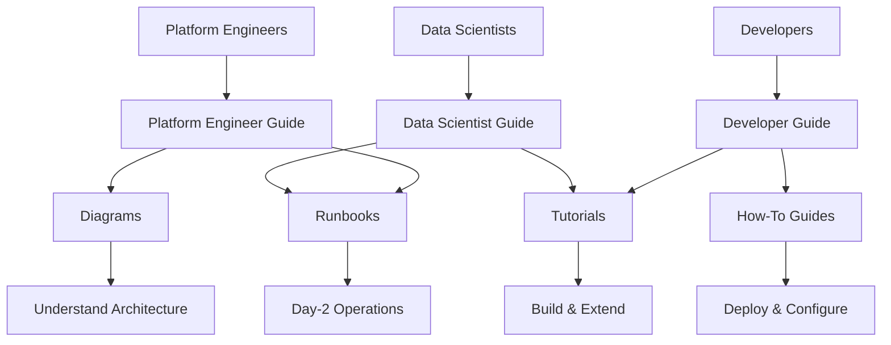

# OpenShift AIOps Platform Documentation

Welcome to the **OpenShift AIOps Self-Healing Platform**. This platform combines deterministic automation with AI-driven anomaly detection to keep OpenShift clusters healthy, stable, and self-repairing.

Three types of users work with this platform every day. Each role has a different starting point and a different set of documentation.

---

## Who Is This For?

### 🔧 Platform Engineers

You provision clusters, manage operators, configure storage, and keep the platform running. You need to understand infrastructure topology (ROSA, SNO, HA), operator lifecycle, and incident response.

**Start here:**

1. [Platform Engineer Guide](user-guide/platform-engineer-guide.md) — Architecture, provisioning, storage, operators, RBAC
2. [Platform Deployment Runbook](runbooks/platform-deployment.md) — Step-by-step deployment procedure with rollback
3. [Incident Response Runbook](runbooks/incident-response.md) — P1-P4 triage and recovery procedures
4. [Monitoring and Alerting Runbook](runbooks/monitoring-and-alerting.md) — PromQL queries, dashboards, capacity planning
5. [Deployment Topology Diagram](diagrams/deployment-topology.md) — ROSA HA, single-worker, and SNO layouts

**Your key benefit:** Automated incident detection and self-healing reduce on-call burden. The coordination engine handles routine remediations. Runbooks cover the rest.

### 💻 Developers

You extend the platform by building custom pipelines, modifying Helm charts, integrating new components, and contributing code. You work with the Go-based Coordination Engine, Tekton, ArgoCD, and the GitOps workflow.

**Start here:**

1. [Developer Guide](user-guide/developer-guide.md) — Dev environment, Coordination Engine, Tekton, Helm, GitOps
2. [GitOps Customization Tutorial](tutorials/gitops-customization.md) — Fork, customize, and promote changes
3. [Custom Tekton Pipeline Tutorial](tutorials/custom-tekton-pipeline.md) — Build your own CI/CD pipeline
4. [Coordination Engine Integration Tutorial](tutorials/coordination-engine-integration.md) — Register remediation rules and test self-healing
5. [GitOps Workflow Diagram](diagrams/gitops-workflow.md) — Commit to deploy flow with sync waves

**Your key benefit:** A GitOps-native platform with clear extension points. Add custom models, pipelines, or operators without breaking the self-healing loop.

### 📊 Data Scientists

You train ML models for anomaly detection and predictive analytics. You work in Jupyter notebooks, collect metrics from Prometheus, train Isolation Forest and LSTM models, and deploy them to KServe for real-time inference.

**Start here:**

1. [Data Scientist Guide](user-guide/data-scientist-guide.md) — Workbench setup, notebooks, model training, KServe
2. [End-to-End Anomaly Detection Tutorial](tutorials/end-to-end-anomaly-detection.md) — Full pipeline from data collection to live testing
3. [Predictive Analytics with GPU Tutorial](tutorials/predictive-analytics-with-gpu.md) — LSTM training with PyTorch and CUDA
4. [Model Training Operations Runbook](runbooks/model-training-operations.md) — Retraining, rollback, drift monitoring
5. [Data Flow Diagram](diagrams/data-flow.md) — Metrics collection through inference pipeline

**Your key benefit:** A production ML platform with automated training pipelines, model versioning in S3, and KServe serving. Train in notebooks, deploy with one pipeline run.

---

## Platform at a Glance

---

## Documentation Structure

This documentation follows the [Diataxis](https://diataxis.fr/) framework: tutorials for learning, how-to guides for tasks, reference for facts, and explanation for understanding.

### 📚 [Tutorials](./tutorials/)

Learning-oriented guides that take you through a process step by step. Perfect for newcomers.

- [Quick Start](tutorials/quick-start.md) — Get the platform running in 5 minutes
- [KServe Model Integration Quickstart](tutorials/KSERVE-MODEL-INTEGRATION-QUICKSTART.md) — Integrate ML models with the coordination engine
- [End-to-End Anomaly Detection](tutorials/end-to-end-anomaly-detection.md) — Full anomaly detection walkthrough
- [Custom Tekton Pipeline](tutorials/custom-tekton-pipeline.md) — Build custom CI/CD pipelines
- [GitOps Customization](tutorials/gitops-customization.md) — Customize your GitOps deployment
- [Predictive Analytics with GPU](tutorials/predictive-analytics-with-gpu.md) — GPU-accelerated predictive analytics

### 🔧 [How-To Guides](./how-to/)

Task-oriented recipes for accomplishing specific goals.

- [Complete Deployment Guide](how-to/DEPLOYMENT.md) — Step-by-step deployment process
- [Deploy on SNO](how-to/deploy-on-sno.md) — Single Node OpenShift deployment
- [Deploy on ROSA](how-to/deploy-on-rosa.md) — ROSA Classic deployment
- [OpenShift Object Store Setup](how-to/OPENSHIFT-OBJECT-STORE-SETUP.md) — ODF/NooBaa storage setup
- [OperatorHub Installation](how-to/OPERATORHUB-INSTALLATION-GUIDE.md) — Install operators from OperatorHub.io

### 📘 [Guides](./guides/)

Procedural guides for operations, migrations, and integrations.

- [Model Training Guide](guides/model-training-guide.md) — Train and deploy production models
- [MCP + Lightspeed Configuration](guides/MCP-LIGHTSPEED-CONFIGURATION.md) — Configure MCP server integration
- [Secure Configuration](guides/SECURE-CONFIGURATION.md) — Secrets and credential management
- [Makefile Migration Guide](guides/MAKEFILE-MIGRATION-GUIDE.md) — Migrate to operator-deploy workflow
- [Model Serving PVC Migration](guides/MODEL-SERVING-PVC-MIGRATION.md) — Migrate from S3 to PVC storage
- [Notebook Validation Migration](guides/NOTEBOOK-VALIDATION-MIGRATION.md) — Migrate to operator-based validation
- [Gitea Integration Guide](guides/GITEA-INTEGRATION-GUIDE.md) — Set up Gitea for development
- [Gitea Development Workflow](guides/GITEA-DEVELOPMENT-WORKFLOW.md) — Day-to-day Gitea usage
- [ACM Integration Guide](guides/RED-HAT-ACM-INTEGRATION-GUIDE.md) — Multi-cluster management
- [Bootstrap Testing Guide](guides/BOOTSTRAP_TESTING_GUIDE.md) — Test the bootstrap system
- [Operator Upgrade Test Guide](guides/OPERATOR-UPGRADE-TEST-GUIDE.md) — Test operator upgrades
- [Jupyter Validator Webhooks](guides/JUPYTER-VALIDATOR-WEBHOOKS-PRODUCTION.md) — Production webhook setup

### 📖 [Reference](./reference/)

Information-oriented technical descriptions of the system.

- [Model Deployment Checklist](reference/MODEL_DEPLOYMENT_CHECKLIST.md) — Pre-deployment checklist for ML models
- [Notebook Quick Reference](reference/NOTEBOOK-QUICK-REFERENCE.md) — Quick reference card for 30 notebooks
- [Git URL Configuration](reference/GIT-URL-CONFIGURATION.md) — Configure repository URLs
- [Release Guide](reference/RELEASE.md) — Versioning and release process
- [Validated Patterns Toolkit Reference](reference/VALIDATED-PATTERNS-TOOLKIT-REFERENCE.md) — Ansible toolkit reference
- [External Secrets Configuration](reference/EXTERNAL-SECRETS-CONFIGURATION-COMPLETE.md) — ESO configuration status
- [Jupyter Operator Installation](reference/JUPYTER-OPERATOR-INSTALLATION-SUCCESS.md) — Operator installation record
- [Validation Complete](reference/VALIDATION-COMPLETE.md) — Validation system status
- [Webhook Automation Complete](reference/WEBHOOK-AUTOMATION-COMPLETE.md) — CI/CD webhook status
- [Code of Conduct](reference/CODE_OF_CONDUCT.md) — Community code of conduct
- [Contributing](reference/CONTRIBUTING.md) — How to contribute

### 💡 [Explanation](./explanation/)

Understanding-oriented discussions about architecture and design.

- [AI Agent Development Guide](explanation/ai-agent-development-guide.md) — Comprehensive AI agent guide
- [AGENTS.md (Project Overview)](explanation/AGENTS.md) — Full project architecture and workflows
- [Latest Architecture Changes](explanation/LATEST-ARCHITECTURE-CHANGES.md) — Recent architectural improvements
- [Gitea Integration Architecture](explanation/GITEA_INTEGRATION.md) — How Gitea integrates with the platform
- [Notebook Validation with ArgoCD](explanation/NOTEBOOK-VALIDATION-ARGOCD.md) — GitOps-based notebook validation

### 🔍 [Troubleshooting](./troubleshooting/)

Problem/solution guides for common issues.

- [Cluster Restart Health](troubleshooting/CLUSTER_RESTART_HEALTH.md) — Post-restart diagnostics and recovery
- [Notebook RBAC Troubleshooting](troubleshooting/NOTEBOOK-RBAC-TROUBLESHOOTING.md) — Fix 403 forbidden errors
- [Operator Deployment Fix](troubleshooting/OPERATOR-DEPLOYMENT-FIX.md) — Fix VP Operator pod crashes

### 📊 [Diagrams](./diagrams/)

Architecture and workflow diagrams.

- [C4 System Context](diagrams/c4-system-context.md) — High-level system boundaries
- [C4 Container Diagram](diagrams/c4-container.md) — Container-level architecture
- [Component Dependencies](diagrams/component-dependencies.md) — Inter-component relationships
- [Data Flow](diagrams/data-flow.md) — Data pipeline visualization
- [Deployment Topology](diagrams/deployment-topology.md) — Infrastructure layout
- [GitOps Workflow](diagrams/gitops-workflow.md) — ArgoCD deployment flow
- [Self-Healing Sequence](diagrams/self-healing-sequence.md) — Self-healing event sequence

### 📋 [Runbooks](./runbooks/)

Operational procedures for day-to-day management.

- [Platform Deployment](runbooks/platform-deployment.md) — Deployment runbook
- [Incident Response](runbooks/incident-response.md) — Incident handling procedures
- [Model Training Operations](runbooks/model-training-operations.md) — Model retraining runbook
- [Monitoring and Alerting](runbooks/monitoring-and-alerting.md) — Alert response procedures
- [Upgrade and Maintenance](runbooks/upgrade-and-maintenance.md) — Platform upgrade runbook

### 👤 [User Guide](./user-guide/)

Role-based guides for different personas.

- [Data Scientist Guide](user-guide/data-scientist-guide.md) — ML model development workflows
- [Developer Guide](user-guide/developer-guide.md) — Platform development and extension
- [Platform Engineer Guide](user-guide/platform-engineer-guide.md) — Cluster operations and management
- [Workbench Access Guide](user-guide/WORKBENCH-ACCESS-GUIDE.md) — JupyterLab access and setup

### 🏛️ [ADRs](./adrs/)

Architectural Decision Records documenting key design choices.

- [ADR Index](adrs/README.md) — Complete index of 58+ ADRs
- [ADR Cross-Reference Matrix](adrs/ADR-CROSS-REFERENCE-MATRIX.md) — ADR dependency map
- [ADR to Automation Mapping](adrs/ADR-TO-AUTOMATION-MAPPING.md) — ADR-to-Ansible mapping
- [ADR Validation System](adrs/ADR-VALIDATION-SYSTEM.md) — Automated ADR validation

### 🔬 [Research](./research/)

Planning documents, roadmaps, and enhancement proposals.

- [Notebook Roadmap](research/NOTEBOOK-ROADMAP.md) — Notebook development status and roadmap
- [Prediction Features Plan](research/implementation-plan-prediction-features.md) — Prediction and capacity planning
- [Documentation Automation Plan](research/DOCUMENTATION-AUTOMATION-PLAN.md) — Automation for docs maintenance
- [Documentation Improvements](research/DOCUMENTATION_IMPROVEMENTS.md) — Documentation improvement tracking
- [Notebook Validator Enhancements](research/NOTEBOOK_VALIDATOR_ENHANCEMENTS.md) — Operator enhancement proposals
- [Operator Upgrade Plan](research/OPERATOR-UPGRADE-AND-VOLUME-IMPLEMENTATION-PLAN.md) — Upgrade implementation plan

### 🐛 [GitHub Issues](./github-issues/)

Issue tracking and bug documentation.

- [Dynamic Model Loading](github-issues/GITHUB-ISSUE-DYNAMIC-MODEL-LOADING.md) — Dynamic KServe model registry
- [KServe Model Name Bug](github-issues/github-issue-kserve-model-name-bug.md) — Hardcoded model name fix
- [Predictive Model Input Mismatch](github-issues/github-issue-predictive-model-input-mismatch.md) — Feature engineering mismatch

### 🔧 [Issues](./issues/)

Known issues and workarounds.

- [Volume Support Issue](issues/VOLUME-SUPPORT-ISSUE.md) — Operator volume mount limitation

---

## 🚀 Quick Start

New to the platform? Pick your path:

| If you are a... | Start with... |
|-----------------|---------------|
| **Platform Engineer** deploying for the first time | [Quick Start](tutorials/quick-start.md), then [Platform Deployment Runbook](runbooks/platform-deployment.md) |
| **Developer** extending the platform | [Quick Start](tutorials/quick-start.md), then [Developer Guide](user-guide/developer-guide.md) |
| **Data Scientist** training models | [Data Scientist Guide](user-guide/data-scientist-guide.md), then [Anomaly Detection Tutorial](tutorials/end-to-end-anomaly-detection.md) |
| **Anyone** wanting to understand the architecture | [C4 System Context](diagrams/c4-system-context.md), then [C4 Container Diagram](diagrams/c4-container.md) |

## 🏗️ Platform Components

| Component | Purpose | Key Docs |
|-----------|---------|----------|
| **Coordination Engine** | Orchestrates self-healing actions (Go-based) | [Developer Guide](user-guide/developer-guide.md), [Integration Tutorial](tutorials/coordination-engine-integration.md) |
| **AI/ML Workbench** | PyTorch-based Jupyter environment with GPU support | [Data Scientist Guide](user-guide/data-scientist-guide.md) |
| **KServe Model Serving** | Production model deployment and inference | [Anomaly Detection Tutorial](tutorials/end-to-end-anomaly-detection.md) |
| **Tekton Pipelines** | Automated model training and validation | [Custom Pipeline Tutorial](tutorials/custom-tekton-pipeline.md) |
| **ArgoCD GitOps** | Declarative deployment via Validated Patterns | [GitOps Tutorial](tutorials/gitops-customization.md) |
| **Prometheus Monitoring** | Cluster observability and alerting | [Monitoring Runbook](runbooks/monitoring-and-alerting.md) |
| **OpenShift Data Foundation** | Persistent storage for data and models | [Platform Engineer Guide](user-guide/platform-engineer-guide.md) |

## 🤝 Contributing

This platform is documented through Architectural Decision Records (ADRs). See the [ADR Index](adrs/README.md) for all 58+ architectural decisions and their rationale. Refer to [Contributing](reference/CONTRIBUTING.md) for contribution guidelines.
