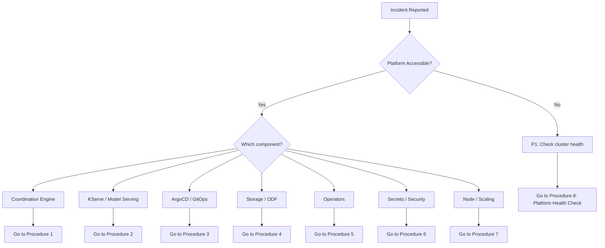
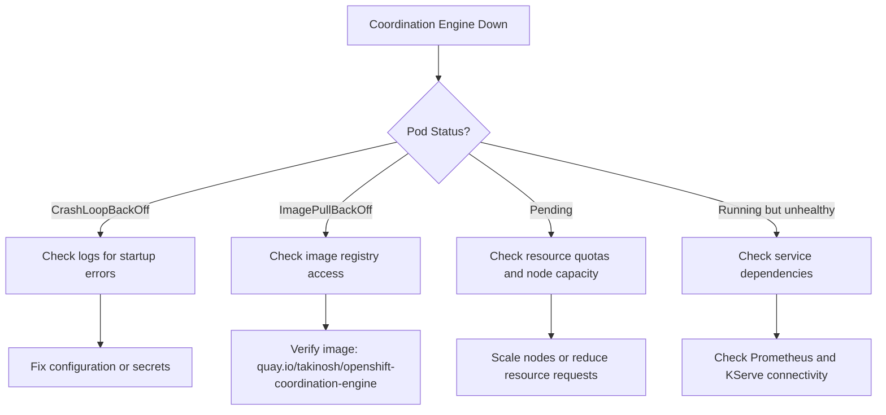

# Runbook: Incident Response Procedures

**Owner**: Platform Engineering Team / SRE
**Risk Level**: Critical
**Last Updated**: 2026-09-29
**Last Tested**: 2026-09-29
**Approved By**: Platform Architect
**Version**: 1.0.0

---

## Quick Reference

| Attribute | Value |
|-----------|-------|
| **Execution Time** | Variable: 5-60 minutes depending on severity |
| **Impact Window** | Depends on incident scope |
| **Rollback Time** | ~10 minutes for most component-level rollbacks |
| **Prerequisites** | Cluster-admin access, monitoring dashboards |

---

## Scope and Use Case

### When to Use This Runbook

Use this runbook when the platform experiences degraded performance, component failures, or security incidents. Each section addresses a specific failure domain with triage, diagnosis, and recovery procedures.

**Triggers**:
- Automated alerts from Prometheus/AlertManager
- Manual observation of degraded service
- Ticket escalation from end users

### Expected Outcome

Platform restored to full operational health with root cause documented and follow-up actions identified.

### What This Does NOT Cover

- Initial platform deployment (see [platform-deployment.md](platform-deployment.md))
- Planned maintenance and upgrades (see [upgrade-and-maintenance.md](upgrade-and-maintenance.md))

---

## Incident Severity Classification

| Severity | Definition | Response Time | Examples |
|----------|-----------|---------------|----------|
| **P1 (Critical)** | Platform fully offline or data loss risk | Immediate, 24/7 | Coordination engine down, all models offline, storage failure |
| **P2 (High)** | Major feature degraded, no workaround | 30 minutes | Single model offline, ArgoCD not syncing, training failures |
| **P3 (Medium)** | Minor feature degraded, workaround exists | 2 hours | Workbench unreachable, single notebook failure |
| **P4 (Low)** | Cosmetic or non-urgent issue | Next business day | Dashboard rendering issue, log verbosity |

---

## Incident Triage Decision Tree



---

## Procedure 0: Platform Health Check

**Severity**: P1 (if platform is unresponsive)
**Estimated Time**: 5-10 minutes

### Step 1: Verify Cluster Connectivity

```bash
oc whoami
oc get nodes
oc get clusterversion
```

**Expected output**: Logged in, all nodes `Ready`, cluster version available.

If `oc` commands time out, check network connectivity and VPN status.

### Step 2: Check Platform Namespace

```bash
oc get pods -n self-healing-platform --no-headers | \
  awk '{print $3}' | sort | uniq -c | sort -rn
```

**Expected output**: Majority of pods in `Running` or `Completed` status.

### Step 3: Run Automated Health Check

```bash
bash scripts/post-deployment-validation.sh
```

Review the report for failing checks.

### Step 4: Check Recent Events

```bash
oc get events -n self-healing-platform --sort-by='.lastTimestamp' | tail -30
```

Look for `Warning` or `Error` events that indicate the root cause.

---

## Procedure 1: Coordination Engine Failure Recovery

**Severity**: P1 (Critical)
**Estimated Time**: 10-20 minutes

### Symptoms

- HTTP requests to coordination engine time out
- Health endpoint returns 503 or connection refused
- Pods in `CrashLoopBackOff` or `0/1 Ready`
- Self-healing actions are not executing

### Step 1: Check Pod Status

```bash
oc get pods -n self-healing-platform -l app.kubernetes.io/component=coordination-engine
```

### Step 2: View Logs

```bash
oc logs -n self-healing-platform deployment/self-healing-coordination-engine --tail=200
```

### Step 3: Test Health Endpoint

```bash
oc exec -n self-healing-platform deployment/self-healing-coordination-engine -- \
  curl -s http://localhost:8080/health
```

### Step 4: Diagnose Root Cause



### Step 5: Restart the Deployment

```bash
oc rollout restart deployment/self-healing-coordination-engine -n self-healing-platform
```

### Step 6: Verify Recovery

```bash
oc rollout status deployment/self-healing-coordination-engine -n self-healing-platform --timeout=120s
```

Then test the health endpoint:

```bash
oc exec -n self-healing-platform deployment/self-healing-coordination-engine -- \
  curl -s http://localhost:8080/health
```

**Success criteria**: Returns healthy status with HTTP 200.

### Step 7: If Restart Fails

Re-run prerequisites to repair RBAC and configuration:

```bash
make operator-deploy-prereqs
```

If the issue persists, check the ConfigMap:

```bash
oc get configmap coordination-engine-config -n self-healing-platform -o yaml
```

---

## Procedure 2: KServe InferenceService Failure Recovery

**Severity**: P1-P2 (depends on number of affected models)
**Estimated Time**: 10-30 minutes

### Symptoms

- InferenceService shows `READY=False`
- Predictor pods are not running
- Inference requests return errors
- Coordination engine reports model unavailability

### Step 1: List InferenceService Status

```bash
oc get inferenceservices -n self-healing-platform
```

**Expected output**:

```
NAME                    URL   READY   PREV   LATEST   AGE
anomaly-detector              True                     5d
predictive-analytics          True                     5d
```

### Step 2: Describe Failing InferenceService

```bash
oc describe inferenceservice <NAME> -n self-healing-platform
```

Look for `Conditions` and `Events` sections.

### Step 3: Check Predictor Pods

```bash
oc get pods -n self-healing-platform -l serving.kserve.io/inferenceservice=<NAME>
oc logs -n self-healing-platform -l serving.kserve.io/inferenceservice=<NAME> -c kserve-container --tail=100
```

### Step 4: Diagnose and Fix

#### Model Artifacts Missing

```bash
oc exec -it self-healing-workbench-0 -n self-healing-platform -- \
  ls -la /opt/app-root/src/models/<model-name>/v1/
```

If missing, trigger model training:

```bash
./scripts/trigger-model-training.sh <model-name> 24 synthetic
```

#### Resource Limits Exceeded

Check pod resource usage:

```bash
oc adm top pods -n self-healing-platform -l serving.kserve.io/inferenceservice=<NAME>
```

Increase limits in `values-hub.yaml` under the `models` section, commit, push, and sync ArgoCD.

#### KServe Runtime Errors

```bash
oc get csv -n openshift-operators | grep kserve
oc get servingruntime -n self-healing-platform
```

If the KServe operator is degraded, see Procedure 5 (Operator Failure).

### Step 5: Restart InferenceService

```bash
oc rollout restart deployment -n self-healing-platform \
  -l serving.kserve.io/inferenceservice=<NAME>
```

### Step 6: Verify Recovery

```bash
oc get inferenceservice <NAME> -n self-healing-platform -w
```

Wait for `READY=True`, then test inference:

```bash
oc exec -n self-healing-platform deployment/self-healing-coordination-engine -- \
  curl -s -X POST http://<NAME>-stable:8080/v1/models/<NAME>:predict \
  -H "Content-Type: application/json" \
  -d '{"instances": [[0.5, 0.3, 0.8, 0.2, 0.6]]}'
```

---

## Procedure 3: ArgoCD Sync Failure Resolution

**Severity**: P2 (High)
**Estimated Time**: 10-20 minutes

### Symptoms

- ArgoCD application shows `OutOfSync`, `Unknown`, or `Degraded`
- New changes in Git are not applied to the cluster
- Resources are missing or in unexpected state

### Step 1: Check Application Status

```bash
oc get applications -n self-healing-platform-hub
oc describe application self-healing-platform -n self-healing-platform-hub
```

### Step 2: Identify Sync Errors

```bash
oc get application self-healing-platform -n self-healing-platform-hub \
  -o jsonpath='{.status.conditions[*].message}'
```

### Step 3: Common Fixes

#### ClusterRoleBinding Namespaced Mode Error

```bash
make operator-deploy-prereqs
```

This grants cluster-admin to the ArgoCD application controller.

#### Git Repository Unreachable

```bash
git ls-remote $(grep repoURL values-global.yaml | awk '{print $2}' | tr -d '"')
```

If the repository is unreachable, verify network access and credentials.

#### Helm Template Rendering Error

```bash
helm template test charts/hub -f values-global.yaml -f values-hub.yaml 2>&1 | head -20
```

Fix any template errors, commit, and push.

#### Force Sync

```bash
oc annotate application self-healing-platform -n self-healing-platform-hub \
  argocd.argoproj.io/refresh=hard --overwrite
```

### Step 4: Verify Recovery

```bash
watch -n 5 'oc get application self-healing-platform -n self-healing-platform-hub \
  -o jsonpath="{.status.sync.status} - {.status.health.status}"'
```

**Success criteria**: Shows `Synced - Healthy`.

---

## Procedure 4: ODF/Storage Failure Handling

**Severity**: P1-P2 (depends on scope)
**Estimated Time**: 15-45 minutes

### Symptoms

- PVCs stuck in `Pending` state
- Pods fail to start with `PVC not bound` errors
- Workbench notebook cannot save data
- CephCluster shows degraded health

### Step 1: Check PVC Status

```bash
oc get pvc -n self-healing-platform
```

### Step 2: Check Storage Classes

```bash
oc get storageclass
```

Confirm the expected storage classes exist:

- HA: `ocs-storagecluster-cephfs`, `ocs-storagecluster-ceph-rbd`, `gp3-csi`
- SNO: `gp3-csi`

### Step 3: Check ODF Health (HA only)

```bash
oc get cephcluster -n openshift-storage
oc get pods -n openshift-storage | grep -E 'osd|mon|mgr'
```

### Step 4: Check NooBaa Status (S3)

```bash
oc get noobaa -n openshift-storage
oc get objectbucketclaim -n self-healing-platform
```

### Step 5: Resolve PVC Issues

#### No Default StorageClass

```bash
oc patch storageclass gp3-csi \
  -p '{"metadata": {"annotations":{"storageclass.kubernetes.io/is-default-class":"true"}}}'
```

#### Insufficient Capacity

Check node storage:

```bash
oc adm top nodes
```

For ODF, add OSD capacity or add new storage nodes.

#### Wrong StorageClass in values-hub.yaml

For SNO, confirm:

```yaml
storage:
  modelStorage:
    storageClass: "gp3-csi"
```

For HA, confirm:

```yaml
storage:
  modelStorage:
    storageClass: "ocs-storagecluster-cephfs"
```

Commit, push, and sync ArgoCD after fixing.

---

## Procedure 5: Operator Failure

**Severity**: P2 (High)
**Estimated Time**: 10-20 minutes

### Symptoms

- Operators in `Failed` or `InstallPlanFailed` state
- CSVs not reaching `Succeeded` phase
- CRDs not available

### Step 1: Check CSV Status

```bash
oc get csv -n openshift-operators
oc get csv -n self-healing-platform
```

### Step 2: Identify the Failing Operator

```bash
oc get csv -n openshift-operators -o custom-columns=NAME:.metadata.name,PHASE:.status.phase | grep -v Succeeded
```

### Step 3: Fix TooManyOperatorGroups

This is the most common operator failure. Check for conflicting OperatorGroups:

```bash
oc get operatorgroups -n openshift-operators
```

**Expected**: Only `global-operators` should exist.

Delete any extras:

```bash
oc delete operatorgroup jupyter-validator-operatorgroup -n openshift-operators
```

Wait 60 seconds for reconciliation:

```bash
oc get csv -n openshift-operators --watch
```

### Step 4: Fix Stuck InstallPlans

```bash
oc get installplan -n openshift-operators
```

Approve any pending install plans:

```bash
oc patch installplan <NAME> -n openshift-operators \
  --type merge -p '{"spec":{"approved":true}}'
```

### Step 5: Verify Recovery

```bash
oc get csv -n openshift-operators -o custom-columns=NAME:.metadata.name,PHASE:.status.phase
```

All CSVs should show `Succeeded`.

---

## Procedure 6: Secret Rotation and Security Incident Response

**Severity**: P1 (Critical for compromised credentials)
**Estimated Time**: 15-30 minutes

### Symptoms

- Secret exposure detected (in logs, git history, or external reports)
- ExternalSecret sync failures
- Authentication errors in component logs

### Immediate Actions for Compromised Credentials

> **WARNING**: If credentials have been exposed, act immediately. Do NOT wait.

#### Step 1: Revoke Compromised Credentials

Revoke the exposed credential at its source (AWS IAM, GitHub token, service account).

#### Step 2: Rotate the Secret

Create new credentials and update the Kubernetes secret:

```bash
oc delete secret <SECRET_NAME> -n self-healing-platform
oc create secret generic <SECRET_NAME> \
  --from-literal=key1=NEW_VALUE \
  --from-literal=key2=NEW_VALUE \
  -n self-healing-platform
```

#### Step 3: Restart Affected Components

```bash
oc rollout restart deployment -n self-healing-platform
```

#### Step 4: Remove from Git History (if pushed)

> **WARNING**: This rewrites git history. All contributors must re-clone.

```bash
./scripts/emergency-security-cleanup.sh
```

Or manually:

```bash
git filter-branch --force --index-filter \
  "git rm --cached --ignore-unmatch <file-with-secret>" \
  --prune-empty --tag-name-filter cat -- --all
git push origin main --force-with-lease
```

#### Step 5: Verify Cleanup

```bash
pre-commit run --all-files
```

All checks must pass with no secrets detected.

### Routine Secret Rotation

For scheduled secret rotation (without a security incident):

```bash
oc get externalsecrets -n self-healing-platform
oc describe externalsecret <NAME> -n self-healing-platform
```

Update the source secret in the backend (Vault, AWS Secrets Manager, or Kubernetes), and ExternalSecret will sync automatically within the configured `refreshInterval` (default: 1 hour).

---

## Procedure 7: Node Failure and Scaling

**Severity**: P1-P2 (depends on topology)
**Estimated Time**: 15-45 minutes

### Symptoms

- Node shows `NotReady` status
- Pods evicted from failed node
- Cluster capacity insufficient for workloads

### Step 1: Check Node Status

```bash
oc get nodes
oc describe node <NODE_NAME> | grep -A 10 "Conditions"
```

### Step 2: Diagnose Node Issue

```bash
oc adm top nodes
oc get events --field-selector involvedObject.name=<NODE_NAME>
```

### Step 3: Scale Up Workers

#### ROSA Clusters

```bash
rosa list machinepools --cluster=<CLUSTER_NAME>
rosa edit machinepool workers --cluster=<CLUSTER_NAME> --replicas=4
```

#### IPI Clusters

```bash
oc get machinesets -n openshift-machine-api
oc scale machineset <MACHINESET_NAME> -n openshift-machine-api --replicas=4
```

### Step 4: Wait for New Nodes

```bash
oc get nodes --watch
```

Wait for new nodes to reach `Ready` status.

### Step 5: Verify Pod Rescheduling

```bash
oc get pods -n self-healing-platform -o wide
```

Confirm all platform pods are running on healthy nodes.

### SNO Node Failure

For SNO clusters, a node failure means a full platform outage. Restore options:

1. Reboot the node and wait for recovery.
2. Restore from backup (see [upgrade-and-maintenance.md](upgrade-and-maintenance.md)).
3. Redeploy the platform on a new cluster (see [platform-deployment.md](platform-deployment.md)).

---

## Post-Incident Tasks

### Immediate (Within 5 Minutes)

- [ ] Update the incident ticket with current status
- [ ] Notify stakeholders in team Slack channel
- [ ] Confirm all monitoring shows healthy state

### Within 24 Hours

- [ ] Document the root cause and resolution
- [ ] Review logs for any secondary issues
- [ ] Update this runbook if any steps changed or new issues were discovered

### Within 1 Week (If Issues Occurred)

- [ ] Conduct post-mortem review
- [ ] Identify automation opportunities to prevent recurrence
- [ ] Update monitoring and alerting rules if gaps were found
- [ ] Share lessons learned with the team

---

## Escalation Path

| Severity | First Contact | Response Time | Next Escalation |
|----------|---------------|---------------|-----------------|
| **P1 (Critical)** | On-call engineer (PagerDuty) | Immediate | Engineering Manager (15 min) |
| **P2 (High)** | Team Slack #aiops-platform | 30 minutes | Team Lead (1 hour) |
| **P3 (Medium)** | Team Slack #aiops-platform | 2 hours | N/A |
| **P4 (Low)** | GitHub issue | Next business day | N/A |

**Contacts**:
- On-call rotation: PagerDuty
- Team Slack: #aiops-platform
- Engineering Manager: Refer to internal contacts directory

---

## Diagnostic Data Collection

When escalating any incident, collect the following:

```bash
# 1. Pattern CR status
oc get pattern self-healing-platform -n openshift-operators -o yaml > pattern-status.yaml

# 2. ArgoCD application status
oc get applications -A -o yaml > argocd-apps.yaml

# 3. Operator status
oc get csv -n openshift-operators > operators.txt

# 4. Pod status
oc get pods -n self-healing-platform -o wide > pods.txt

# 5. Events
oc get events -n self-healing-platform --sort-by='.lastTimestamp' > events.txt

# 6. ArgoCD controller logs
oc logs -n self-healing-platform-hub deployment/hub-gitops-application-controller \
  --tail=200 > argocd-controller.log

# 7. Coordination engine logs
oc logs -n self-healing-platform deployment/self-healing-coordination-engine \
  --tail=200 > coordination-engine.log
```

Attach all files to the incident ticket.

---

## Appendix

### Related Runbooks

- [Platform Deployment](platform-deployment.md)
- [Model Training Operations](model-training-operations.md)
- [Upgrade and Maintenance](upgrade-and-maintenance.md)
- [Monitoring and Alerting](monitoring-and-alerting.md)

### Reference Documentation

- [Troubleshooting Guide](../guides/TROUBLESHOOTING-GUIDE.md)
- [ADR-030: Hybrid Management Model](../adrs/030-hybrid-management-model-namespaced-argocd.md)
- [ADR-042: ArgoCD Deployment Lessons Learned](../adrs/042-argocd-deployment-lessons-learned.md)
- [ADR-043: Deployment Stability and Health Checks](../adrs/043-deployment-stability-health-checks.md)
- Emergency cleanup script: `scripts/emergency-security-cleanup.sh`

### Version History

| Version | Date | Author | Changes |
|---------|------|--------|---------|
| 1.0.0 | 2026-09-29 | Platform Engineering | Initial version |

---

**Last Reviewed**: 2026-09-29
**Next Review**: 2026-12-29
**Feedback**: Report issues at https://github.com/KubeHeal/openshift-aiops-platform/issues
