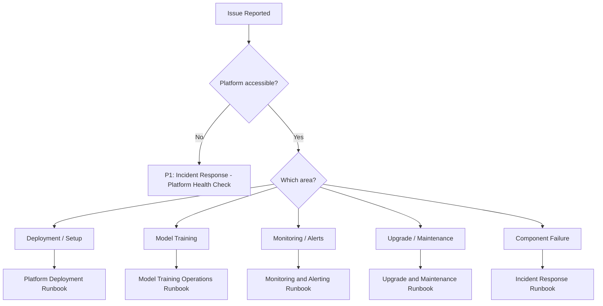

# Operational Runbooks Index

**OpenShift AI Ops Self-Healing Platform**

**Owner**: Platform Engineering Team
**Last Updated**: 2026-09-29
**Version**: 1.0.0

---

## Overview

This directory contains operational runbooks for the OpenShift AI Ops Self-Healing Platform. Each runbook provides step-by-step procedures that platform engineers can follow during deployment, operations, incidents, and maintenance.

**Standards**: All runbooks follow STE100 voice pack conventions (short sentences, active voice, one instruction per step, no contractions). Every runbook includes prerequisites, step-by-step procedures, verification, rollback, and escalation paths.

---

## Runbook Catalog

### Deployment and Operations

| Runbook | Purpose | Risk Level | Estimated Time |
|---------|---------|------------|----------------|
| [Platform Deployment](platform-deployment.md) | Full platform deployment on fresh or existing cluster | High | 25-45 min |
| [Model Training Operations](model-training-operations.md) | ML model training, retraining, rollback, and GPU management | Medium | 15 min - 6 hours |
| [Monitoring and Alerting](monitoring-and-alerting.md) | Metrics, alerts, dashboards, capacity planning | Low | 30-60 min (setup) |

### Incident Response

| Runbook | Purpose | Risk Level | Estimated Time |
|---------|---------|------------|----------------|
| [Incident Response](incident-response.md) | All incident procedures with triage decision tree | Critical | 5-60 min |

The incident response runbook contains the following procedures:

| Procedure | Scope | Severity |
|-----------|-------|----------|
| Platform Health Check | Full platform assessment | P1 |
| Coordination Engine Failure | Go-based coordination engine recovery | P1 |
| KServe InferenceService Failure | Model serving recovery | P1-P2 |
| ArgoCD Sync Failure | GitOps sync resolution | P2 |
| ODF/Storage Failure | PVC, Ceph, NooBaa recovery | P1-P2 |
| Operator Failure | TooManyOperatorGroups, CSV failures | P2 |
| Secret Rotation and Security | Credential rotation, git history cleanup | P1 |
| Node Failure and Scaling | Worker node scaling, SNO recovery | P1-P2 |

### Maintenance and Upgrades

| Runbook | Purpose | Risk Level | Estimated Time |
|---------|---------|------------|----------------|
| [Upgrade and Maintenance](upgrade-and-maintenance.md) | OCP upgrades, operator upgrades, backups, certificates | High | 30-120 min |

The upgrade runbook contains the following procedures:

| Procedure | Scope | Frequency |
|-----------|-------|-----------|
| OpenShift Version Upgrade | Cluster version hop | Quarterly or as needed |
| Operator Upgrade | RHOAI, GPU, Pipelines, GitOps | Monthly or as needed |
| Helm Chart Update | Platform configuration changes | As needed |
| Certificate Renewal | TLS certificate management | Before expiration |
| Backup and Restore | Model artifacts, workbench data | Weekly (automated) |
| Periodic Maintenance | Cleanup, storage review, validation | Weekly/Monthly/Quarterly |

---

## Severity Classification

| Severity | Response Time | Description | Escalation |
|----------|---------------|-------------|------------|
| **P1 (Critical)** | Immediate, 24/7 | Platform offline, data loss risk, security breach | On-call to Engineering Manager in 15 min |
| **P2 (High)** | 30 minutes | Major feature degraded, no workaround available | Team lead within 1 hour |
| **P3 (Medium)** | 2 hours | Minor feature degraded, workaround exists | N/A |
| **P4 (Low)** | Next business day | Cosmetic issue, non-urgent improvement | N/A |

---

## Quick Triage Guide



---

## Essential Commands Quick Reference

```bash
# Cluster health
make show-cluster-info
oc get nodes
oc get clusterversion

# Platform status
make argo-healthcheck
oc get pods -n self-healing-platform
oc get inferenceservices -n self-healing-platform

# Coordination engine
oc logs -n self-healing-platform deployment/self-healing-coordination-engine --tail=100

# Model training
./scripts/check-training-status.sh
tkn pipelinerun list -n self-healing-platform

# Events and diagnostics
oc get events -n self-healing-platform --sort-by='.lastTimestamp' | tail -20

# Validation
bash scripts/post-deployment-validation.sh
```

---

## Automation Scripts Reference

| Script | Purpose | Used In |
|--------|---------|---------|
| `scripts/create-rosa-cluster.sh` | Provision ROSA cluster | Platform Deployment |
| `scripts/configure-cluster-infrastructure.sh` | Install ODF, scale workers | Platform Deployment |
| `scripts/detect-cluster-topology.sh` | Detect SNO/HA topology | All runbooks |
| `scripts/post-deployment-validation.sh` | Post-deployment health checks | Platform Deployment, Incident Response |
| `scripts/trigger-model-training.sh` | Manual model training trigger | Model Training Operations |
| `scripts/check-training-status.sh` | Training pipeline status report | Model Training Operations |
| `scripts/upgrade-cluster.sh` | Automated OCP/RHOAI upgrade | Upgrade and Maintenance |
| `scripts/emergency-security-cleanup.sh` | Remove secrets from git history | Incident Response |

---

## Related Documentation

| Document | Purpose |
|----------|---------|
| [CLAUDE.md](../../CLAUDE.md) | AI agent quick reference (comprehensive platform overview) |
| [Troubleshooting Guide](../guides/TROUBLESHOOTING-GUIDE.md) | Detailed troubleshooting for common issues |
| [Fresh Cluster Deployment Guide](../guides/FRESH-CLUSTER-DEPLOYMENT.md) | Step-by-step deployment walkthrough |
| [Operator Training Guide](../guides/OPERATOR-TRAINING-GUIDE.md) | 5-week training curriculum for platform operators |
| [ADRs Index](../adrs/README.md) | Architectural Decision Records (58+ ADRs) |

---

## Runbook Maintenance

### Review Schedule

- **Monthly**: Review incident patterns and update procedures
- **Quarterly**: Full runbook review and accuracy validation
- **After every P1 incident**: Update relevant runbook with lessons learned

### Contribution Guidelines

1. Follow STE100 voice pack conventions.
2. Include all required sections: purpose, prerequisites, procedure, verification, rollback, escalation.
3. Test all commands before adding them to a runbook.
4. Include expected output examples after key commands.
5. Mark destructive operations with WARNING callouts.
6. Cross-reference related runbooks and troubleshooting guides.

---

**Last Reviewed**: 2026-09-29
**Next Review**: 2026-12-29
**Feedback**: Report issues at https://github.com/KubeHeal/openshift-aiops-platform/issues
