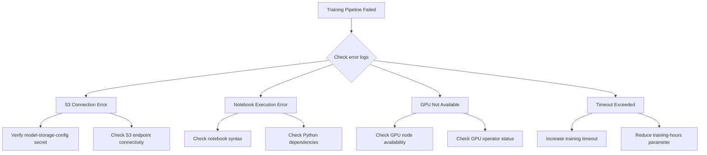

# Runbook: ML Model Training Operations

**Owner**: Platform Engineering Team / ML Engineering
**Risk Level**: Medium
**Last Updated**: 2026-09-29
**Last Tested**: 2026-09-29
**Approved By**: Platform Architect
**Version**: 1.0.0

---

## Quick Reference

| Attribute | Value |
|-----------|-------|
| **Execution Time** | Variable: 15 min (synthetic) to 6 hours (full GPU training) |
| **Impact Window** | No downtime. Model serving continues during retraining. |
| **Rollback Time** | ~5 minutes (revert InferenceService to prior model version) |
| **Prerequisites** | Running platform, S3/NooBaa credentials, Tekton CLI |

---

## Scope and Use Case

### When to Use This Runbook

Use this runbook to manage the full lifecycle of ML model training, including scheduled retraining, failure recovery, artifact management, model rollback, and GPU resource management.

**Triggers**:
- Scheduled weekly retraining (cron-based)
- Model drift detection alert
- Training pipeline failure requiring manual intervention
- Model rollback after degraded prediction quality

### Expected Outcome

Updated ML models deployed via KServe InferenceServices with validated prediction accuracy.

### What This Does NOT Cover

- Initial platform deployment (see [platform-deployment.md](platform-deployment.md))
- Coordination engine configuration
- Alert configuration (see [monitoring-and-alerting.md](monitoring-and-alerting.md))

---

## Platform Models Overview

| Model | Pipeline | Notebook | Runtime | Schedule |
|-------|----------|----------|---------|----------|
| **anomaly-detector** | `model-training-pipeline` (CPU) | `01-isolation-forest-implementation.ipynb` | scikit-learn (Isolation Forest) | Sundays 02:00 UTC |
| **predictive-analytics** | `model-training-pipeline-gpu` (GPU) | `05-predictive-analytics-kserve.ipynb` | XGBoost/LSTM ensemble | Sundays 03:00 UTC |

---

## Prerequisites

### Required Access and Permissions

- [ ] `oc` CLI logged in with cluster-admin or namespace-admin for `self-healing-platform`
- [ ] `tkn` CLI installed (Tekton CLI)
- [ ] S3 bucket credentials configured (model-storage-config secret)

### Required Tools

- [ ] `oc` 4.18+
- [ ] `tkn` 0.38.1+
- [ ] `kubectl` 1.31+

**Verify access**:

```bash
oc whoami
tkn version
oc get secret model-storage-config -n self-healing-platform -o name
```

### System State Requirements

- [ ] Platform is deployed and ArgoCD application is `Synced - Healthy`
- [ ] Tekton Pipelines operator is installed and running
- [ ] S3 storage (NooBaa or AWS S3) is accessible
- [ ] For GPU training: at least one GPU node is available

---

## Procedure 1: Scheduled Model Retraining

### Overview

Models retrain automatically on a weekly schedule via Tekton CronJobs. This section describes how to verify and manage the schedule.

### Check Current Schedule

```bash
oc get cronjobs -n self-healing-platform -l component=model-training
```

**Expected output**:

```
NAME                                    SCHEDULE      SUSPEND   ACTIVE
train-anomaly-detector-cron             0 2 * * 0     False     0
train-predictive-analytics-cron         0 3 * * 0     False     0
```

### Modify Training Schedule

Edit `values-hub.yaml` to change the cron schedule:

```yaml
tekton:
  modelTraining:
    anomalyDetector:
      schedule: "0 2 * * 0"    # Every Sunday at 02:00 UTC
    predictiveAnalytics:
      schedule: "0 3 * * 0"    # Every Sunday at 03:00 UTC
```

Commit, push, and sync ArgoCD:

```bash
git add values-hub.yaml
git commit -s -m "chore(training): update model training schedule"
git push origin main
oc annotate application self-healing-platform -n self-healing-platform-hub \
  argocd.argoproj.io/refresh=hard --overwrite
```

### Suspend or Resume Scheduled Training

**Suspend**:

```bash
oc patch cronjob train-anomaly-detector-cron -n self-healing-platform \
  -p '{"spec":{"suspend":true}}'
```

**Resume**:

```bash
oc patch cronjob train-anomaly-detector-cron -n self-healing-platform \
  -p '{"spec":{"suspend":false}}'
```

---

## Procedure 2: Manual Model Training

### Trigger Anomaly Detector Training (CPU)

```bash
./scripts/trigger-model-training.sh anomaly-detector 168 prometheus
```

Or use `tkn` directly:

```bash
tkn pipeline start model-training-pipeline \
  -p model-name=anomaly-detector \
  -p notebook-path=notebooks/02-anomaly-detection/01-isolation-forest-implementation.ipynb \
  -p data-source=prometheus \
  -p training-hours=168 \
  -p inference-service-name=anomaly-detector \
  -p health-check-enabled=true \
  -p git-url=https://github.com/YOUR-USERNAME/openshift-aiops-platform.git \
  -p git-ref=main \
  -n self-healing-platform --showlog
```

**Expected duration**: 15-30 minutes.

### Trigger Predictive Analytics Training (GPU)

```bash
./scripts/trigger-model-training.sh predictive-analytics 720 prometheus
```

Or use `tkn` directly:

```bash
tkn pipeline start model-training-pipeline-gpu \
  -p model-name=predictive-analytics \
  -p notebook-path=notebooks/02-anomaly-detection/05-predictive-analytics-kserve.ipynb \
  -p data-source=prometheus \
  -p training-hours=720 \
  -p inference-service-name=predictive-analytics \
  -p health-check-enabled=true \
  -p git-url=https://github.com/YOUR-USERNAME/openshift-aiops-platform.git \
  -p git-ref=main \
  -n self-healing-platform --showlog
```

**Expected duration**: 2-6 hours (GPU-dependent).

### Data Source Options

| Source | Description | Use Case |
|--------|-------------|----------|
| `synthetic` | 100% generated data | Development, fast iteration |
| `prometheus` | Real cluster metrics + synthetic anomalies | Production retraining |
| `hybrid` | 50% Prometheus + 50% synthetic | Staging validation |

---

## Procedure 3: Training Pipeline Failure Recovery

### Step 1: Identify the Failure

```bash
./scripts/check-training-status.sh
```

Or manually:

```bash
tkn pipelinerun list -n self-healing-platform --label model-name=anomaly-detector
```

### Step 2: View Failure Logs

```bash
tkn pipelinerun logs <PIPELINERUN_NAME> -n self-healing-platform
```

Replace `<PIPELINERUN_NAME>` with the name from Step 1.

### Step 3: Diagnose Common Failures



### Step 4: Fix and Retry

#### S3 Connection Error

```bash
oc get secret model-storage-config -n self-healing-platform -o yaml
oc describe externalsecret model-storage-secret -n self-healing-platform
```

If credentials are missing, re-run prerequisites:

```bash
make operator-deploy-prereqs
```

#### Notebook Execution Error

Check the notebook job logs:

```bash
oc logs -n self-healing-platform job/<notebook-job-name> --tail=200
```

Fix the notebook and push changes, then retry:

```bash
./scripts/trigger-model-training.sh anomaly-detector 168 prometheus
```

#### GPU Not Available

```bash
oc get nodes -l nvidia.com/gpu.present=true
oc get csv -n openshift-operators | grep gpu-operator
oc get pods -n nvidia-gpu-operator
```

If no GPU nodes exist, use CPU training with synthetic data:

```bash
./scripts/trigger-model-training.sh anomaly-detector 24 synthetic
```

---

## Procedure 4: Model Artifact Management

### List Model Artifacts in S3

For NooBaa:

```bash
oc exec -n self-healing-platform deployment/self-healing-coordination-engine -- \
  curl -s http://localhost:8080/api/v1/status | python3 -m json.tool
```

### Verify Model Storage PVCs

```bash
oc get pvc -n self-healing-platform | grep model
```

**Expected output**:

```
model-storage          Bound    pvc-xxx   10Gi       RWX    ocs-storagecluster-cephfs
model-storage-gpu      Bound    pvc-yyy   10Gi       RWO    gp3-csi
```

### Check Model Artifacts on PVC

```bash
oc exec -it self-healing-workbench-0 -n self-healing-platform -- \
  ls -lhR /opt/app-root/src/models/
```

**Expected structure**:

```
/opt/app-root/src/models/
  anomaly-detector/
    v1/
      model.pkl
      metadata.json
  predictive-analytics/
    v1/
      model.bst
      metadata.json
```

---

## Procedure 5: Model Rollback

### When to Rollback

- Prediction accuracy drops below the baseline threshold
- False positive rate exceeds 5%
- InferenceService health checks fail after retraining

### Step 1: Identify Available Model Versions

```bash
oc exec -it self-healing-workbench-0 -n self-healing-platform -- \
  ls -lt /opt/app-root/src/models/anomaly-detector/
```

### Step 2: Rollback InferenceService

Restart the InferenceService to reload the previous model:

```bash
oc rollout restart deployment -n self-healing-platform \
  -l serving.kserve.io/inferenceservice=anomaly-detector
```

### Step 3: Verify Rollback

```bash
oc get inferenceservice anomaly-detector -n self-healing-platform
```

Confirm `READY=True` and test inference:

```bash
oc exec -n self-healing-platform deployment/self-healing-coordination-engine -- \
  curl -s -X POST http://anomaly-detector-stable:8080/v1/models/anomaly-detector:predict \
  -H "Content-Type: application/json" \
  -d '{"instances": [[0.5, 0.3, 0.8, 0.2, 0.6]]}'
```

**Success criteria**: HTTP 200 response with valid prediction output.

### Step 4: Suspend Automated Retraining (Temporary)

Prevent the next scheduled training from overwriting the rollback:

```bash
oc patch cronjob train-anomaly-detector-cron -n self-healing-platform \
  -p '{"spec":{"suspend":true}}'
```

Resume after the root cause is resolved.

---

## Procedure 6: GPU Resource Management

### Check GPU Availability

```bash
oc get nodes -l nvidia.com/gpu.present=true -o custom-columns=NAME:.metadata.name,GPU:.status.allocatable.'nvidia\.com/gpu'
```

### Monitor GPU Utilization

In Prometheus or via CLI:

```bash
oc exec -n openshift-monitoring prometheus-k8s-0 -- \
  curl -s 'http://localhost:9090/api/v1/query?query=DCGM_FI_DEV_GPU_UTIL' | python3 -m json.tool
```

Key GPU metrics:

| Metric | Description | Alert Threshold |
|--------|-------------|-----------------|
| `DCGM_FI_DEV_GPU_UTIL` | GPU compute utilization (%) | Sustained >95% for 30 min |
| `DCGM_FI_DEV_MEM_COPY_UTIL` | GPU memory utilization (%) | >90% |
| `DCGM_FI_DEV_GPU_TEMP` | GPU temperature (Celsius) | >85C |

### Add GPU Machine Pool (ROSA)

```bash
rosa create machinepool --cluster=<cluster-name> \
  --name=gpu-pool \
  --instance-type=g5.2xlarge \
  --replicas=1
```

Wait for the node to join and verify:

```bash
oc get nodes -l nvidia.com/gpu.present=true --watch
```

---

## Procedure 7: Monitor Model Drift and Performance

### Check Model Prediction Quality

Run the model performance monitoring notebook:

```bash
oc port-forward self-healing-workbench-0 8888:8888 -n self-healing-platform
```

Open `http://localhost:8888` and navigate to `notebooks/07-monitoring-operations/model-performance-monitoring.ipynb`.

### Key Performance Indicators

| KPI | Target | Alert Threshold |
|-----|--------|-----------------|
| Anomaly detection precision | >85% | <75% |
| False positive rate | <5% | >10% |
| Inference latency (P95) | <500ms | >2s |
| Model training success rate | >95% | <80% |

### Prometheus Queries for Model Health

```promql
# Inference request rate
rate(kserve_request_count_total{namespace="self-healing-platform"}[5m])

# Inference latency P95
histogram_quantile(0.95, rate(kserve_request_latency_bucket{namespace="self-healing-platform"}[5m]))

# Model errors
rate(kserve_request_count_total{namespace="self-healing-platform",response_code!="200"}[5m])
```

---

## Verification and Success Criteria

### After Any Training Run

- [ ] PipelineRun shows `Succeeded` status
- [ ] Model artifacts exist in S3 or PVC
- [ ] InferenceService shows `READY=True`
- [ ] Inference endpoint returns valid predictions
- [ ] No increase in error rate for 10 minutes after deployment

---

## Escalation Path

| Severity | First Contact | Response Time | Next Escalation |
|----------|---------------|---------------|-----------------|
| **P1**: All models offline | On-call engineer | Immediate | Engineering Manager (15 min) |
| **P2**: Training pipeline repeatedly failing | Team Slack #aiops-platform | 30 minutes | ML Engineer (1 hour) |
| **P3**: Model drift detected | Team Slack #aiops-platform | 4 hours | N/A |

---

## Appendix

### Related Runbooks

- [Platform Deployment](platform-deployment.md)
- [Incident Response](incident-response.md) (InferenceService failure)
- [Monitoring and Alerting](monitoring-and-alerting.md)

### Reference Documentation

- [ADR-053: Tekton Model Training Pipelines](../adrs/053-tekton-model-training-pipelines.md)
- [ADR-054: InferenceService Model Readiness Race Condition](../adrs/054-inferenceservice-model-readiness-race-condition.md)
- [ADR-041: Model Storage and Versioning Strategy](../adrs/041-model-storage-and-versioning-strategy.md)
- Training trigger script: `scripts/trigger-model-training.sh`
- Training status script: `scripts/check-training-status.sh`

### Version History

| Version | Date | Author | Changes |
|---------|------|--------|---------|
| 1.0.0 | 2026-09-29 | Platform Engineering | Initial version |

---

**Last Reviewed**: 2026-09-29
**Next Review**: 2026-12-29
**Feedback**: Report issues at https://github.com/KubeHeal/openshift-aiops-platform/issues
