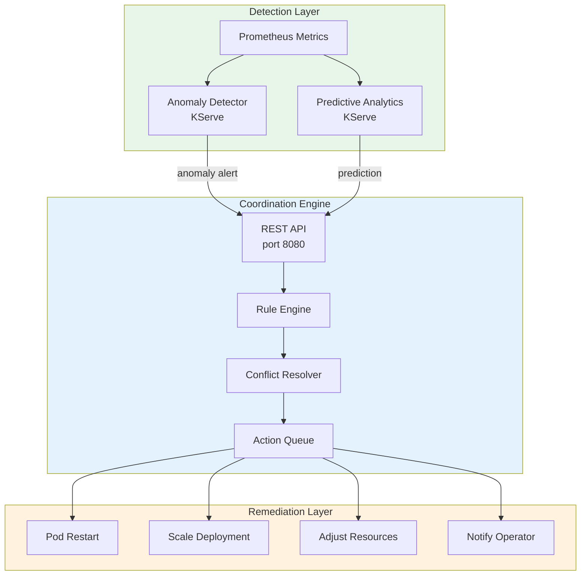

# Integrate with the Coordination Engine

**Learning Objective**: Integrate your ML models and custom automation with the Go-based coordination engine. Register remediation actions, configure rule priorities, test end-to-end self-healing, and monitor the engine's decisions.

**Level**: Intermediate
**Time**: ~75 minutes
**Last Updated**: 2026-09-29

---

## What You Will Build

By the end of this tutorial, you will have:

- A working connection to the coordination engine REST API
- Custom remediation actions registered with the engine
- Deterministic rules for known failure patterns
- AI-driven rules that use your deployed ML models
- An end-to-end test that triggers anomaly detection and automated remediation
- A monitoring setup that tracks engine decisions and outcomes

**Technologies Used**:

- Coordination Engine (Go-based, external repo)
- KServe InferenceServices (anomaly-detector, predictive-analytics)
- Prometheus (metrics and alerts)
- Python (notebook integration)

---

## Prerequisites

### Required Knowledge

- Familiarity with REST APIs (HTTP methods, JSON payloads)
- Completed the [End-to-End Anomaly Detection](./end-to-end-anomaly-detection.md) tutorial
- Basic understanding of self-healing concepts (detection, diagnosis, remediation)

### Required Tools

- [ ] OpenShift cluster with the Self-Healing Platform deployed
- [ ] `oc` CLI installed and logged into the cluster
- [ ] Coordination engine running in `self-healing-platform` namespace
- [ ] At least one KServe InferenceService deployed

**Verify your setup**:

```bash
# Check coordination engine is running
oc get deployment coordination-engine -n self-healing-platform

# Test health endpoint
oc exec -n self-healing-platform deployment/coordination-engine -- \
  curl -s http://localhost:8080/health
```

**Expected output**:

```json
{"status":"healthy"}
```

If the coordination engine is not running, deploy prerequisites first:

```bash
make operator-deploy-prereqs
```

---

## Architecture Overview

The coordination engine sits at the center of the self-healing loop. It receives anomaly reports from ML models and dispatches remediation actions.



**Key API endpoints**:

| Endpoint | Method | Purpose |
|----------|--------|---------|
| `/health` | GET | Health check |
| `/api/v1/anomalies` | POST | Submit an anomaly report |
| `/api/v1/anomalies` | GET | List recent anomalies |
| `/api/v1/status` | GET | Get engine status |
| `/metrics` | GET | Prometheus metrics |

---

## Step 1: Connect to the Coordination Engine (10 Minutes)

### 1.1 Access the Workbench

```bash
oc port-forward self-healing-workbench-0 8888:8888 -n self-healing-platform
```

Open http://localhost:8888 and create a new notebook at:
`/opt/app-root/src/tutorials/coordination/coordination-integration.ipynb`

### 1.2 Set Up the API Client

```python
# Cell 1: Set up the coordination engine client
import requests
import json
import time
from datetime import datetime

# The coordination engine is accessible via its Kubernetes service
ENGINE_URL = "http://coordination-engine.self-healing-platform.svc:8080"

def call_engine(method, path, data=None, timeout=30):
    """Make a request to the coordination engine API."""
    url = f"{ENGINE_URL}{path}"
    try:
        if method == "GET":
            response = requests.get(url, timeout=timeout)
        elif method == "POST":
            response = requests.post(url, json=data, timeout=timeout)
        else:
            raise ValueError(f"Unsupported method: {method}")

        return {
            "status_code": response.status_code,
            "body": response.json() if response.headers.get("content-type", "").startswith("application/json") else response.text,
        }
    except requests.exceptions.RequestException as e:
        return {"status_code": 0, "body": str(e)}

# Test the connection
result = call_engine("GET", "/health")
print(f"Health check: {json.dumps(result, indent=2)}")
```

**Expected output**:

```json
{
  "status_code": 200,
  "body": {
    "status": "healthy"
  }
}
```

### 1.3 Check Engine Status

```python
# Cell 2: Get detailed engine status
result = call_engine("GET", "/api/v1/status")
print(f"Engine status:")
print(json.dumps(result["body"], indent=2))
```

This returns information about the engine version, connected models, and active rules.

Checkpoint: You can communicate with the coordination engine from within the workbench.

---

## Step 2: Submit Anomalies to the Engine (15 Minutes)

### 2.1 Understand the Anomaly Report Format

The coordination engine accepts anomaly reports in the following format:

```python
# Cell 3: Define anomaly report structure
ANOMALY_TEMPLATE = {
    "timestamp": "",           # ISO 8601 timestamp
    "type": "",                # Anomaly type: resource_exhaustion, crash_loop, etc.
    "severity": "",            # Severity: info, warning, critical
    "source": "",              # Detection source: ml-model, prometheus-alert, etc.
    "namespace": "",           # Affected namespace
    "resource": "",            # Affected resource (pod, deployment, node)
    "details": {},             # Additional context
    "confidence_score": 0.0,   # Model confidence (0.0 to 1.0)
    "recommended_action": "",  # Suggested remediation
}

print("Anomaly report fields:")
for key, value in ANOMALY_TEMPLATE.items():
    print(f"  {key}: {type(value).__name__}")
```

### 2.2 Submit a Test Anomaly

```python
# Cell 4: Submit a simulated high-memory anomaly
test_anomaly = {
    "timestamp": datetime.now().isoformat(),
    "type": "resource_exhaustion",
    "severity": "warning",
    "source": "tutorial-notebook",
    "namespace": "self-healing-platform",
    "resource": "deployment/test-app",
    "details": {
        "metric": "memory_usage_ratio",
        "current_value": 0.87,
        "threshold": 0.85,
        "pod": "test-app-abc123",
        "container": "main",
    },
    "confidence_score": 0.92,
    "recommended_action": "restart_pod",
}

result = call_engine("POST", "/api/v1/anomalies", data=test_anomaly)
print(f"Submit result ({result['status_code']}):")
print(json.dumps(result["body"], indent=2))
```

### 2.3 Submit Multiple Anomaly Types

```python
# Cell 5: Submit different anomaly types
anomaly_types = [
    {
        "type": "crash_loop",
        "severity": "critical",
        "resource": "pod/unstable-service-xyz",
        "details": {
            "restart_count": 5,
            "last_exit_code": 137,
            "reason": "OOMKilled",
        },
        "confidence_score": 0.99,
        "recommended_action": "increase_memory_limit",
    },
    {
        "type": "network_anomaly",
        "severity": "warning",
        "resource": "service/api-gateway",
        "details": {
            "metric": "request_latency_p99",
            "current_value_ms": 2500,
            "baseline_ms": 200,
        },
        "confidence_score": 0.78,
        "recommended_action": "scale_up",
    },
    {
        "type": "cpu_throttling",
        "severity": "info",
        "resource": "deployment/batch-processor",
        "details": {
            "throttle_rate": 0.35,
            "cpu_request": "500m",
            "cpu_limit": "1000m",
        },
        "confidence_score": 0.85,
        "recommended_action": "increase_cpu_limit",
    },
]

for anomaly_data in anomaly_types:
    anomaly_data["timestamp"] = datetime.now().isoformat()
    anomaly_data["source"] = "tutorial-notebook"
    anomaly_data["namespace"] = "self-healing-platform"

    result = call_engine("POST", "/api/v1/anomalies", data=anomaly_data)
    status = "OK" if result["status_code"] in [200, 201, 202] else "FAILED"
    print(f"  [{status}] {anomaly_data['type']} - {anomaly_data['severity']}")
```

### 2.4 Query Submitted Anomalies

```python
# Cell 6: List recent anomalies
result = call_engine("GET", "/api/v1/anomalies")
if result["status_code"] == 200:
    anomalies = result["body"]
    if isinstance(anomalies, list):
        print(f"Recent anomalies ({len(anomalies)}):")
        for a in anomalies[:10]:
            print(f"  [{a.get('severity', 'unknown'):8s}] "
                  f"{a.get('type', 'unknown'):25s} "
                  f"confidence={a.get('confidence_score', 0):.2f}")
    else:
        print(json.dumps(anomalies, indent=2))
else:
    print(f"Query failed: {result}")
```

Checkpoint: You can submit and query anomalies through the coordination engine API.

---

## Step 3: Configure Deterministic Rules (10 Minutes)

### 3.1 Understand Rule Types

The coordination engine supports two rule categories:

| Category | When to Use | Example |
|----------|------------|---------|
| **Deterministic** | Known failure patterns with well-defined remediation | Restart OOMKilled pods |
| **AI-Driven** | Novel patterns where ML models guide decisions | Anomaly detection-based scaling |

### 3.2 Create Deterministic Remediation Rules

In the workbench terminal, create a ConfigMap with remediation rules:

```bash
cat > /tmp/tutorial-remediation-rules.yaml <<'EOF'
apiVersion: v1
kind: ConfigMap
metadata:
  name: tutorial-remediation-rules
  namespace: self-healing-platform
  labels:
    app.kubernetes.io/part-of: self-healing-platform
data:
  rules.yaml: |
    # Deterministic rules for known failure patterns
    deterministic_rules:

      # Rule 1: Restart OOMKilled pods
      - name: restart-oomkilled-pods
        description: "Restart pods killed by OOM and increase memory limit"
        trigger:
          type: crash_loop
          conditions:
            - field: details.reason
              operator: equals
              value: "OOMKilled"
            - field: details.restart_count
              operator: greater_than
              value: 3
        action:
          type: increase_memory_limit
          parameters:
            multiplier: 2.5
            max_limit: "2Gi"
        priority: high
        cooldown_seconds: 300

      # Rule 2: Scale up on sustained high CPU
      - name: scale-on-high-cpu
        description: "Scale deployment when CPU exceeds 85% for 5 minutes"
        trigger:
          type: cpu_throttling
          conditions:
            - field: details.throttle_rate
              operator: greater_than
              value: 0.25
        action:
          type: scale_up
          parameters:
            increment: 1
            max_replicas: 10
        priority: medium
        cooldown_seconds: 600

      # Rule 3: Notify on network latency spikes
      - name: notify-network-latency
        description: "Send notification when p99 latency exceeds 5x baseline"
        trigger:
          type: network_anomaly
          conditions:
            - field: details.current_value_ms
              operator: greater_than
              value: 1000
        action:
          type: notify
          parameters:
            channels:
              - coordination-engine-log
        priority: low
        cooldown_seconds: 900

    # AI-driven rules that use ML model confidence scores
    ai_driven_rules:

      # Rule 4: ML-based anomaly response
      - name: ml-anomaly-response
        description: "Take action based on ML model confidence score"
        trigger:
          source: ml-model
          conditions:
            - field: confidence_score
              operator: greater_than
              value: 0.85
            - field: severity
              operator: in
              value: ["warning", "critical"]
        action:
          type: recommended_action
          parameters:
            use_model_recommendation: true
            require_approval_above: 0.95
        priority: medium
        cooldown_seconds: 300
EOF

oc apply -f /tmp/tutorial-remediation-rules.yaml
```

### 3.3 Verify Rules Are Loaded

```bash
oc get configmap tutorial-remediation-rules -n self-healing-platform -o yaml | head -20
```

Checkpoint: Remediation rules are deployed as a ConfigMap in the platform namespace.

---

## Step 4: Connect ML Models to the Engine (15 Minutes)

### 4.1 Create a Detection-to-Engine Bridge

Back in your notebook, create a function that queries your ML model and reports anomalies to the engine:

```python
# Cell 7: Build the ML detection bridge
import numpy as np
import subprocess

def get_model_prediction(model_name, features):
    """Query a KServe InferenceService for predictions."""
    try:
        result = subprocess.run(
            ["oc", "get", "pod", "-n", "self-healing-platform",
             "-l", f"serving.kserve.io/inferenceservice={model_name}",
             "-o", "jsonpath={.items[0].status.podIP}"],
            capture_output=True, text=True, check=True,
        )
        pod_ip = result.stdout.strip()
        if not pod_ip:
            return None

        url = f"http://{pod_ip}:8080/v1/models/{model_name}:predict"
        response = requests.post(url, json={"instances": [features]}, timeout=10)

        if response.status_code == 200:
            return response.json()["predictions"][0]
    except Exception as e:
        print(f"  Model query failed: {e}")
    return None

def detect_and_report(metric_name, metric_value, pod_name, threshold=0.85):
    """Run anomaly detection and report results to the coordination engine."""
    print(f"\nChecking {metric_name} for {pod_name}: {metric_value:.4f}")

    # Simple threshold check (deterministic)
    if metric_value > threshold:
        severity = "critical" if metric_value > 0.95 else "warning"

        anomaly = {
            "timestamp": datetime.now().isoformat(),
            "type": "resource_exhaustion",
            "severity": severity,
            "source": "hybrid-detection",
            "namespace": "self-healing-platform",
            "resource": f"pod/{pod_name}",
            "details": {
                "metric": metric_name,
                "current_value": round(metric_value, 4),
                "threshold": threshold,
            },
            "confidence_score": min(metric_value / threshold, 1.0),
            "recommended_action": "restart_pod" if severity == "critical" else "scale_up",
        }

        result = call_engine("POST", "/api/v1/anomalies", data=anomaly)
        status = "Reported" if result["status_code"] in [200, 201, 202] else "Failed"
        print(f"  Anomaly detected ({severity}). {status} to coordination engine.")
        return True

    print(f"  Normal (below threshold {threshold})")
    return False

# Test the detection bridge
detect_and_report("cpu_usage", 0.92, "test-pod-001", threshold=0.85)
detect_and_report("cpu_usage", 0.45, "test-pod-002", threshold=0.85)
```

### 4.2 Build a Monitoring Loop

```python
# Cell 8: Continuous monitoring loop (single iteration for tutorial)
from prometheus_api_client import PrometheusConnect

PROMETHEUS_URL = "http://prometheus-k8s.openshift-monitoring.svc:9090"
prom = PrometheusConnect(url=PROMETHEUS_URL, disable_ssl=True)

def run_monitoring_cycle():
    """Execute one monitoring cycle: collect metrics, detect anomalies, report."""
    print("=" * 60)
    print(f"Monitoring Cycle: {datetime.now().isoformat()}")
    print("=" * 60)

    # Query current CPU usage per pod
    cpu_query = 'sum(rate(container_cpu_usage_seconds_total{namespace="self-healing-platform"}[5m])) by (pod)'
    cpu_result = prom.custom_query(query=cpu_query)

    anomaly_count = 0
    for metric in cpu_result:
        pod = metric["metric"].get("pod", "unknown")
        cpu_value = float(metric["value"][1])

        # Skip very low values (idle pods)
        if cpu_value < 0.01:
            continue

        if detect_and_report("cpu_usage", cpu_value, pod, threshold=0.5):
            anomaly_count += 1

    # Query memory usage ratio
    mem_query = (
        'sum(container_memory_usage_bytes{namespace="self-healing-platform"}) by (pod) / '
        'sum(container_spec_memory_limit_bytes{namespace="self-healing-platform"}) by (pod)'
    )
    mem_result = prom.custom_query(query=mem_query)

    for metric in mem_result:
        pod = metric["metric"].get("pod", "unknown")
        mem_ratio = float(metric["value"][1])

        if detect_and_report("memory_ratio", mem_ratio, pod, threshold=0.85):
            anomaly_count += 1

    print(f"\nCycle complete: {anomaly_count} anomalies detected and reported")
    return anomaly_count

# Run one cycle
run_monitoring_cycle()
```

Checkpoint: The monitoring loop queries Prometheus, detects anomalies, and reports them to the coordination engine.

---

## Step 5: Test End-to-End Self-Healing (15 Minutes)

### 5.1 Create a Test Application

Deploy a simple application that you will use to test self-healing:

```bash
cat > /tmp/test-self-healing-app.yaml <<'EOF'
apiVersion: apps/v1
kind: Deployment
metadata:
  name: tutorial-test-app
  namespace: self-healing-platform
  labels:
    app: tutorial-test-app
spec:
  replicas: 1
  selector:
    matchLabels:
      app: tutorial-test-app
  template:
    metadata:
      labels:
        app: tutorial-test-app
    spec:
      containers:
      - name: app
        image: registry.access.redhat.com/ubi9/ubi-minimal:latest
        command: ["sh", "-c", "while true; do echo 'running'; sleep 10; done"]
        resources:
          requests:
            cpu: "100m"
            memory: "128Mi"
          limits:
            cpu: "500m"
            memory: "256Mi"
EOF

oc apply -f /tmp/test-self-healing-app.yaml

# Wait for the pod to be ready
oc rollout status deployment/tutorial-test-app -n self-healing-platform
```

### 5.2 Simulate a Failure Scenario

Submit an anomaly report that represents a real failure:

```python
# Cell 9: Simulate a critical OOMKill scenario
oom_anomaly = {
    "timestamp": datetime.now().isoformat(),
    "type": "crash_loop",
    "severity": "critical",
    "source": "kubernetes-events",
    "namespace": "self-healing-platform",
    "resource": "deployment/tutorial-test-app",
    "details": {
        "reason": "OOMKilled",
        "restart_count": 5,
        "last_exit_code": 137,
        "pod": "tutorial-test-app-abc123",
        "container": "app",
        "memory_request": "128Mi",
        "memory_limit": "256Mi",
    },
    "confidence_score": 0.99,
    "recommended_action": "increase_memory_limit",
}

result = call_engine("POST", "/api/v1/anomalies", data=oom_anomaly)
print(f"OOMKill anomaly submitted ({result['status_code']})")
print(json.dumps(result["body"], indent=2))
```

### 5.3 Check the Engine Response

```python
# Cell 10: Monitor the engine's response
print("Waiting 10 seconds for the engine to process the anomaly...")
time.sleep(10)

# Check engine status
status = call_engine("GET", "/api/v1/status")
print(f"\nEngine Status:")
print(json.dumps(status["body"], indent=2))

# Check recent anomalies
anomalies = call_engine("GET", "/api/v1/anomalies")
if anomalies["status_code"] == 200 and isinstance(anomalies["body"], list):
    recent = [a for a in anomalies["body"] if a.get("type") == "crash_loop"]
    print(f"\nRecent crash_loop anomalies: {len(recent)}")
    for a in recent[:3]:
        print(f"  [{a.get('severity')}] {a.get('resource')} "
              f"confidence={a.get('confidence_score', 0)}")
```

### 5.4 View Engine Logs

```bash
# From a separate terminal, check coordination engine logs
oc logs -n self-healing-platform deployment/coordination-engine --tail=30
```

Look for log entries that show:

- Anomaly received
- Rule evaluation
- Action queued or executed
- Outcome recorded

### 5.5 Clean Up Test Application

```bash
oc delete deployment tutorial-test-app -n self-healing-platform
```

---

## Step 6: Monitor Engine Decisions (10 Minutes)

### 6.1 Query Engine Metrics

```python
# Cell 11: Query coordination engine Prometheus metrics
engine_metrics = [
    "coordination_engine_anomalies_received_total",
    "coordination_engine_remediations_executed_total",
    "coordination_engine_processing_duration_seconds",
]

print("Coordination Engine Metrics:")
for metric in engine_metrics:
    try:
        result = prom.custom_query(query=metric)
        if result:
            for series in result:
                labels = series.get("metric", {})
                value = series["value"][1]
                label_str = ", ".join(f"{k}={v}" for k, v in labels.items()
                                      if k != "__name__")
                print(f"  {metric}({label_str}): {value}")
        else:
            print(f"  {metric}: no data")
    except Exception as e:
        print(f"  {metric}: query error ({e})")
```

### 6.2 Build a Decision Summary

```python
# Cell 12: Create a summary of engine activity
def get_engine_summary():
    """Collect and display a summary of engine activity."""
    print("=" * 60)
    print("Coordination Engine Decision Summary")
    print("=" * 60)

    # Get status
    status = call_engine("GET", "/api/v1/status")
    if status["status_code"] == 200:
        body = status["body"]
        print(f"\nEngine Version: {body.get('version', 'unknown')}")
        print(f"Uptime: {body.get('uptime', 'unknown')}")

    # Get anomaly counts
    anomalies = call_engine("GET", "/api/v1/anomalies")
    if anomalies["status_code"] == 200 and isinstance(anomalies["body"], list):
        all_anomalies = anomalies["body"]
        print(f"\nAnomaly Statistics:")
        print(f"  Total anomalies: {len(all_anomalies)}")

        # Count by severity
        severity_counts = {}
        for a in all_anomalies:
            sev = a.get("severity", "unknown")
            severity_counts[sev] = severity_counts.get(sev, 0) + 1
        for sev, count in sorted(severity_counts.items()):
            print(f"    {sev}: {count}")

        # Count by type
        type_counts = {}
        for a in all_anomalies:
            atype = a.get("type", "unknown")
            type_counts[atype] = type_counts.get(atype, 0) + 1
        print(f"\n  By type:")
        for atype, count in sorted(type_counts.items()):
            print(f"    {atype}: {count}")

    print("=" * 60)

get_engine_summary()
```

### 6.3 Set Up Continuous Monitoring (Advanced)

For production monitoring, the coordination engine exposes metrics on port 9090. These are automatically scraped by Prometheus via the `prometheus.io/scrape: "true"` annotation on the deployment.

View metrics in the OpenShift console:

1. Navigate to **Observe** > **Metrics** in the OpenShift console.
2. Query: `coordination_engine_anomalies_received_total`
3. Query: `coordination_engine_remediations_executed_total`

---

## Cleanup

Remove tutorial resources:

```bash
# Delete tutorial ConfigMap
oc delete configmap tutorial-remediation-rules -n self-healing-platform --ignore-not-found

# Delete tutorial test application
oc delete deployment tutorial-test-app -n self-healing-platform --ignore-not-found

# Remove tutorial notebook files
rm -rf /opt/app-root/src/tutorials/coordination/
```

---

## What You Learned

In this tutorial, you:

- Connected to the coordination engine REST API from within the workbench
- Submitted anomaly reports with different types, severities, and confidence scores
- Created deterministic remediation rules for known failure patterns
- Built an ML detection bridge that queries KServe models and reports anomalies
- Implemented a monitoring loop that continuously checks Prometheus metrics
- Tested an end-to-end self-healing scenario with a simulated OOMKill failure
- Queried engine metrics and built a decision summary dashboard

---

## Next Steps

### Add External Notifications

- Configure Slack webhook, PagerDuty routing key, or AlertManager URL in `values-hub.yaml`:

```yaml
coordinationEngine:
  alertWebhooks:
    slackWebhookUrl: "https://hooks.slack.com/services/..."
    pagerdutyRoutingKey: "your-routing-key"
    alertmanagerUrl: "http://alertmanager.openshift-monitoring.svc:9093"
```

### Build Custom Remediation Actions

- Fork the coordination engine repository at https://github.com/KubeHeal/openshift-coordination-engine
- Add new action handlers in the Go codebase
- **See**: [ADR-038: Go Coordination Engine Migration](../adrs/038-go-coordination-engine-migration.md)

### Integrate with OpenShift Lightspeed

- Use the MCP server to expose coordination engine tools to Lightspeed
- Enable natural language queries like "What anomalies were detected in the last hour?"
- **See**: [ADR-036: Go-Based Standalone MCP Server](../adrs/036-go-based-standalone-mcp-server.md)

### Automate Training Feedback Loops

- Send remediation outcomes back to the ML training pipeline
- Retrain models with labeled data from successful and failed remediations
- **See**: [Build a Custom Tekton Pipeline](./custom-tekton-pipeline.md)

---

## Troubleshooting

### Coordination Engine Returns 503

The engine may still be starting. Check the init container:

```bash
oc describe pod -n self-healing-platform -l app.kubernetes.io/component=coordination-engine
```

The engine waits for Prometheus to be available before starting. If Prometheus is slow, the init container retries every 10 seconds.

### Anomaly Submission Returns 400

Check the JSON payload structure. All required fields must be present:

```python
# Minimum required fields
required_fields = ["timestamp", "type", "severity", "namespace"]
```

### Engine Logs Show "KServe model not reachable"

Verify your InferenceServices are running:

```bash
oc get inferenceservice -n self-healing-platform
```

If models show `READY=False`, check the predictor pods:

```bash
oc get pods -n self-healing-platform -l serving.kserve.io/inferenceservice
```

### Remediation Actions Not Executing

The coordination engine requires proper RBAC to modify resources. Verify the service account permissions:

```bash
oc describe clusterrolebinding | grep self-healing-operator
```

If permissions are missing, re-run prerequisites:

```bash
make operator-deploy-prereqs
```

---

## Additional Resources

- **[Coordination Engine Repository](https://github.com/KubeHeal/openshift-coordination-engine)** - Source code and API documentation
- **[ADR-002: Hybrid Self-Healing Approach](../adrs/002-hybrid-self-healing-approach.md)** - Core architecture
- **[ADR-038: Go Coordination Engine Migration](../adrs/038-go-coordination-engine-migration.md)** - Engine design
- **[ADR-043: Deployment Stability and Health Checks](../adrs/043-deployment-stability-health-checks.md)** - Health check patterns
- **[Feature Engineering Guide](https://github.com/KubeHeal/openshift-coordination-engine/blob/main/docs/FEATURE-ENGINEERING-GUIDE.md)** - Model feature configuration

---

**Tutorial last tested**: 2026-09-29
**Tested on**: OpenShift 4.22, Coordination Engine v1.2.0, KServe 1.36.1
