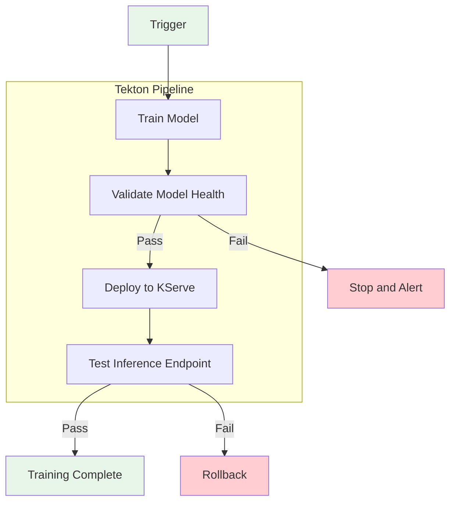

# Build a Custom Tekton Pipeline for Model Training

**Learning Objective**: Build a custom Tekton pipeline that automates training, validation, and deployment of your ML model, with scheduled retraining and event-driven triggers.

**Level**: Intermediate
**Time**: ~60 minutes
**Last Updated**: 2026-09-29

---

## What You Will Build

By the end of this tutorial, you will have created:

- A custom Tekton Task that trains an ML model via a Jupyter notebook
- A multi-stage Pipeline that trains, validates, deploys, and tests the model
- A CronJob trigger for scheduled weekly retraining
- A manual trigger for on-demand retraining
- Monitoring commands for tracking pipeline run status

**Technologies Used**:

- OpenShift Pipelines (Tekton) 1.17.2
- Jupyter Notebook Validator Operator
- KServe 1.36.1 (model serving)
- `tkn` CLI (pipeline management)

---

## Prerequisites

### Required Knowledge

- Familiarity with YAML and Kubernetes resource definitions
- Basic understanding of CI/CD pipeline concepts
- Completed the [End-to-End Anomaly Detection](./end-to-end-anomaly-detection.md) tutorial (or have a trained model)

### Required Tools

- [ ] OpenShift cluster with the Self-Healing Platform deployed
- [ ] `oc` CLI installed and logged into the cluster
- [ ] `tkn` CLI installed (Tekton CLI)
- [ ] Access to the `self-healing-platform` namespace

**Verify your setup**:

```bash
# Confirm Tekton Pipelines operator is installed
oc get csv -n openshift-operators | grep openshift-pipelines

# Confirm tkn CLI
tkn version

# List existing pipelines in the platform namespace
tkn pipeline list -n self-healing-platform
```

**Expected output** includes `model-training-pipeline` and `model-training-pipeline-gpu`.

---

## Architecture Overview

The platform uses Tekton Pipelines to separate model training from ArgoCD deployment sync waves (ADR-053). This gives you flexible triggers and health checks without blocking GitOps.



**Pipeline stages**:

1. **Train**: Execute a Jupyter notebook via the NotebookValidationJob CRD.
2. **Validate**: Verify the model file exists, loads correctly, and produces predictions.
3. **Deploy**: Restart the KServe InferenceService predictor pods to load the new model.
4. **Test**: Send test predictions to the live endpoint and verify responses.

---

## Step 1: Understand the Existing Pipeline (10 Minutes)

### 1.1 Inspect the Platform Pipelines

The platform deploys two built-in pipelines:

```bash
# List all pipelines
tkn pipeline list -n self-healing-platform
```

**Expected output**:

```
NAME                          AGE     LAST RUN   STARTED   DURATION   STATUS
model-training-pipeline       1d      ---        ---       ---        ---
model-training-pipeline-gpu   1d      ---        ---       ---        ---
```

### 1.2 View Pipeline Details

```bash
# View CPU pipeline structure
tkn pipeline describe model-training-pipeline -n self-healing-platform
```

This shows the four tasks: `train-model`, `health-check`, `deploy-model`, and `post-deployment-check`.

### 1.3 List Available Tasks

```bash
# View all tasks used by the pipelines
tkn task list -n self-healing-platform
```

**Key tasks**:

| Task | Purpose |
|------|---------|
| `run-notebook-validation` | Train a CPU-based model via notebook execution |
| `run-notebook-validation-gpu` | Train a GPU-based model via notebook execution |
| `validate-model-health` | Check model file exists and loads correctly |
| `restart-inference-service` | Delete predictor pods to reload the model |
| `test-inference-endpoint` | Send test predictions to the live endpoint |

---

## Step 2: Create a Custom Training Task (10 Minutes)

### 2.1 Define the Custom Task

Create a task that trains a custom model. This example trains a network traffic anomaly detector.

```bash
cat > /tmp/custom-training-task.yaml <<'EOF'
apiVersion: tekton.dev/v1
kind: Task
metadata:
  name: train-network-anomaly-model
  namespace: self-healing-platform
  labels:
    app.kubernetes.io/name: train-network-anomaly-model
    app.kubernetes.io/part-of: custom-model-training
spec:
  description: |
    Trains a network traffic anomaly detection model.
    Uses the NotebookValidationJob CRD to execute a training notebook.

  params:
    - name: notebook-path
      type: string
      default: "notebooks/02-anomaly-detection/01-isolation-forest-implementation.ipynb"
      description: "Path to the training notebook in the Git repository"
    - name: data-source
      type: string
      default: "synthetic"
      description: "Data source mode: synthetic, prometheus, or hybrid"
    - name: training-hours
      type: string
      default: "168"
      description: "Hours of training data to collect (168 = 7 days)"
    - name: git-url
      type: string
      description: "Git repository URL"
    - name: git-ref
      type: string
      default: "main"
      description: "Git branch, tag, or commit"

  results:
    - name: job-name
      type: string
      description: "Name of the created NotebookValidationJob"

  steps:
    - name: create-training-job
      image: image-registry.openshift-image-registry.svc:5000/openshift/cli:latest
      script: |
        #!/bin/bash
        set -e

        NOTEBOOK_PATH="$(params.notebook-path)"
        DATA_SOURCE="$(params.data-source)"
        TRAINING_HOURS="$(params.training-hours)"
        GIT_URL="$(params.git-url)"
        GIT_REF="$(params.git-ref)"
        JOB_NAME="train-network-anomaly-$(date +%s)"

        echo "=========================================="
        echo "Creating Network Anomaly Training Job"
        echo "=========================================="
        echo "Notebook: $NOTEBOOK_PATH"
        echo "Data Source: $DATA_SOURCE"
        echo "Training Hours: $TRAINING_HOURS"
        echo "Job Name: $JOB_NAME"
        echo "=========================================="

        cat <<MANIFEST | oc apply -f -
        apiVersion: mlops.mlops.dev/v1alpha1
        kind: NotebookValidationJob
        metadata:
          name: $JOB_NAME
          namespace: self-healing-platform
          labels:
            model-name: network-anomaly-detector
            triggered-by: custom-tekton-pipeline
        spec:
          notebook:
            path: $NOTEBOOK_PATH
            git:
              url: $GIT_URL
              ref: $GIT_REF
          podConfig:
            containerImage: image-registry.openshift-image-registry.svc:5000/self-healing-platform/notebook-validator:latest
            env:
              - name: DATA_SOURCE
                value: "$DATA_SOURCE"
              - name: PROMETHEUS_URL
                value: "http://prometheus-k8s.openshift-monitoring.svc:9090"
              - name: TRAINING_HOURS
                value: "$TRAINING_HOURS"
            envFrom:
              - secretRef:
                  name: model-storage-config
            serviceAccountName: self-healing-workbench
            volumeMounts:
              - name: model-storage
                mountPath: /mnt/models
            volumes:
              - name: model-storage
                persistentVolumeClaim:
                  claimName: model-storage-pvc
            resources:
              requests:
                memory: "2Gi"
                cpu: "500m"
              limits:
                memory: "8Gi"
                cpu: "4000m"
          timeout: 20m
        MANIFEST

        echo "$JOB_NAME" > $(results.job-name.path)
        echo "Job created: $JOB_NAME"

    - name: wait-for-completion
      image: image-registry.openshift-image-registry.svc:5000/openshift/cli:latest
      script: |
        #!/bin/bash
        set -e

        JOB_NAME=$(cat $(results.job-name.path))
        TIMEOUT=1200
        INTERVAL=15
        ELAPSED=0

        echo "Waiting for job: $JOB_NAME (timeout: ${TIMEOUT}s)"

        while [ $ELAPSED -lt $TIMEOUT ]; do
          PHASE=$(oc get notebookvalidationjob "$JOB_NAME" -n self-healing-platform \
            -o jsonpath='{.status.phase}' 2>/dev/null || echo "Pending")

          case $PHASE in
            Succeeded)
              echo "Training completed successfully"
              exit 0
              ;;
            Failed)
              echo "Training failed"
              oc get notebookvalidationjob "$JOB_NAME" -n self-healing-platform -o yaml
              exit 1
              ;;
            *)
              echo "Status: $PHASE (elapsed: ${ELAPSED}s)"
              ;;
          esac

          sleep $INTERVAL
          ELAPSED=$((ELAPSED + INTERVAL))
        done

        echo "Timeout waiting for training to complete"
        exit 1
EOF
```

### 2.2 Apply the Task

```bash
oc apply -f /tmp/custom-training-task.yaml
```

**Expected output**:

```
task.tekton.dev/train-network-anomaly-model created
```

### 2.3 Verify the Task

```bash
tkn task describe train-network-anomaly-model -n self-healing-platform
```

---

## Step 3: Build the Custom Pipeline (10 Minutes)

### 3.1 Define the Pipeline

```bash
cat > /tmp/custom-model-pipeline.yaml <<'EOF'
apiVersion: tekton.dev/v1
kind: Pipeline
metadata:
  name: custom-model-training-pipeline
  namespace: self-healing-platform
  labels:
    app.kubernetes.io/name: custom-model-training-pipeline
    app.kubernetes.io/part-of: custom-model-training
spec:
  description: |
    Custom pipeline for training, validating, and deploying a network anomaly
    detection model. Follows the same pattern as the platform's built-in
    model-training-pipeline.

  params:
    - name: notebook-path
      type: string
      description: "Path to the training notebook"
    - name: model-name
      type: string
      description: "Name of the model (used for storage and InferenceService)"
    - name: data-source
      type: string
      default: "synthetic"
      description: "Data source mode: synthetic, prometheus, or hybrid"
    - name: training-hours
      type: string
      default: "168"
      description: "Hours of training data"
    - name: inference-service-name
      type: string
      description: "KServe InferenceService to restart after training"
    - name: git-url
      type: string
      description: "Git repository URL"
    - name: git-ref
      type: string
      default: "main"
      description: "Git branch, tag, or commit"

  tasks:
    # Stage 1: Train the model
    - name: train-model
      taskRef:
        kind: Task
        name: train-network-anomaly-model
      params:
        - name: notebook-path
          value: $(params.notebook-path)
        - name: data-source
          value: $(params.data-source)
        - name: training-hours
          value: $(params.training-hours)
        - name: git-url
          value: $(params.git-url)
        - name: git-ref
          value: $(params.git-ref)

    # Stage 2: Validate model health
    - name: validate-model
      runAfter:
        - train-model
      taskRef:
        kind: Task
        name: validate-model-health
      params:
        - name: model-name
          value: $(params.model-name)

    # Stage 3: Deploy to KServe
    - name: deploy-model
      runAfter:
        - validate-model
      taskRef:
        kind: Task
        name: restart-inference-service
      params:
        - name: inference-service-name
          value: $(params.inference-service-name)

    # Stage 4: Test the live endpoint
    - name: test-endpoint
      runAfter:
        - deploy-model
      taskRef:
        kind: Task
        name: test-inference-endpoint
      params:
        - name: inference-service-name
          value: $(params.inference-service-name)
        - name: model-name
          value: $(params.model-name)
EOF
```

### 3.2 Apply the Pipeline

```bash
oc apply -f /tmp/custom-model-pipeline.yaml
```

### 3.3 Verify the Pipeline

```bash
tkn pipeline describe custom-model-training-pipeline -n self-healing-platform
```

**Expected output** shows four tasks in sequence: `train-model` > `validate-model` > `deploy-model` > `test-endpoint`.

Checkpoint: The custom pipeline and task are registered in the `self-healing-platform` namespace.

---

## Step 4: Run the Pipeline Manually (10 Minutes)

### 4.1 Start the Pipeline

Replace `<your-repo-url>` with your fork URL:

```bash
tkn pipeline start custom-model-training-pipeline \
  -p notebook-path=notebooks/02-anomaly-detection/01-isolation-forest-implementation.ipynb \
  -p model-name=anomaly-detector \
  -p data-source=synthetic \
  -p training-hours=24 \
  -p inference-service-name=anomaly-detector \
  -p git-url=https://github.com/YOUR-USERNAME/openshift-aiops-platform.git \
  -p git-ref=main \
  -n self-healing-platform \
  --showlog
```

The `--showlog` flag streams the pipeline output to your terminal in real time.

### 4.2 Monitor the Pipeline Run

If you started the pipeline without `--showlog`, monitor it with:

```bash
# List recent pipeline runs
tkn pipelinerun list -n self-healing-platform

# View logs of the latest run
tkn pipelinerun logs -n self-healing-platform --last -f
```

### 4.3 Check Pipeline Run Status

```bash
# Get the status of the latest run
tkn pipelinerun describe -n self-healing-platform --last
```

**Expected output** shows each task with `Succeeded` status:

```
Name:        custom-model-training-pipeline-run-xxxxx
Status:      Succeeded

Tasks:
  NAME              STATUS
  train-model       Succeeded
  validate-model    Succeeded
  deploy-model      Succeeded
  test-endpoint     Succeeded
```

Checkpoint: The pipeline completes all four stages successfully.

---

## Step 5: Add Validation Tasks (10 Minutes)

### 5.1 Create a Custom Validation Task

Add a data quality check before training:

```bash
cat > /tmp/validate-training-data.yaml <<'EOF'
apiVersion: tekton.dev/v1
kind: Task
metadata:
  name: validate-training-data
  namespace: self-healing-platform
  labels:
    app.kubernetes.io/part-of: custom-model-training
spec:
  description: |
    Validates that sufficient Prometheus training data is available
    before starting model training.

  params:
    - name: data-source
      type: string
    - name: training-hours
      type: string
    - name: namespace
      type: string
      default: "self-healing-platform"

  steps:
    - name: check-prometheus
      image: image-registry.openshift-image-registry.svc:5000/openshift/cli:latest
      script: |
        #!/bin/bash
        set -e

        DATA_SOURCE="$(params.data-source)"
        TRAINING_HOURS="$(params.training-hours)"
        NAMESPACE="$(params.namespace)"

        echo "=========================================="
        echo "Validating Training Data Availability"
        echo "=========================================="
        echo "Data source: $DATA_SOURCE"
        echo "Training hours: $TRAINING_HOURS"

        if [ "$DATA_SOURCE" = "synthetic" ]; then
          echo "Using synthetic data, no Prometheus check required"
          exit 0
        fi

        # Check Prometheus is accessible
        PROM_URL="http://prometheus-k8s.openshift-monitoring.svc:9090"
        echo "Checking Prometheus at $PROM_URL..."

        HTTP_CODE=$(curl -s -o /dev/null -w "%{http_code}" \
          "${PROM_URL}/api/v1/status/config" 2>/dev/null || echo "000")

        if [ "$HTTP_CODE" != "200" ]; then
          echo "ERROR: Prometheus is not accessible (HTTP $HTTP_CODE)"
          exit 1
        fi
        echo "Prometheus is accessible"

        # Check that metrics exist for the target namespace
        QUERY="count(container_cpu_usage_seconds_total{namespace=\"${NAMESPACE}\"})"
        RESULT=$(curl -s "${PROM_URL}/api/v1/query?query=${QUERY}" | \
          python3 -c "import sys,json; d=json.load(sys.stdin); print(d['data']['result'][0]['value'][1] if d['data']['result'] else '0')" 2>/dev/null || echo "0")

        echo "Active CPU metric series: $RESULT"

        if [ "$RESULT" = "0" ]; then
          echo "WARNING: No CPU metrics found for namespace $NAMESPACE"
          echo "Training will use default/generated data"
        else
          echo "Sufficient metrics available for training"
        fi

        echo "=========================================="
        echo "Validation PASSED"
        echo "=========================================="
EOF

oc apply -f /tmp/validate-training-data.yaml
```

### 5.2 Update the Pipeline to Include Validation

Create an enhanced pipeline that runs data validation first:

```bash
cat > /tmp/enhanced-pipeline.yaml <<'EOF'
apiVersion: tekton.dev/v1
kind: Pipeline
metadata:
  name: enhanced-model-training-pipeline
  namespace: self-healing-platform
  labels:
    app.kubernetes.io/name: enhanced-model-training-pipeline
    app.kubernetes.io/part-of: custom-model-training
spec:
  description: |
    Enhanced pipeline with pre-training data validation.
    Stages: validate-data > train > validate-model > deploy > test

  params:
    - name: notebook-path
      type: string
    - name: model-name
      type: string
    - name: data-source
      type: string
      default: "synthetic"
    - name: training-hours
      type: string
      default: "168"
    - name: inference-service-name
      type: string
    - name: git-url
      type: string
    - name: git-ref
      type: string
      default: "main"

  tasks:
    # Stage 0: Validate data availability
    - name: validate-data
      taskRef:
        kind: Task
        name: validate-training-data
      params:
        - name: data-source
          value: $(params.data-source)
        - name: training-hours
          value: $(params.training-hours)

    # Stage 1: Train the model
    - name: train-model
      runAfter:
        - validate-data
      taskRef:
        kind: Task
        name: train-network-anomaly-model
      params:
        - name: notebook-path
          value: $(params.notebook-path)
        - name: data-source
          value: $(params.data-source)
        - name: training-hours
          value: $(params.training-hours)
        - name: git-url
          value: $(params.git-url)
        - name: git-ref
          value: $(params.git-ref)

    # Stage 2: Validate model health
    - name: validate-model
      runAfter:
        - train-model
      taskRef:
        kind: Task
        name: validate-model-health
      params:
        - name: model-name
          value: $(params.model-name)

    # Stage 3: Deploy
    - name: deploy-model
      runAfter:
        - validate-model
      taskRef:
        kind: Task
        name: restart-inference-service
      params:
        - name: inference-service-name
          value: $(params.inference-service-name)

    # Stage 4: Test
    - name: test-endpoint
      runAfter:
        - deploy-model
      taskRef:
        kind: Task
        name: test-inference-endpoint
      params:
        - name: inference-service-name
          value: $(params.inference-service-name)
        - name: model-name
          value: $(params.model-name)
EOF

oc apply -f /tmp/enhanced-pipeline.yaml
```

Checkpoint: The enhanced pipeline includes a data validation stage before training.

---

## Step 6: Configure Automated Retraining (10 Minutes)

### 6.1 Create a CronJob Trigger

Schedule the pipeline to run every Sunday at 2:00 AM UTC:

```bash
cat > /tmp/retraining-cronjob.yaml <<'EOF'
apiVersion: batch/v1
kind: CronJob
metadata:
  name: weekly-model-retraining
  namespace: self-healing-platform
  labels:
    app.kubernetes.io/name: weekly-model-retraining
    app.kubernetes.io/part-of: custom-model-training
spec:
  schedule: "0 2 * * 0"  # Every Sunday at 2:00 AM UTC
  concurrencyPolicy: Forbid
  successfulJobsHistoryLimit: 3
  failedJobsHistoryLimit: 3
  jobTemplate:
    spec:
      template:
        spec:
          serviceAccountName: pipeline
          restartPolicy: Never
          containers:
          - name: trigger-pipeline
            image: image-registry.openshift-image-registry.svc:5000/openshift/cli:latest
            command:
            - /bin/bash
            - -c
            - |
              echo "Starting scheduled model retraining..."

              # Start the pipeline using tkn (installed in CLI image)
              # Alternatively, create a PipelineRun resource directly
              cat <<PIPELINERUN | oc apply -f -
              apiVersion: tekton.dev/v1
              kind: PipelineRun
              metadata:
                generateName: scheduled-retraining-
                namespace: self-healing-platform
                labels:
                  triggered-by: cronjob
                  schedule: weekly
              spec:
                pipelineRef:
                  name: enhanced-model-training-pipeline
                params:
                  - name: notebook-path
                    value: "notebooks/02-anomaly-detection/01-isolation-forest-implementation.ipynb"
                  - name: model-name
                    value: "anomaly-detector"
                  - name: data-source
                    value: "prometheus"
                  - name: training-hours
                    value: "168"
                  - name: inference-service-name
                    value: "anomaly-detector"
                  - name: git-url
                    value: "https://github.com/KubeHeal/openshift-aiops-platform.git"
                  - name: git-ref
                    value: "main"
              PIPELINERUN

              echo "Pipeline run created"
EOF

oc apply -f /tmp/retraining-cronjob.yaml
```

### 6.2 Verify the CronJob

```bash
oc get cronjob weekly-model-retraining -n self-healing-platform
```

**Expected output**:

```
NAME                       SCHEDULE      SUSPEND   ACTIVE   LAST SCHEDULE   AGE
weekly-model-retraining    0 2 * * 0     False     0        <none>          10s
```

### 6.3 Test the CronJob Manually

Trigger the CronJob immediately to verify it works:

```bash
oc create job --from=cronjob/weekly-model-retraining test-retraining \
  -n self-healing-platform
```

Monitor the triggered pipeline:

```bash
# Watch the job
oc get job test-retraining -n self-healing-platform -w

# Check the pipeline run it created
tkn pipelinerun list -n self-healing-platform
```

Clean up the test job:

```bash
oc delete job test-retraining -n self-healing-platform
```

---

## Step 7: Monitor Pipeline Runs (5 Minutes)

### 7.1 List All Pipeline Runs

```bash
tkn pipelinerun list -n self-healing-platform
```

### 7.2 View Detailed Logs

```bash
# View the most recent pipeline run
tkn pipelinerun logs -n self-healing-platform --last

# View a specific pipeline run
tkn pipelinerun logs <pipelinerun-name> -n self-healing-platform
```

### 7.3 Check Task-Level Status

```bash
# Describe a specific pipeline run
tkn pipelinerun describe <pipelinerun-name> -n self-healing-platform
```

### 7.4 Delete Old Pipeline Runs

```bash
# Delete pipeline runs older than 7 days
tkn pipelinerun delete -n self-healing-platform \
  --keep 5 \
  --force
```

---

## Cleanup

Remove all tutorial resources:

```bash
# Delete custom pipeline and tasks
oc delete pipeline custom-model-training-pipeline -n self-healing-platform --ignore-not-found
oc delete pipeline enhanced-model-training-pipeline -n self-healing-platform --ignore-not-found
oc delete task train-network-anomaly-model -n self-healing-platform --ignore-not-found
oc delete task validate-training-data -n self-healing-platform --ignore-not-found
oc delete cronjob weekly-model-retraining -n self-healing-platform --ignore-not-found

# Delete any remaining pipeline runs from this tutorial
tkn pipelinerun delete -n self-healing-platform \
  -l app.kubernetes.io/part-of=custom-model-training \
  --force
```

The platform's built-in pipelines (`model-training-pipeline`, `model-training-pipeline-gpu`) remain unaffected.

---

## What You Learned

In this tutorial, you:

- Inspected the platform's built-in Tekton model training pipelines
- Created a custom Tekton Task that trains a model via the NotebookValidationJob CRD
- Built a multi-stage pipeline with training, validation, deployment, and testing stages
- Added a pre-training data quality validation stage
- Configured a CronJob for scheduled weekly retraining
- Monitored pipeline runs with the `tkn` CLI

---

## Next Steps

### Add GPU Training

- Modify the task to use GPU resources and tolerations for LSTM models
- **See**: [Predictive Analytics with GPU](./predictive-analytics-with-gpu.md)

### Add Event-Driven Triggers

- Create a Tekton EventListener that triggers retraining on Git push events
- Reference the existing trigger at `tekton/triggers/github-gitea-webhook-eventlistener.yaml`
- **See**: [ADR-053: Tekton Pipelines for Model Training](../adrs/053-tekton-model-training-pipelines.md)

### Integrate with GitOps

- Add your custom pipeline to the Helm chart for ArgoCD-managed deployment
- **See**: [GitOps Customization](./gitops-customization.md)

### Add Notification Steps

- Add a Slack or email notification task after pipeline success or failure
- Use the coordination engine alert webhook sinks configuration

---

## Troubleshooting

### Pipeline Run Stays in "Running" State

Check the active task:

```bash
tkn pipelinerun describe --last -n self-healing-platform
tkn taskrun list -n self-healing-platform
```

If a task is stuck, check the underlying pod:

```bash
oc get pods -n self-healing-platform -l tekton.dev/pipelineRun=<run-name>
oc logs <pod-name> -n self-healing-platform
```

### NotebookValidationJob Fails

Check the job status:

```bash
oc get notebookvalidationjob -n self-healing-platform
oc describe notebookvalidationjob <job-name> -n self-healing-platform
```

Common causes:

- Notebook syntax error: run the notebook manually in the workbench to debug
- Image pull failure: verify the `notebook-validator` image exists in the internal registry
- Insufficient resources: increase the CPU and memory limits in the task

### Model Validation Fails After Training

Verify the model file was created:

```bash
oc exec self-healing-workbench-0 -n self-healing-platform -- \
  ls -la /opt/app-root/src/models/anomaly-detector/
```

If the model file is missing, the notebook may have completed but failed to save the model. Check the notebook output in the NotebookValidationJob logs.

---

## Additional Resources

- **[Tekton Pipelines Documentation](https://tekton.dev/docs/pipelines/)** - Official Tekton reference
- **[ADR-053: Tekton Pipelines for Model Training](../adrs/053-tekton-model-training-pipelines.md)** - Architecture decision
- **[ADR-054: InferenceService Model Readiness](../adrs/054-inferenceservice-model-readiness-race-condition.md)** - Race condition fix
- **[Tekton CLI Reference](https://tekton.dev/docs/cli/)** - `tkn` command reference

---

**Tutorial last tested**: 2026-09-29
**Tested on**: OpenShift 4.22, Pipelines 1.17.2, KServe 1.36.1
