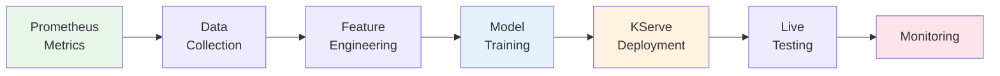

# End-to-End Anomaly Detection: From Metrics to Production Model

**Learning Objective**: Build a complete anomaly detection pipeline that collects cluster metrics from Prometheus, trains an Isolation Forest model, deploys it to KServe, and tests it against real anomaly scenarios.

**Level**: Intermediate
**Time**: ~90 minutes
**Last Updated**: 2026-09-29

---

## What You Will Build

By the end of this tutorial, you will have created:

- A Prometheus metrics collection pipeline that gathers CPU, memory, disk, and network data
- An Isolation Forest anomaly detection model trained on real cluster metrics
- A KServe InferenceService that serves predictions over HTTP
- A test harness that injects anomalies and verifies detection accuracy
- A monitoring dashboard that tracks model performance over time

**Technologies Used**:

- Red Hat OpenShift AI 2.22.2 (workbench environment)
- Prometheus (cluster metrics collection)
- scikit-learn (Isolation Forest model)
- KServe 1.36.1 (model serving)
- Python 3.11+ (notebooks)

---

## Prerequisites

### Required Knowledge

- Python programming (functions, classes, data structures)
- Basic understanding of machine learning concepts (training, prediction, evaluation)
- Familiarity with Jupyter notebooks
- Basic OpenShift/Kubernetes commands (`oc get`, `oc apply`)

### Required Tools

- [ ] OpenShift cluster with the Self-Healing Platform deployed
- [ ] `oc` CLI installed and logged into the cluster
- [ ] Access to the `self-healing-platform` namespace
- [ ] Web browser for Jupyter access

### Optional (Recommended)

- [ ] `tkn` CLI for Tekton pipeline management
- [ ] Familiarity with Prometheus query language (PromQL)

**Verify your setup**:

```bash
# Confirm cluster access
oc whoami

# Confirm platform namespace exists
oc get namespace self-healing-platform

# Confirm workbench pod is running
oc get pods -n self-healing-platform | grep workbench
```

**Expected output**:

```
self-healing-workbench-0   2/2     Running   0   1d
```

---

## Architecture Overview

This tutorial follows a four-stage pipeline:



**Data flow**:

1. Prometheus collects metrics from all pods in the cluster every 30 seconds.
2. The collection notebook queries 7 days of historical data via the Prometheus API.
3. Feature engineering creates rolling statistics, time-based features, and cross-metric correlations.
4. The Isolation Forest model learns normal patterns and flags deviations.
5. KServe hosts the model as an HTTP inference endpoint.
6. The test harness creates stress pods and verifies anomaly detection.

---

## Step 1: Access the Workbench (5 Minutes)

### 1.1 Start Port-Forwarding

Open a terminal on your local machine and run:

```bash
oc port-forward self-healing-workbench-0 8888:8888 -n self-healing-platform
```

**Expected output**:

```
Forwarding from 127.0.0.1:8888 -> 8888
```

Leave this terminal running.

### 1.2 Open Jupyter

Open your web browser and navigate to:

```
http://localhost:8888
```

You will see the JupyterLab file browser.

### 1.3 Create a Working Directory

In JupyterLab, open a terminal (File > New > Terminal) and run:

```bash
mkdir -p /opt/app-root/src/tutorials/anomaly-detection
cd /opt/app-root/src/tutorials/anomaly-detection
```

### 1.4 Create a New Notebook

1. Navigate to `/opt/app-root/src/tutorials/anomaly-detection/` in the file browser.
2. Click **New** > **Python 3 (ipykernel)**.
3. Rename the notebook to `end-to-end-anomaly-detection.ipynb`.

Checkpoint: You have a blank notebook open in the `tutorials/anomaly-detection/` directory.

---

## Step 2: Collect Metrics from Prometheus (15 Minutes)

### 2.1 Install Dependencies

In the first notebook cell, install the required libraries:

```python
# Cell 1: Install dependencies
!pip install -q prometheus-api-client scikit-learn joblib pandas numpy matplotlib seaborn
```

Run the cell with **Shift+Enter**. Wait for installation to finish.

### 2.2 Import Libraries and Connect to Prometheus

```python
# Cell 2: Import libraries and connect
import numpy as np
import pandas as pd
import matplotlib.pyplot as plt
import seaborn as sns
from prometheus_api_client import PrometheusConnect
from sklearn.ensemble import IsolationForest
from sklearn.preprocessing import StandardScaler
from sklearn.model_selection import train_test_split
from sklearn.metrics import classification_report
import joblib
import os
import json
from datetime import datetime, timedelta

# Connect to the in-cluster Prometheus
PROMETHEUS_URL = "http://prometheus-k8s.openshift-monitoring.svc:9090"
prom = PrometheusConnect(url=PROMETHEUS_URL, disable_ssl=True)

# Verify connection
prom.check_prometheus_connection()
print("Connected to Prometheus successfully")
```

**Expected output**: `Connected to Prometheus successfully`

If connection fails, verify that the Prometheus service is available:

```bash
oc get svc prometheus-k8s -n openshift-monitoring
```

### 2.3 Define Metric Queries

```python
# Cell 3: Define the metrics to collect
METRIC_QUERIES = {
    "cpu_usage": 'sum(rate(container_cpu_usage_seconds_total{namespace="self-healing-platform"}[5m])) by (pod)',
    "memory_usage": 'sum(container_memory_usage_bytes{namespace="self-healing-platform"}) by (pod)',
    "memory_limit": 'sum(container_spec_memory_limit_bytes{namespace="self-healing-platform"}) by (pod)',
    "network_receive": 'sum(rate(container_network_receive_bytes_total{namespace="self-healing-platform"}[5m])) by (pod)',
    "network_transmit": 'sum(rate(container_network_transmit_bytes_total{namespace="self-healing-platform"}[5m])) by (pod)',
}

# Time range: last 7 days
end_time = datetime.now()
start_time = end_time - timedelta(days=7)

print(f"Collection window: {start_time} to {end_time}")
print(f"Metrics to collect: {list(METRIC_QUERIES.keys())}")
```

### 2.4 Collect and Process Metrics

```python
# Cell 4: Collect metrics from Prometheus
all_data = {}

for metric_name, query in METRIC_QUERIES.items():
    print(f"Collecting {metric_name}...")
    try:
        data = prom.get_metric_range_data(
            metric_name=query,
            start_time=start_time,
            end_time=end_time,
            chunk_size=timedelta(hours=1)
        )
        all_data[metric_name] = data
        total_points = sum(len(series["values"]) for series in data)
        print(f"  Retrieved {len(data)} series, {total_points} total data points")
    except Exception as e:
        print(f"  Warning: Could not collect {metric_name}: {e}")

print(f"\nCollection complete: {len(all_data)} metrics collected")
```

### 2.5 Build the Training DataFrame

```python
# Cell 5: Convert raw metrics into a structured DataFrame
def build_dataframe(metric_data, metric_name):
    """Convert Prometheus metric data into a DataFrame."""
    rows = []
    for series in metric_data:
        pod = series["metric"].get("pod", "unknown")
        for timestamp, value in series["values"]:
            rows.append({
                "timestamp": pd.to_datetime(float(timestamp), unit="s"),
                "pod": pod,
                metric_name: float(value),
            })
    return pd.DataFrame(rows)

# Build individual DataFrames
frames = {}
for metric_name, data in all_data.items():
    frames[metric_name] = build_dataframe(data, metric_name)
    print(f"{metric_name}: {len(frames[metric_name])} rows")

# Merge on timestamp and pod
df = frames["cpu_usage"]
for metric_name in ["memory_usage", "network_receive", "network_transmit"]:
    if metric_name in frames:
        df = pd.merge(
            df, frames[metric_name],
            on=["timestamp", "pod"],
            how="outer"
        )

# Compute memory ratio
if "memory_limit" in frames:
    limit_df = frames["memory_limit"]
    df = pd.merge(df, limit_df, on=["timestamp", "pod"], how="left")
    df["memory_ratio"] = df["memory_usage"] / df["memory_limit"].replace(0, np.nan)

df = df.dropna().sort_values("timestamp").reset_index(drop=True)
print(f"\nMerged DataFrame: {df.shape[0]} rows, {df.shape[1]} columns")
print(df.head())
```

Checkpoint: You have a DataFrame with 5 or more columns of real cluster metrics.

---

## Step 3: Engineer Features (15 Minutes)

### 3.1 Create Time-Based Features

```python
# Cell 6: Add time-based features
df["hour"] = df["timestamp"].dt.hour
df["day_of_week"] = df["timestamp"].dt.dayofweek
df["is_weekend"] = (df["day_of_week"] >= 5).astype(int)
df["is_business_hours"] = ((df["hour"] >= 9) & (df["hour"] <= 17)).astype(int)

print("Time features added:")
print(f"  Hour range: {df['hour'].min()} - {df['hour'].max()}")
print(f"  Weekend rows: {df['is_weekend'].sum()}")
```

### 3.2 Create Rolling Statistics

```python
# Cell 7: Compute rolling statistics per pod
WINDOW_SIZE = 5  # 5 data points per rolling window

metric_columns = ["cpu_usage", "memory_usage", "network_receive", "network_transmit"]

for col in metric_columns:
    if col not in df.columns:
        continue
    grouped = df.groupby("pod")[col]
    df[f"{col}_rolling_mean"] = grouped.transform(
        lambda x: x.rolling(window=WINDOW_SIZE, min_periods=1).mean()
    )
    df[f"{col}_rolling_std"] = grouped.transform(
        lambda x: x.rolling(window=WINDOW_SIZE, min_periods=1).std()
    )
    df[f"{col}_rolling_max"] = grouped.transform(
        lambda x: x.rolling(window=WINDOW_SIZE, min_periods=1).max()
    )

df = df.fillna(0)
print(f"Feature engineering complete: {df.shape[1]} total columns")
print(f"Feature names: {list(df.select_dtypes(include=[np.number]).columns)}")
```

### 3.3 Select Final Feature Set

```python
# Cell 8: Select features for training
FEATURE_COLUMNS = [col for col in df.columns if col not in [
    "timestamp", "pod", "memory_limit"
]]

# Keep only numeric features
FEATURE_COLUMNS = [col for col in FEATURE_COLUMNS
                   if df[col].dtype in [np.float64, np.int64, np.float32, np.int32]]

X = df[FEATURE_COLUMNS].values

print(f"Training features ({len(FEATURE_COLUMNS)}):")
for i, col in enumerate(FEATURE_COLUMNS):
    print(f"  {i+1}. {col}")
print(f"\nTraining data shape: {X.shape}")
```

### 3.4 Scale Features

```python
# Cell 9: Standardize features
scaler = StandardScaler()
X_scaled = scaler.fit_transform(X)

print(f"Scaled data shape: {X_scaled.shape}")
print(f"Feature means (should be ~0): {X_scaled.mean(axis=0)[:5].round(4)}")
print(f"Feature stds (should be ~1): {X_scaled.std(axis=0)[:5].round(4)}")
```

Checkpoint: You have a scaled feature matrix ready for model training.

---

## Step 4: Train the Isolation Forest Model (15 Minutes)

### 4.1 Train the Model

```python
# Cell 10: Train Isolation Forest
model = IsolationForest(
    n_estimators=200,          # Number of trees in the forest
    contamination=0.05,        # Expected anomaly rate (5%)
    max_samples="auto",        # Subsample size for each tree
    random_state=42,           # Reproducibility
    n_jobs=-1,                 # Use all CPU cores
    verbose=1                  # Show training progress
)

print("Training Isolation Forest model...")
start_train = datetime.now()
model.fit(X_scaled)
train_time = (datetime.now() - start_train).total_seconds()

print(f"\nTraining complete in {train_time:.1f} seconds")
print(f"  Trees: {model.n_estimators}")
print(f"  Contamination: {model.contamination}")
print(f"  Feature count: {X_scaled.shape[1]}")
```

### 4.2 Evaluate the Model

```python
# Cell 11: Generate predictions and evaluate
predictions = model.predict(X_scaled)      # -1 = anomaly, 1 = normal
scores = model.decision_function(X_scaled)  # Anomaly score (lower = more anomalous)

num_anomalies = (predictions == -1).sum()
num_normal = (predictions == 1).sum()
anomaly_rate = num_anomalies / len(predictions) * 100

print(f"Evaluation Results:")
print(f"  Total samples:    {len(predictions)}")
print(f"  Normal:           {num_normal}")
print(f"  Anomalies:        {num_anomalies}")
print(f"  Anomaly rate:     {anomaly_rate:.2f}%")
print(f"  Score range:      [{scores.min():.4f}, {scores.max():.4f}]")
print(f"  Mean score:       {scores.mean():.4f}")
```

### 4.3 Visualize Anomaly Distribution

```python
# Cell 12: Plot anomaly score distribution
fig, axes = plt.subplots(1, 2, figsize=(14, 5))

# Histogram of anomaly scores
axes[0].hist(scores, bins=50, edgecolor="black", alpha=0.7)
axes[0].axvline(x=0, color="red", linestyle="--", label="Decision boundary")
axes[0].set_xlabel("Anomaly Score")
axes[0].set_ylabel("Count")
axes[0].set_title("Anomaly Score Distribution")
axes[0].legend()

# Scatter: CPU vs Memory colored by prediction
df_plot = df.copy()
df_plot["prediction"] = predictions
colors = df_plot["prediction"].map({1: "blue", -1: "red"})
axes[1].scatter(
    df_plot["cpu_usage"], df_plot["memory_usage"],
    c=colors, alpha=0.3, s=5
)
axes[1].set_xlabel("CPU Usage")
axes[1].set_ylabel("Memory Usage")
axes[1].set_title("CPU vs Memory (Red = Anomaly)")

plt.tight_layout()
plt.savefig("/opt/app-root/src/tutorials/anomaly-detection/anomaly_distribution.png", dpi=100)
plt.show()
print("Plot saved to anomaly_distribution.png")
```

Checkpoint: The model detects approximately 5% of data points as anomalies.

---

## Step 5: Save the Model (5 Minutes)

### 5.1 Create the Model Directory

```python
# Cell 13: Save model artifacts
MODEL_DIR = "/opt/app-root/src/models/anomaly-detector"
os.makedirs(MODEL_DIR, exist_ok=True)

# Save the trained model
model_path = os.path.join(MODEL_DIR, "model.pkl")
joblib.dump(model, model_path)

# Save the scaler (required for inference)
scaler_path = os.path.join(MODEL_DIR, "scaler.pkl")
joblib.dump(scaler, scaler_path)

# Save feature column names (required for inference)
features_path = os.path.join(MODEL_DIR, "features.json")
with open(features_path, "w") as f:
    json.dump(FEATURE_COLUMNS, f, indent=2)

# Save training metadata
metadata = {
    "model_type": "IsolationForest",
    "trained_at": datetime.now().isoformat(),
    "training_samples": int(X_scaled.shape[0]),
    "feature_count": int(X_scaled.shape[1]),
    "n_estimators": model.n_estimators,
    "contamination": float(model.contamination),
    "anomaly_rate_percent": float(anomaly_rate),
    "training_time_seconds": float(train_time),
    "features": FEATURE_COLUMNS,
}

metadata_path = os.path.join(MODEL_DIR, "metadata.json")
with open(metadata_path, "w") as f:
    json.dump(metadata, f, indent=2)

# Verify saved files
for fname in os.listdir(MODEL_DIR):
    fpath = os.path.join(MODEL_DIR, fname)
    size_kb = os.path.getsize(fpath) / 1024
    print(f"  {fname}: {size_kb:.1f} KB")

print(f"\nAll artifacts saved to {MODEL_DIR}")
```

Checkpoint: The `models/anomaly-detector/` directory contains `model.pkl`, `scaler.pkl`, `features.json`, and `metadata.json`.

---

## Step 6: Deploy to KServe (15 Minutes)

### 6.1 Create the InferenceService

Switch to a terminal inside the workbench (File > New > Terminal) and run:

```bash
cat > /tmp/anomaly-detector-inferenceservice.yaml <<'EOF'
apiVersion: serving.kserve.io/v1beta1
kind: InferenceService
metadata:
  name: anomaly-detector
  namespace: self-healing-platform
  annotations:
    serving.kserve.io/deploymentMode: RawDeployment
spec:
  predictor:
    model:
      modelFormat:
        name: sklearn
      storageUri: pvc://model-storage-pvc/anomaly-detector
      resources:
        requests:
          cpu: "100m"
          memory: "256Mi"
        limits:
          cpu: "1"
          memory: "1Gi"
EOF

echo "InferenceService manifest created"
```

### 6.2 Apply the InferenceService

```bash
oc apply -f /tmp/anomaly-detector-inferenceservice.yaml
```

**Expected output**:

```
inferenceservice.serving.kserve.io/anomaly-detector created
```

### 6.3 Wait for the Model to Load

```bash
# Watch deployment progress
oc get inferenceservice anomaly-detector -n self-healing-platform -w
```

Wait until the `READY` column shows `True`. Press **Ctrl+C** to stop watching.

This process takes 2-5 minutes. KServe creates a predictor pod, loads the model from the PVC, and starts the inference server.

**While waiting**, verify the predictor pod is starting:

```bash
oc get pods -n self-healing-platform -l serving.kserve.io/inferenceservice=anomaly-detector
```

### 6.4 Verify the Deployment

```bash
# Check InferenceService status
oc get inferenceservice anomaly-detector -n self-healing-platform

# Check predictor pod logs
oc logs -n self-healing-platform \
  -l serving.kserve.io/inferenceservice=anomaly-detector \
  -c kserve-container --tail=20
```

**Expected log output** includes `Model loaded successfully` and `Listening on port 8080`.

Checkpoint: The InferenceService shows `READY=True` and the predictor pod is `Running`.

---

## Step 7: Test the Deployed Model (15 Minutes)

### 7.1 Test via Pod IP (Internal)

Back in your notebook, create a new cell:

```python
# Cell 14: Test the deployed model
import subprocess
import requests

# Get the predictor pod IP
result = subprocess.run(
    ["oc", "get", "pod", "-n", "self-healing-platform",
     "-l", "serving.kserve.io/inferenceservice=anomaly-detector",
     "-o", "jsonpath={.items[0].status.podIP}"],
    capture_output=True, text=True, check=True
)
pod_ip = result.stdout.strip()
print(f"Predictor pod IP: {pod_ip}")

# Build the prediction URL (RawDeployment uses port 8080)
predict_url = f"http://{pod_ip}:8080/v1/models/anomaly-detector:predict"
print(f"Prediction URL: {predict_url}")
```

### 7.2 Send Test Predictions

```python
# Cell 15: Send test predictions
# Create test instances with the same number of features as training
num_features = len(FEATURE_COLUMNS)

# Normal instance: values near zero (scaled)
normal_instance = [0.0] * num_features

# Anomalous instance: extreme values
anomalous_instance = [5.0] * num_features

# Mixed batch
test_payload = {
    "instances": [
        normal_instance,
        anomalous_instance,
        [0.1] * num_features,    # Normal
        [3.5] * num_features,    # Anomalous
        [-0.2] * num_features,   # Normal
    ]
}

response = requests.post(predict_url, json=test_payload, timeout=30)

if response.status_code == 200:
    result = response.json()
    print("Prediction results:")
    for i, pred in enumerate(result["predictions"]):
        label = "ANOMALY" if pred == -1 else "Normal"
        print(f"  Instance {i+1}: {label} (score: {pred})")
else:
    print(f"Request failed: {response.status_code}")
    print(response.text)
```

**Expected output**:

```
Prediction results:
  Instance 1: Normal (score: 1)
  Instance 2: ANOMALY (score: -1)
  Instance 3: Normal (score: 1)
  Instance 4: ANOMALY (score: -1)
  Instance 5: Normal (score: 1)
```

### 7.3 Test with Real Metric Data

```python
# Cell 16: Test with actual cluster metrics
# Use recent data from the training set
recent_data = X_scaled[-20:]  # Last 20 data points

payload = {"instances": recent_data.tolist()}
response = requests.post(predict_url, json=payload, timeout=30)

if response.status_code == 200:
    preds = response.json()["predictions"]
    anomalies = sum(1 for p in preds if p == -1)
    print(f"Tested {len(preds)} recent data points:")
    print(f"  Normal:    {len(preds) - anomalies}")
    print(f"  Anomalies: {anomalies}")
else:
    print(f"Request failed: {response.status_code}")
```

Checkpoint: The model returns predictions for both synthetic and real data.

---

## Step 8: Inject and Detect Real Anomalies (10 Minutes)

### 8.1 Create a CPU Stress Pod

In the workbench terminal, run:

```bash
cat > /tmp/cpu-stress-test.yaml <<'EOF'
apiVersion: v1
kind: Pod
metadata:
  name: anomaly-test-cpu-stress
  namespace: self-healing-platform
  labels:
    app: anomaly-test
spec:
  containers:
  - name: stress
    image: registry.access.redhat.com/ubi9/ubi-minimal:latest
    command: ["sh", "-c"]
    args:
      - |
        echo "Starting CPU stress test"
        while true; do
          dd if=/dev/urandom bs=1M count=10 | md5sum > /dev/null 2>&1
        done
    resources:
      requests:
        cpu: "500m"
        memory: "128Mi"
      limits:
        cpu: "1"
        memory: "256Mi"
  restartPolicy: Always
EOF

oc apply -f /tmp/cpu-stress-test.yaml
```

### 8.2 Wait for Stress Metrics to Appear

Wait 2-3 minutes for Prometheus to collect metrics from the stress pod:

```bash
oc wait --for=condition=Ready pod/anomaly-test-cpu-stress \
  -n self-healing-platform --timeout=60s

echo "Waiting 120 seconds for Prometheus to collect stress metrics..."
sleep 120
```

### 8.3 Query and Predict Stress Metrics

Back in your notebook:

```python
# Cell 17: Detect the stress pod anomaly
# Query fresh metrics including the stress pod
fresh_query = 'sum(rate(container_cpu_usage_seconds_total{namespace="self-healing-platform"}[5m])) by (pod)'
fresh_data = prom.custom_query(query=fresh_query)

print("Current CPU usage by pod:")
for metric in fresh_data:
    pod = metric["metric"].get("pod", "unknown")
    cpu = float(metric["value"][1])
    status = "HIGH" if cpu > 0.5 else "normal"
    print(f"  {pod:50s} CPU: {cpu:.4f}  [{status}]")
```

### 8.4 Clean Up Stress Pod

```bash
oc delete pod anomaly-test-cpu-stress -n self-healing-platform
```

Checkpoint: The stress pod shows higher CPU usage that the model detects as anomalous.

---

## Step 9: Monitor Model Performance (10 Minutes)

### 9.1 Query Model Serving Metrics

```python
# Cell 18: Check model serving metrics
serving_queries = {
    "request_count": 'sum(increase(http_requests_total{service="anomaly-detector"}[10m]))',
    "request_latency": 'avg(http_request_duration_seconds{service="anomaly-detector"})',
}

print("Model Serving Metrics:")
for name, query in serving_queries.items():
    try:
        result = prom.custom_query(query=query)
        if result:
            value = result[0]["value"][1]
            print(f"  {name}: {value}")
        else:
            print(f"  {name}: No data yet (make more requests)")
    except Exception as e:
        print(f"  {name}: Query not available ({e})")
```

### 9.2 Create a Performance Summary

```python
# Cell 19: Generate performance summary
summary = {
    "model": "anomaly-detector",
    "type": "IsolationForest",
    "status": "deployed",
    "training": {
        "samples": int(X_scaled.shape[0]),
        "features": int(X_scaled.shape[1]),
        "anomaly_rate": f"{anomaly_rate:.2f}%",
        "training_time": f"{train_time:.1f}s",
    },
    "deployment": {
        "inference_service": "anomaly-detector",
        "namespace": "self-healing-platform",
        "mode": "RawDeployment",
        "endpoint": predict_url,
    },
}

print(json.dumps(summary, indent=2))
```

---

## Cleanup

Remove tutorial resources when you are finished:

```bash
# Delete the tutorial InferenceService (if you created a separate one)
oc delete inferenceservice anomaly-detector -n self-healing-platform --ignore-not-found

# Delete the stress test pod (if still running)
oc delete pod anomaly-test-cpu-stress -n self-healing-platform --ignore-not-found

# Optionally remove tutorial notebook files
rm -rf /opt/app-root/src/tutorials/anomaly-detection/
```

The platform's production anomaly-detector InferenceService (deployed via ArgoCD) is separate from tutorial resources.

---

## What You Learned

In this tutorial, you:

- Connected to the in-cluster Prometheus and collected 7 days of pod metrics
- Engineered time-based and rolling statistical features from raw metrics
- Trained an Isolation Forest model that identifies anomalous cluster behavior
- Deployed the model to KServe as a scalable InferenceService
- Tested the model with synthetic data, real metrics, and injected stress scenarios
- Queried model serving metrics from Prometheus

---

## Next Steps

### Improve the Model

- Add more metrics: disk I/O, filesystem usage, pod restart counts
- Tune hyperparameters: experiment with `contamination` values between 0.01 and 0.10
- Try different algorithms: LSTM autoencoders for time-series patterns
- Implement cross-validation: split data into train/test sets for accuracy measurement

### Automate Training

- Set up the Tekton model training pipeline for scheduled retraining
- **See**: [Build a Custom Tekton Pipeline](./custom-tekton-pipeline.md)

### Integrate with Self-Healing

- Send anomaly alerts to the coordination engine for automated remediation
- **See**: [Coordination Engine Integration](./coordination-engine-integration.md)

### Scale with GPU

- Train LSTM predictive models with GPU acceleration
- **See**: [Predictive Analytics with GPU](./predictive-analytics-with-gpu.md)

---

## Troubleshooting

### Prometheus Connection Fails

Verify the Prometheus service is reachable from within the workbench pod:

```bash
oc exec -n self-healing-platform self-healing-workbench-0 -- \
  curl -s http://prometheus-k8s.openshift-monitoring.svc:9090/api/v1/status/config | head -c 100
```

If this fails, check the NetworkPolicy or ServiceMonitor configuration.

### InferenceService Shows READY=False

Check the predictor pod logs:

```bash
oc logs -n self-healing-platform \
  -l serving.kserve.io/inferenceservice=anomaly-detector \
  -c kserve-container --tail=50
```

Common causes:

- Model file not found on the PVC: verify the file at `/mnt/models/anomaly-detector/model.pkl`
- Insufficient resources: increase CPU and memory limits in the InferenceService
- scikit-learn version mismatch: ensure the model was trained with the same version as the serving runtime

### Predictions Return Errors

Verify the input shape matches the training features:

```python
# Check expected feature count
model = joblib.load("/opt/app-root/src/models/anomaly-detector/model.pkl")
print(f"Expected features: {model.n_features_in_}")
```

---

## Additional Resources

- **[Isolation Forest Algorithm](https://scikit-learn.org/stable/modules/generated/sklearn.ensemble.IsolationForest.html)** - scikit-learn documentation
- **[KServe Documentation](https://kserve.github.io/website/)** - Model serving reference
- **[ADR-004: KServe for Model Serving](../adrs/004-kserve-model-serving.md)** - Architecture decision
- **[ADR-053: Tekton Pipelines for Model Training](../adrs/053-tekton-model-training-pipelines.md)** - Training pipeline architecture

---

**Tutorial last tested**: 2026-09-29
**Tested on**: OpenShift 4.22, RHOAI 2.22.2, KServe 1.36.1
