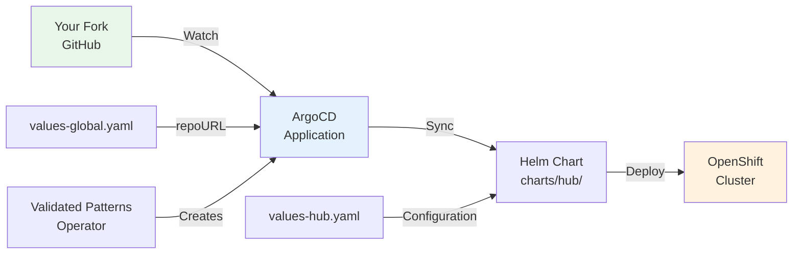
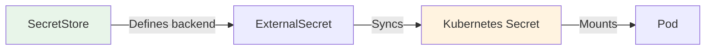

# Customize the Platform via GitOps

> **Note**: This tutorial covers the **Validated Patterns** installation path (Tier 2). If you prefer a simpler managed install, see the [KubeHeal Operator path (Tier 1)](../how-to/OPERATORHUB-INSTALLATION-GUIDE.md) or use `helm install` for direct Helm deployment (Tier 3).

**Learning Objective**: Customize the Self-Healing Platform deployment by forking the repository, modifying Helm chart values, adding custom components, managing secrets with External Secrets Operator, and promoting changes through ArgoCD.

**Level**: Intermediate
**Time**: ~45 minutes
**Last Updated**: 2026-09-29

---

## What You Will Build

By the end of this tutorial, you will have:

- A forked repository with your own configuration values
- A customized `values-hub.yaml` tailored to your cluster topology
- A new custom component added to the Helm chart
- Secrets managed through External Secrets Operator
- A working ArgoCD sync workflow that deploys your changes

**Technologies Used**:

- OpenShift GitOps (ArgoCD) 1.15.4
- Helm 3.x (chart management)
- Validated Patterns Operator (deployment)
- External Secrets Operator (secrets management)

---

## Prerequisites

### Required Knowledge

- Basic Git workflow (fork, clone, commit, push)
- Familiarity with YAML syntax
- Understanding of Helm charts (templates, values)
- Basic ArgoCD concepts (applications, sync)

### Required Tools

- [ ] GitHub account
- [ ] `oc` CLI installed and logged into the cluster
- [ ] `helm` CLI installed
- [ ] `git` CLI installed
- [ ] Text editor for YAML files

**Verify your setup**:

```bash
oc whoami
helm version
git --version
```

---

## Architecture Overview

The platform uses a GitOps deployment model where ArgoCD watches your Git repository and applies changes automatically.



**Key files**:

| File | Purpose |
|------|---------|
| `values-global.yaml` | Git repository URL and sync settings |
| `values-hub.yaml` | Cluster-specific configuration (topology, storage, models) |
| `charts/hub/values.yaml` | Default Helm chart values |
| `charts/hub/templates/` | Kubernetes resource templates |

---

## Step 1: Fork and Clone the Repository (5 Minutes)

### 1.1 Fork on GitHub

1. Navigate to https://github.com/KubeHeal/openshift-aiops-platform
2. Click the **Fork** button in the upper right.
3. Select your GitHub account as the destination.

Your fork URL is: `https://github.com/YOUR-USERNAME/openshift-aiops-platform.git`

### 1.2 Clone Your Fork

```bash
git clone https://github.com/YOUR-USERNAME/openshift-aiops-platform.git
cd openshift-aiops-platform
```

### 1.3 Create Values Files

```bash
cp values-global.yaml.example values-global.yaml
cp values-hub.yaml.example values-hub.yaml
cp values-secret.yaml.example values-secret.yaml
```

The VP framework requires `values-secret.yaml` to exist, even if the file is empty. For public GitHub deployments the example file contents are sufficient.

### 1.4 Update the Repository URL

Edit `values-global.yaml` and set your fork URL:

```bash
# Replace YOUR-USERNAME with your GitHub username
sed -i 's|repoURL:.*|repoURL: "https://github.com/YOUR-USERNAME/openshift-aiops-platform.git"|' values-global.yaml

# Verify the change
grep repoURL values-global.yaml
```

Apply the same change to `values-hub.yaml`:

```bash
sed -i 's|repoURL:.*|repoURL: "https://github.com/YOUR-USERNAME/openshift-aiops-platform.git"|' values-hub.yaml
```

Checkpoint: Both values files point to your fork URL.

---

## Step 2: Understand the ArgoCD Application Structure (10 Minutes)

### 2.1 Check Your Cluster Topology

```bash
make show-cluster-info
```

**Expected output**:

```
Cluster Information:
  Topology: ha
  OpenShift Version: 4.22
  Platform: AWS
```

Note the topology (`ha` or `sno`) and version. These affect your configuration.

### 2.2 Inspect the ArgoCD Application

```bash
# List ArgoCD applications
oc get applications -n self-healing-platform-hub

# Describe the main application
oc describe application self-healing-platform -n self-healing-platform-hub
```

Key fields to note:

- **Source RepoURL**: The Git repository ArgoCD watches
- **Source Path**: `charts/hub` (the Helm chart location)
- **Sync Status**: `Synced` means the cluster matches the repository

### 2.3 View the Helm Chart Structure

```bash
# Chart metadata
cat charts/hub/Chart.yaml

# List all templates
ls charts/hub/templates/
```

The `templates/` directory contains Kubernetes resource templates. Each file generates one or more resources based on `values.yaml` settings.

**Key templates**:

| Template | Resources Created |
|----------|-------------------|
| `namespace.yaml` | Platform namespace |
| `rbac.yaml` | ServiceAccount, Role, RoleBinding |
| `storage.yaml` | PersistentVolumeClaims |
| `ai-ml-workbench.yaml` | Jupyter notebook StatefulSet |
| `model-serving.yaml` | KServe InferenceServices |
| `coordination-engine-deployment.yaml` | Coordination engine Deployment |
| `tekton-model-training-pipeline.yaml` | Tekton Tasks and Pipelines |
| `externalsecrets.yaml` | ExternalSecret resources |

### 2.4 View Current Values

```bash
# View default values
head -100 charts/hub/values.yaml

# View key configuration sections
grep -A 5 "cluster:" charts/hub/values.yaml
grep -A 10 "storage:" charts/hub/values.yaml
grep -A 10 "models:" charts/hub/values.yaml
```

---

## Step 3: Modify Helm Values for Your Environment (10 Minutes)

### 3.1 Configure Cluster Topology

Edit `values-hub.yaml` based on your `make show-cluster-info` output.

**For HA clusters** (3 or more worker nodes):

```yaml
cluster:
  topology: "ha"
  version: "4.22"

storage:
  modelStorage:
    storageClass: "ocs-storagecluster-cephfs"
```

**For SNO clusters** (single node):

```yaml
cluster:
  topology: "sno"
  version: "4.22"

storage:
  modelStorage:
    storageClass: "gp3-csi"
```

**For ROSA clusters** (AWS managed):

```yaml
cluster:
  topology: "ha"
  version: "4.22"

objectStore:
  backend: "aws-s3"
  aws:
    region: "us-east-1"
    bucketName: "your-model-storage-bucket"
```

### 3.2 Customize Model Resources

Adjust CPU and memory limits for your cluster capacity:

```yaml
# In values-hub.yaml
models:
  - name: anomaly-detector
    cpu: "1"
    memory: "1Gi"
    cpuLimit: "4"
    memoryLimit: "8Gi"
    syncWave: "2"
    gpuTrained: false

  - name: predictive-analytics
    cpu: "1"
    memory: "2Gi"
    cpuLimit: "2"
    memoryLimit: "6Gi"
    syncWave: "2"
    gpuTrained: true
```

### 3.3 Configure the Workbench

```yaml
# In values-hub.yaml
workbench:
  enabled: true
  resources:
    requests:
      cpu: 1
      memory: 4Gi
    limits:
      cpu: 4
      memory: 8Gi
  gpu:
    enabled: false  # Set to true if GPU node has CephFS driver
```

### 3.4 Commit and Push

```bash
git add values-hub.yaml values-global.yaml
git commit -s -m "feat(config): customize values for my cluster"
git push origin main
```

ArgoCD detects the push and syncs the changes automatically. Monitor the sync:

```bash
oc get application self-healing-platform -n self-healing-platform-hub -w
```

Checkpoint: ArgoCD syncs your configuration changes to the cluster.

---

## Step 4: Add a Custom Component (10 Minutes)

### 4.1 Create a Custom ConfigMap Template

Add a new template that creates a custom alert configuration:

```bash
cat > charts/hub/templates/custom-alert-config.yaml <<'EOF'
{{- if .Values.customAlerts }}
{{- if .Values.customAlerts.enabled }}
apiVersion: v1
kind: ConfigMap
metadata:
  name: custom-alert-config
  namespace: {{ .Values.main.namespace }}
  labels:
    app.kubernetes.io/name: custom-alert-config
    app.kubernetes.io/part-of: self-healing-platform
  annotations:
    argocd.argoproj.io/sync-wave: "1"
data:
  alert-rules.yaml: |
    rules:
    {{- range .Values.customAlerts.rules }}
      - name: {{ .name }}
        metric: {{ .metric }}
        threshold: {{ .threshold }}
        severity: {{ .severity | default "warning" }}
        action: {{ .action | default "notify" }}
    {{- end }}
{{- end }}
{{- end }}
EOF
```

### 4.2 Add Values for the Custom Component

Add the following to `values-hub.yaml`:

```yaml
# Custom alert configuration
customAlerts:
  enabled: true
  rules:
    - name: high-cpu-usage
      metric: cpu_usage_ratio
      threshold: 0.85
      severity: warning
      action: scale_up
    - name: memory-pressure
      metric: memory_usage_ratio
      threshold: 0.90
      severity: critical
      action: restart_pod
    - name: disk-space-low
      metric: disk_usage_ratio
      threshold: 0.80
      severity: warning
      action: notify
```

### 4.3 Validate the Template Locally

```bash
# Render the template without applying
helm template self-healing-platform charts/hub/ \
  -f values-hub.yaml \
  -s templates/custom-alert-config.yaml \
  --set global.git.repoURL=https://github.com/test/test.git
```

**Expected output**: A rendered ConfigMap with your alert rules.

### 4.4 Commit and Push

```bash
git add charts/hub/templates/custom-alert-config.yaml values-hub.yaml
git commit -s -m "feat(alerts): add custom alert configuration"
git push origin main
```

Wait for ArgoCD to sync, then verify:

```bash
oc get configmap custom-alert-config -n self-healing-platform -o yaml
```

Checkpoint: The custom ConfigMap is deployed to the cluster via ArgoCD.

---

## Step 5: Manage Secrets with External Secrets Operator (5 Minutes)

### 5.1 Understand the Secrets Architecture

The platform uses External Secrets Operator (ESO) to sync secrets from a backend store into Kubernetes Secrets.



### 5.2 Check Existing Secrets Configuration

```bash
# List SecretStores
oc get secretstore -n self-healing-platform

# List ExternalSecrets
oc get externalsecret -n self-healing-platform

# Check sync status
oc get externalsecret -n self-healing-platform -o wide
```

### 5.3 View the ExternalSecret Template

The platform defines ExternalSecrets in `charts/hub/templates/externalsecrets.yaml`. Key secrets include:

- `model-storage-config`: S3 credentials for model storage
- `git-credentials`: Git repository authentication

### 5.4 Add a Custom Secret

To add a custom secret, create a source secret first:

```bash
# Create the source secret with your values
oc create secret generic custom-api-credentials-source \
  --from-literal=api-key=your-api-key-here \
  --from-literal=api-secret=your-api-secret-here \
  -n self-healing-platform
```

Then add an ExternalSecret to your values:

```yaml
# In values-hub.yaml
secrets:
  backend: external-secrets
  externalSecrets:
    enabled: true
```

The ExternalSecret resources are managed by the Helm chart template at `charts/hub/templates/externalsecrets.yaml`.

**Important**: Never commit secret values to Git. Use source secrets, environment variables, or an external backend (AWS Secrets Manager, HashiCorp Vault).

---

## Step 6: Promote Changes Through Environments (5 Minutes)

### 6.1 Use Git Branches for Environments

Create branches for different environments:

```bash
# Development branch (current)
git checkout -b development
git push origin development

# Staging branch
git checkout -b staging
git push origin staging

# Production branch
git checkout main
```

### 6.2 Update ArgoCD Target Revision

Change the branch ArgoCD watches by editing `values-global.yaml`:

```yaml
# For development
global:
  git:
    revision: "development"

# For staging
global:
  git:
    revision: "staging"

# For production
global:
  git:
    revision: "main"
```

### 6.3 Promote Changes

Follow this promotion workflow:

1. **Develop**: Make changes on the `development` branch. ArgoCD syncs to your dev cluster.
2. **Test**: Merge `development` into `staging` after validation.
3. **Deploy**: Merge `staging` into `main` for production deployment.

```bash
# Merge development into staging
git checkout staging
git merge development
git push origin staging

# After staging validation, merge into main
git checkout main
git merge staging
git push origin main
```

### 6.4 Force a Manual Sync

If ArgoCD does not detect changes immediately:

```bash
oc annotate application self-healing-platform \
  -n self-healing-platform-hub \
  argocd.argoproj.io/refresh=hard --overwrite
```

---

## Cleanup

To remove tutorial-specific resources:

```bash
# Delete the custom ConfigMap
oc delete configmap custom-alert-config -n self-healing-platform --ignore-not-found

# Delete the custom source secret
oc delete secret custom-api-credentials-source -n self-healing-platform --ignore-not-found

# Remove the custom template from git
rm charts/hub/templates/custom-alert-config.yaml
git add -A
git commit -s -m "chore: remove tutorial custom alert config"
git push origin main
```

---

## What You Learned

In this tutorial, you:

- Forked the repository and configured values files for your cluster
- Inspected the ArgoCD application structure and Helm chart organization
- Modified `values-hub.yaml` for different cluster topologies (HA, SNO, ROSA)
- Created a custom Helm template and added it to the chart
- Managed secrets using External Secrets Operator source secrets
- Promoted changes through environment branches via GitOps

---

## Next Steps

### Add Custom Operators

- Add new operator subscriptions to the Helm chart
- Reference: `k8s/operators/` directory for existing operator manifests

### Implement Multi-Cluster GitOps

- Deploy the same platform to multiple clusters with per-cluster values
- **See**: [ADR-055: Multi-Cluster Topology Support](../adrs/055-openshift-420-multi-cluster-topology-support.md)

### Automate with Tekton

- Create Tekton pipelines for custom model training workflows
- **See**: [Build a Custom Tekton Pipeline](./custom-tekton-pipeline.md)

### Integrate with External Systems

- Connect the coordination engine to Slack, PagerDuty, or ServiceNow
- **See**: [Coordination Engine Integration](./coordination-engine-integration.md)

---

## Troubleshooting

### ArgoCD Shows "OutOfSync"

Check the sync error details:

```bash
oc describe application self-healing-platform -n self-healing-platform-hub
```

Common causes:

- Helm template syntax error: validate with `helm template charts/hub/ -f values-hub.yaml`
- Missing values: check that all required values are set in `values-hub.yaml`
- RBAC issues: re-run `make operator-deploy-prereqs` to fix permissions

### Values File Not Found Error

Verify both values files exist in the repository root:

```bash
ls -la values-global.yaml values-hub.yaml
```

If missing, create them from examples:

```bash
cp values-global.yaml.example values-global.yaml
cp values-hub.yaml.example values-hub.yaml
cp values-secret.yaml.example values-secret.yaml
```

### Custom Template Not Rendering

Check for YAML syntax errors:

```bash
helm lint charts/hub/ -f values-hub.yaml
```

Verify the conditional guard in your template matches your values file structure.

---

## Additional Resources

- **[ArgoCD Documentation](https://argo-cd.readthedocs.io/)** - GitOps reference
- **[Helm Chart Best Practices](https://helm.sh/docs/chart_best_practices/)** - Template guidelines
- **[ADR-019: Validated Patterns Framework](../adrs/019-validated-patterns-framework-adoption.md)** - Deployment framework
- **[ADR-026: Secrets Management Automation](../adrs/026-secrets-management-automation.md)** - External Secrets Operator
- **[ADR-042: ArgoCD Deployment Lessons](../adrs/042-argocd-deployment-lessons-learned.md)** - Deployment patterns

---

**Tutorial last tested**: 2026-09-29
**Tested on**: OpenShift 4.22, GitOps 1.15.4, Helm 3.16.4
