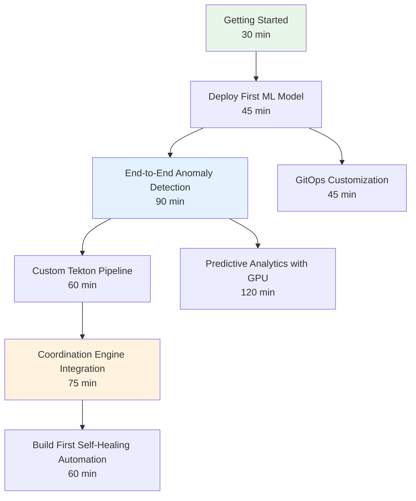

# Tutorials

Learning-oriented guides for newcomers

## Available Guides

This section contains tutorials documentation following the Diataxis framework.

**Tutorials** are learning-oriented and help newcomers get started:
- Take the reader through a process step by step
- Focus on learning by doing
- Ensure the reader succeeds in accomplishing something
- Build confidence through success

## Contents

### Getting Started

- **[Getting Started with OpenShift AIOps Platform](./getting-started.md)** - Complete introduction to the Self-Healing Platform, including RHODS access, environment verification, and your first anomaly detection experiment

### Model Deployment

- **[Deploy Your First ML Model to KServe](./deploy-first-ml-model.md)** - Hands-on tutorial to train an anomaly detection model and deploy it as a scalable inference service (45 minutes)
- **[Build Your First Self-Healing Automation](./build-first-self-healing-automation.md)** - Create an end-to-end self-healing workflow that detects and remediates problems automatically (60 minutes)

### Anomaly Detection and ML

- **[End-to-End Anomaly Detection](./end-to-end-anomaly-detection.md)** - Complete pipeline from Prometheus metrics collection through Isolation Forest training to KServe deployment and live anomaly testing (90 minutes)
- **[Predictive Analytics with GPU](./predictive-analytics-with-gpu.md)** - Train an LSTM predictive analytics model with GPU acceleration, benchmark CPU vs GPU performance, and deploy GPU-optimized inference (120 minutes)

### Pipelines and Automation

- **[Build a Custom Tekton Pipeline](./custom-tekton-pipeline.md)** - Create a custom Tekton pipeline for model training with validation tasks, CronJob triggers, and automated retraining (60 minutes)
- **[Coordination Engine Integration](./coordination-engine-integration.md)** - Connect your ML models to the Go-based coordination engine, register remediation actions, and test end-to-end self-healing workflows (75 minutes)

### Platform Customization

- **[GitOps Customization](./gitops-customization.md)** - Fork the repository, modify Helm values, add custom components, manage secrets with External Secrets Operator, and promote changes via ArgoCD (45 minutes)

### Development Guides

- **[Workbench Development Guide](./workbench-development-guide.md)** - Deep dive into developing self-healing algorithms and anomaly detection models in the workbench environment

## Recommended Learning Path

Follow the tutorials in this order for a complete learning experience:

| Path | Tutorials | Total Time |
|------|-----------|------------|
| **Quick Start** | Getting Started, Deploy First ML Model | ~75 minutes |
| **Data Scientist** | Quick Start + End-to-End Anomaly Detection + Predictive Analytics with GPU | ~5 hours |
| **Platform Engineer** | Quick Start + GitOps Customization + Custom Tekton Pipeline | ~2.5 hours |
| **Full Platform** | All tutorials in recommended order | ~8.5 hours |
