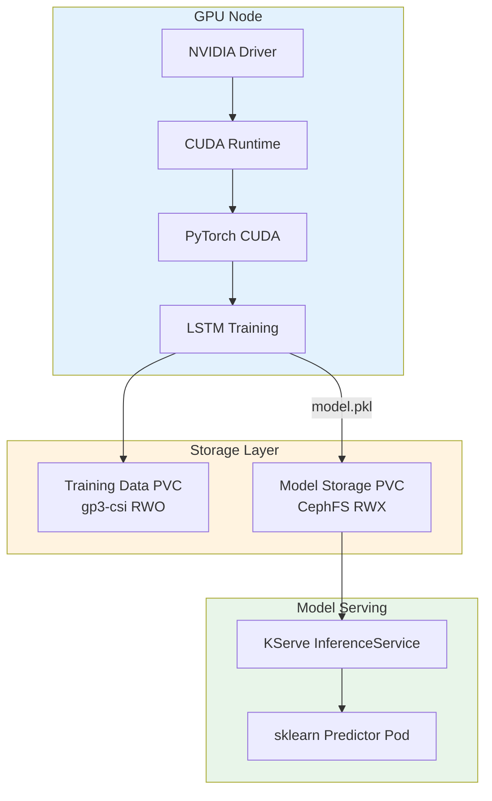

# Predictive Analytics with GPU-Accelerated Training

**Learning Objective**: Train an LSTM-based predictive analytics model using GPU acceleration, compare CPU and GPU training performance, and deploy the model as a GPU-optimized KServe InferenceService.

**Level**: Advanced
**Time**: ~120 minutes
**Last Updated**: 2026-09-29

---

## What You Will Build

By the end of this tutorial, you will have created:

- A verified GPU environment inside the OpenShift AI workbench
- An LSTM neural network for predictive analytics on cluster metrics
- A training benchmark comparing CPU and GPU performance
- A GPU-trained model deployed to KServe as an InferenceService
- A prediction test that forecasts future cluster resource usage

**Technologies Used**:

- NVIDIA GPU Operator 24.9.2
- PyTorch 2.x with CUDA support
- Red Hat OpenShift AI 2.22.2
- KServe 1.36.1 (model serving)
- Tekton `model-training-pipeline-gpu` (automated training)

---

## Prerequisites

### Required Knowledge

- Python programming and PyTorch basics
- Understanding of neural network concepts (layers, loss functions, optimizers)
- Completed the [End-to-End Anomaly Detection](./end-to-end-anomaly-detection.md) tutorial

### Required Tools

- [ ] OpenShift cluster with **at least one GPU node** (NVIDIA)
- [ ] GPU Operator installed and running
- [ ] `oc` CLI installed and logged into the cluster
- [ ] Access to the `self-healing-platform` namespace

### Optional (Recommended)

- [ ] `tkn` CLI for running the GPU training pipeline
- [ ] Familiarity with LSTM networks and time-series forecasting

**Verify GPU availability**:

```bash
# Check for GPU-enabled nodes
oc get nodes -l nvidia.com/gpu.present=true
```

**Expected output** shows at least one node:

```
NAME                    STATUS   ROLES    AGE   VERSION
ip-10-0-xxx-xxx.ec2..  Ready    worker   1d    v1.29.x
```

If no GPU nodes appear, your cluster does not have GPU workers. You can complete this tutorial on CPU only (training will be slower).

```bash
# Verify GPU operator pods are running
oc get pods -n nvidia-gpu-operator | grep -E "driver|device-plugin"
```

**Expected output** includes running driver and device plugin pods.

---

## Architecture Overview



**Key architecture decisions**:

- GPU nodes use `gp3-csi` (RWO) for training because they may not have the CephFS CSI driver.
- After training, a copy task moves the model to the shared CephFS PVC (RWX) for KServe access.
- On SNO clusters, both training and serving use the same `gp3-csi` PVC.

---

## Step 1: Verify GPU Environment (10 Minutes)

### 1.1 Access the Workbench

```bash
oc port-forward self-healing-workbench-0 8888:8888 -n self-healing-platform
```

Open http://localhost:8888 and create a new notebook at:
`/opt/app-root/src/tutorials/gpu-predictive/gpu-predictive-analytics.ipynb`

### 1.2 Check GPU from Python

```python
# Cell 1: Verify GPU availability
import torch
import sys

print(f"Python version: {sys.version}")
print(f"PyTorch version: {torch.__version__}")
print(f"CUDA available: {torch.cuda.is_available()}")

if torch.cuda.is_available():
    print(f"CUDA version: {torch.version.cuda}")
    print(f"GPU count: {torch.cuda.device_count()}")
    for i in range(torch.cuda.device_count()):
        props = torch.cuda.get_device_properties(i)
        print(f"  GPU {i}: {props.name}")
        print(f"    Memory: {props.total_mem / 1024**3:.1f} GB")
        print(f"    Compute capability: {props.major}.{props.minor}")

    # Test GPU tensor operations
    x = torch.randn(1000, 1000, device="cuda")
    y = torch.matmul(x, x)
    print(f"\nGPU tensor test: OK (matrix multiply {x.shape} = {y.shape})")
else:
    print("\nNo GPU detected. Training will use CPU (slower).")
    print("To add GPU: create a GPU machine pool with 'rosa create machinepool'")

DEVICE = torch.device("cuda" if torch.cuda.is_available() else "cpu")
print(f"\nUsing device: {DEVICE}")
```

### 1.3 Check GPU Resource Allocation

If CUDA is available, verify the GPU allocation in the cluster:

```bash
# From a separate terminal
oc describe node $(oc get nodes -l nvidia.com/gpu.present=true -o jsonpath='{.items[0].metadata.name}') \
  | grep -A 10 "Allocated resources"
```

Checkpoint: You know whether GPU is available and which device to use.

---

## Step 2: Prepare Time-Series Data (15 Minutes)

### 2.1 Collect Prometheus Metrics

```python
# Cell 2: Install dependencies and collect data
!pip install -q prometheus-api-client scikit-learn joblib

import numpy as np
import pandas as pd
from prometheus_api_client import PrometheusConnect
from datetime import datetime, timedelta

PROMETHEUS_URL = "http://prometheus-k8s.openshift-monitoring.svc:9090"
prom = PrometheusConnect(url=PROMETHEUS_URL, disable_ssl=True)

# Collect 30 days of data for predictive analytics
end_time = datetime.now()
start_time = end_time - timedelta(days=30)

queries = {
    "cpu": 'avg(rate(container_cpu_usage_seconds_total{namespace="self-healing-platform"}[5m]))',
    "memory": 'avg(container_memory_usage_bytes{namespace="self-healing-platform"})',
    "network_in": 'sum(rate(container_network_receive_bytes_total{namespace="self-healing-platform"}[5m]))',
    "network_out": 'sum(rate(container_network_transmit_bytes_total{namespace="self-healing-platform"}[5m]))',
}

print(f"Collecting 30 days of metrics ({start_time.date()} to {end_time.date()})...")

all_series = {}
for name, query in queries.items():
    try:
        data = prom.get_metric_range_data(
            metric_name=query,
            start_time=start_time,
            end_time=end_time,
            chunk_size=timedelta(hours=6),
        )
        if data:
            values = [(float(ts), float(val)) for ts, val in data[0]["values"]]
            all_series[name] = values
            print(f"  {name}: {len(values)} data points")
    except Exception as e:
        print(f"  {name}: Could not collect ({e}), using synthetic data")

# Fall back to synthetic data if Prometheus data is insufficient
if len(all_series) < 2:
    print("\nInsufficient Prometheus data. Generating synthetic training data...")
    np.random.seed(42)
    n_points = 4320  # 30 days at 10-minute intervals
    timestamps = pd.date_range(start=start_time, periods=n_points, freq="10min")

    all_series = {
        "cpu": [(t.timestamp(), 0.3 + 0.1 * np.sin(2 * np.pi * t.hour / 24) + np.random.normal(0, 0.02))
                for t in timestamps],
        "memory": [(t.timestamp(), 2e9 + 5e8 * np.sin(2 * np.pi * t.hour / 24) + np.random.normal(0, 1e8))
                   for t in timestamps],
        "network_in": [(t.timestamp(), 1e6 + 5e5 * np.sin(2 * np.pi * t.hour / 24) + np.random.normal(0, 1e5))
                       for t in timestamps],
        "network_out": [(t.timestamp(), 8e5 + 3e5 * np.sin(2 * np.pi * t.hour / 24) + np.random.normal(0, 8e4))
                        for t in timestamps],
    }
    print(f"  Generated {n_points} synthetic data points per metric")
```

### 2.2 Build the DataFrame

```python
# Cell 3: Build and normalize the DataFrame
# Convert to DataFrame
frames = []
for name, values in all_series.items():
    df_metric = pd.DataFrame(values, columns=["timestamp", name])
    df_metric["timestamp"] = pd.to_datetime(df_metric["timestamp"], unit="s")
    frames.append(df_metric.set_index("timestamp"))

df = pd.concat(frames, axis=1)
df = df.dropna().sort_index()

# Normalize to [0, 1] range
from sklearn.preprocessing import MinMaxScaler

scaler = MinMaxScaler()
feature_columns = list(all_series.keys())
df_scaled = pd.DataFrame(
    scaler.fit_transform(df[feature_columns]),
    columns=feature_columns,
    index=df.index,
)

print(f"Dataset shape: {df_scaled.shape}")
print(f"Date range: {df_scaled.index.min()} to {df_scaled.index.max()}")
print(f"\nScaled feature statistics:")
print(df_scaled.describe().round(3))
```

### 2.3 Create Sequences for LSTM

```python
# Cell 4: Create sliding window sequences
SEQUENCE_LENGTH = 24  # 24 time steps to predict the next step
FORECAST_HORIZON = 1  # Predict 1 step ahead

def create_sequences(data, seq_length, forecast_horizon):
    """Create input-output pairs for LSTM training."""
    X, y = [], []
    for i in range(len(data) - seq_length - forecast_horizon + 1):
        X.append(data[i : i + seq_length])
        y.append(data[i + seq_length : i + seq_length + forecast_horizon])
    return np.array(X), np.array(y)

data_array = df_scaled.values
X, y = create_sequences(data_array, SEQUENCE_LENGTH, FORECAST_HORIZON)

# Reshape y to 2D
y = y.reshape(y.shape[0], -1)

# Split into train/test (80/20)
split_idx = int(len(X) * 0.8)
X_train, X_test = X[:split_idx], X[split_idx:]
y_train, y_test = y[:split_idx], y[split_idx:]

print(f"Training sequences: {X_train.shape[0]}")
print(f"Test sequences: {X_test.shape[0]}")
print(f"Input shape: {X_train.shape} (samples, timesteps, features)")
print(f"Output shape: {y_train.shape} (samples, features)")
```

Checkpoint: You have training and test sequences ready for LSTM training.

---

## Step 3: Build the LSTM Model (10 Minutes)

### 3.1 Define the Model Architecture

```python
# Cell 5: Define the LSTM model
import torch
import torch.nn as nn

class PredictiveLSTM(nn.Module):
    """LSTM model for multi-variate time series prediction."""

    def __init__(self, input_size, hidden_size, num_layers, output_size, dropout=0.2):
        super().__init__()
        self.hidden_size = hidden_size
        self.num_layers = num_layers

        self.lstm = nn.LSTM(
            input_size=input_size,
            hidden_size=hidden_size,
            num_layers=num_layers,
            batch_first=True,
            dropout=dropout if num_layers > 1 else 0,
        )
        self.fc1 = nn.Linear(hidden_size, hidden_size // 2)
        self.relu = nn.ReLU()
        self.dropout = nn.Dropout(dropout)
        self.fc2 = nn.Linear(hidden_size // 2, output_size)

    def forward(self, x):
        # x shape: (batch, sequence_length, input_size)
        lstm_out, _ = self.lstm(x)
        # Use the last time step output
        last_output = lstm_out[:, -1, :]
        out = self.fc1(last_output)
        out = self.relu(out)
        out = self.dropout(out)
        out = self.fc2(out)
        return out

# Model parameters
INPUT_SIZE = len(feature_columns)  # Number of metrics
HIDDEN_SIZE = 128
NUM_LAYERS = 2
OUTPUT_SIZE = len(feature_columns) * FORECAST_HORIZON
DROPOUT = 0.2

model = PredictiveLSTM(INPUT_SIZE, HIDDEN_SIZE, NUM_LAYERS, OUTPUT_SIZE, DROPOUT)
model = model.to(DEVICE)

total_params = sum(p.numel() for p in model.parameters())
trainable_params = sum(p.numel() for p in model.parameters() if p.requires_grad)

print(f"Model architecture:")
print(model)
print(f"\nTotal parameters: {total_params:,}")
print(f"Trainable parameters: {trainable_params:,}")
print(f"Device: {DEVICE}")
```

### 3.2 Prepare PyTorch DataLoaders

```python
# Cell 6: Create data loaders
from torch.utils.data import TensorDataset, DataLoader

BATCH_SIZE = 64

# Convert to tensors and move to device
X_train_t = torch.FloatTensor(X_train).to(DEVICE)
y_train_t = torch.FloatTensor(y_train).to(DEVICE)
X_test_t = torch.FloatTensor(X_test).to(DEVICE)
y_test_t = torch.FloatTensor(y_test).to(DEVICE)

train_dataset = TensorDataset(X_train_t, y_train_t)
test_dataset = TensorDataset(X_test_t, y_test_t)

train_loader = DataLoader(train_dataset, batch_size=BATCH_SIZE, shuffle=True)
test_loader = DataLoader(test_dataset, batch_size=BATCH_SIZE, shuffle=False)

print(f"Train batches: {len(train_loader)}")
print(f"Test batches: {len(test_loader)}")
print(f"Batch size: {BATCH_SIZE}")
```

---

## Step 4: Train and Benchmark (25 Minutes)

### 4.1 Define the Training Function

```python
# Cell 7: Training function
import time

def train_model(model, train_loader, test_loader, epochs, device, label=""):
    """Train the LSTM model and return training history."""
    optimizer = torch.optim.Adam(model.parameters(), lr=0.001)
    criterion = nn.MSELoss()
    scheduler = torch.optim.lr_scheduler.ReduceLROnPlateau(
        optimizer, mode="min", factor=0.5, patience=5
    )

    history = {"train_loss": [], "test_loss": [], "epoch_time": []}

    print(f"\n{'='*50}")
    print(f"Training on {device} ({label})")
    print(f"{'='*50}")

    total_start = time.time()

    for epoch in range(epochs):
        epoch_start = time.time()

        # Training phase
        model.train()
        train_loss = 0.0
        for batch_X, batch_y in train_loader:
            optimizer.zero_grad()
            predictions = model(batch_X)
            loss = criterion(predictions, batch_y)
            loss.backward()
            optimizer.step()
            train_loss += loss.item()

        train_loss /= len(train_loader)

        # Evaluation phase
        model.eval()
        test_loss = 0.0
        with torch.no_grad():
            for batch_X, batch_y in test_loader:
                predictions = model(batch_X)
                loss = criterion(predictions, batch_y)
                test_loss += loss.item()
        test_loss /= len(test_loader)

        epoch_time = time.time() - epoch_start
        history["train_loss"].append(train_loss)
        history["test_loss"].append(test_loss)
        history["epoch_time"].append(epoch_time)

        scheduler.step(test_loss)

        if (epoch + 1) % 5 == 0 or epoch == 0:
            print(f"  Epoch {epoch+1:3d}/{epochs}: "
                  f"Train Loss={train_loss:.6f}, "
                  f"Test Loss={test_loss:.6f}, "
                  f"Time={epoch_time:.2f}s")

    total_time = time.time() - total_start
    history["total_time"] = total_time

    print(f"\nTraining complete: {total_time:.1f}s total")
    return history
```

### 4.2 Train on GPU (or CPU)

```python
# Cell 8: Train the model
EPOCHS = 50

history = train_model(model, train_loader, test_loader, EPOCHS, DEVICE, label=str(DEVICE))

print(f"\nFinal train loss: {history['train_loss'][-1]:.6f}")
print(f"Final test loss: {history['test_loss'][-1]:.6f}")
print(f"Average epoch time: {np.mean(history['epoch_time']):.2f}s")
print(f"Total training time: {history['total_time']:.1f}s")
```

### 4.3 Compare CPU vs GPU (Optional)

If you have a GPU, run this cell to benchmark CPU performance:

```python
# Cell 9: CPU benchmark (optional - run only if GPU is available)
if torch.cuda.is_available():
    print("Running CPU benchmark for comparison...")

    # Create a fresh model on CPU
    cpu_model = PredictiveLSTM(INPUT_SIZE, HIDDEN_SIZE, NUM_LAYERS, OUTPUT_SIZE, DROPOUT)
    cpu_model = cpu_model.to("cpu")

    # Move data to CPU
    X_train_cpu = torch.FloatTensor(X_train)
    y_train_cpu = torch.FloatTensor(y_train)
    X_test_cpu = torch.FloatTensor(X_test)
    y_test_cpu = torch.FloatTensor(y_test)

    cpu_train_ds = TensorDataset(X_train_cpu, y_train_cpu)
    cpu_test_ds = TensorDataset(X_test_cpu, y_test_cpu)
    cpu_train_loader = DataLoader(cpu_train_ds, batch_size=BATCH_SIZE, shuffle=True)
    cpu_test_loader = DataLoader(cpu_test_ds, batch_size=BATCH_SIZE, shuffle=False)

    # Train for 10 epochs only (to save time)
    cpu_history = train_model(cpu_model, cpu_train_loader, cpu_test_loader, 10, "cpu", label="CPU")

    # Compare
    gpu_avg = np.mean(history["epoch_time"][:10])
    cpu_avg = np.mean(cpu_history["epoch_time"])
    speedup = cpu_avg / gpu_avg if gpu_avg > 0 else 0

    print(f"\n{'='*50}")
    print(f"Performance Comparison (first 10 epochs)")
    print(f"{'='*50}")
    print(f"  GPU avg epoch: {gpu_avg:.2f}s")
    print(f"  CPU avg epoch: {cpu_avg:.2f}s")
    print(f"  GPU speedup:   {speedup:.1f}x faster")
else:
    print("GPU not available. Skipping CPU comparison benchmark.")
```

### 4.4 Visualize Training Progress

```python
# Cell 10: Plot training curves
import matplotlib.pyplot as plt

fig, axes = plt.subplots(1, 2, figsize=(14, 5))

axes[0].plot(history["train_loss"], label="Train Loss")
axes[0].plot(history["test_loss"], label="Test Loss")
axes[0].set_xlabel("Epoch")
axes[0].set_ylabel("MSE Loss")
axes[0].set_title("Training and Test Loss")
axes[0].legend()

axes[1].plot(history["epoch_time"])
axes[1].set_xlabel("Epoch")
axes[1].set_ylabel("Time (seconds)")
axes[1].set_title(f"Epoch Duration ({DEVICE})")

plt.tight_layout()
plt.savefig("/opt/app-root/src/tutorials/gpu-predictive/training_curves.png", dpi=100)
plt.show()
```

Checkpoint: The model trains to convergence with decreasing loss values.

---

## Step 5: Save the Trained Model (10 Minutes)

### 5.1 Export the Model

The platform uses scikit-learn's joblib format for KServe compatibility. Wrap the PyTorch model in a scikit-learn-compatible predictor:

```python
# Cell 11: Save model in KServe-compatible format
import joblib
import os

class PredictiveAnalyticsPredictor:
    """Wrapper for the LSTM model in scikit-learn predict() interface."""

    def __init__(self, model, scaler, feature_columns, seq_length, device):
        self.model = model
        self.scaler = scaler
        self.feature_columns = feature_columns
        self.seq_length = seq_length
        self.device = device

    def predict(self, X):
        """Predict from raw feature values.

        Args:
            X: numpy array of shape (n_samples, n_features)

        Returns:
            numpy array of predictions
        """
        self.model.eval()
        with torch.no_grad():
            X_tensor = torch.FloatTensor(X).to(self.device)
            if X_tensor.dim() == 2:
                # Add sequence dimension if missing
                X_tensor = X_tensor.unsqueeze(0)
            predictions = self.model(X_tensor)
            return predictions.cpu().numpy()

# Move model to CPU for serving (GPU not required for inference)
model_cpu = model.to("cpu")
model_cpu.eval()

predictor = PredictiveAnalyticsPredictor(
    model=model_cpu,
    scaler=scaler,
    feature_columns=feature_columns,
    seq_length=SEQUENCE_LENGTH,
    device="cpu",
)

# Save to the model storage directory
MODEL_DIR = "/opt/app-root/src/models/predictive-analytics"
os.makedirs(MODEL_DIR, exist_ok=True)

model_path = os.path.join(MODEL_DIR, "model.pkl")
joblib.dump(predictor, model_path)

# Save metadata
metadata = {
    "model_type": "LSTM",
    "trained_at": datetime.now().isoformat(),
    "device": str(DEVICE),
    "epochs": EPOCHS,
    "hidden_size": HIDDEN_SIZE,
    "num_layers": NUM_LAYERS,
    "sequence_length": SEQUENCE_LENGTH,
    "features": feature_columns,
    "final_train_loss": float(history["train_loss"][-1]),
    "final_test_loss": float(history["test_loss"][-1]),
    "total_training_time": float(history["total_time"]),
    "total_parameters": total_params,
}

import json
with open(os.path.join(MODEL_DIR, "metadata.json"), "w") as f:
    json.dump(metadata, f, indent=2)

# Verify
for fname in os.listdir(MODEL_DIR):
    fpath = os.path.join(MODEL_DIR, fname)
    size_kb = os.path.getsize(fpath) / 1024
    print(f"  {fname}: {size_kb:.1f} KB")

print(f"\nModel saved to {MODEL_DIR}")
```

### 5.2 Verify the Model Loads Correctly

```python
# Cell 12: Verify model loading
loaded = joblib.load(model_path)
test_input = np.random.rand(1, SEQUENCE_LENGTH, len(feature_columns))
test_pred = loaded.predict(test_input)
print(f"Model loaded successfully")
print(f"  Input shape: {test_input.shape}")
print(f"  Output shape: {test_pred.shape}")
print(f"  Sample prediction: {test_pred[0][:4].round(4)}")
```

---

## Step 6: Deploy the GPU-Trained Model (15 Minutes)

### 6.1 Create the InferenceService

In the workbench terminal:

```bash
cat > /tmp/predictive-analytics-inferenceservice.yaml <<'EOF'
apiVersion: serving.kserve.io/v1beta1
kind: InferenceService
metadata:
  name: predictive-analytics
  namespace: self-healing-platform
  annotations:
    serving.kserve.io/deploymentMode: RawDeployment
spec:
  predictor:
    model:
      modelFormat:
        name: sklearn
      storageUri: pvc://model-storage-pvc/predictive-analytics
      resources:
        requests:
          cpu: "200m"
          memory: "512Mi"
        limits:
          cpu: "2"
          memory: "2Gi"
EOF

oc apply -f /tmp/predictive-analytics-inferenceservice.yaml
```

### 6.2 Wait for Deployment

```bash
oc get inferenceservice predictive-analytics -n self-healing-platform -w
```

Wait until `READY` shows `True` (2-5 minutes).

### 6.3 Test the Deployed Model

Back in your notebook:

```python
# Cell 13: Test the deployed model
import subprocess
import requests

result = subprocess.run(
    ["oc", "get", "pod", "-n", "self-healing-platform",
     "-l", "serving.kserve.io/inferenceservice=predictive-analytics",
     "-o", "jsonpath={.items[0].status.podIP}"],
    capture_output=True, text=True, check=True,
)
pod_ip = result.stdout.strip()
url = f"http://{pod_ip}:8080/v1/models/predictive-analytics:predict"

# Send test prediction (5 features: cpu, memory, network_in, network_out, disk)
test_data = np.random.rand(5).tolist()
payload = {"instances": [test_data]}

response = requests.post(url, json=payload, timeout=30)
if response.status_code == 200:
    result = response.json()
    print(f"Prediction successful:")
    print(f"  Input: {[round(v, 3) for v in test_data]}")
    print(f"  Prediction: {result['predictions']}")
else:
    print(f"Request failed: {response.status_code}")
    print(response.text)
```

Checkpoint: The predictive analytics model serves predictions from KServe.

---

## Step 7: Run the GPU Training Pipeline (15 Minutes)

### 7.1 Start the Built-In GPU Pipeline

The platform includes `model-training-pipeline-gpu` for automated GPU training. Run it with:

```bash
tkn pipeline start model-training-pipeline-gpu \
  -p model-name=predictive-analytics \
  -p notebook-path=notebooks/02-anomaly-detection/05-predictive-analytics-kserve.ipynb \
  -p data-source=synthetic \
  -p training-hours=168 \
  -p inference-service-name=predictive-analytics \
  -p health-check-enabled=true \
  -p git-url=https://github.com/YOUR-USERNAME/openshift-aiops-platform.git \
  -p git-ref=main \
  -n self-healing-platform \
  --showlog
```

Replace `YOUR-USERNAME` with your GitHub username.

### 7.2 Monitor the Pipeline

```bash
# View pipeline run status
tkn pipelinerun list -n self-healing-platform

# View logs of the latest run
tkn pipelinerun logs --last -n self-healing-platform -f
```

The GPU pipeline follows these stages:

1. **train-model**: Executes the notebook on a GPU node (with tolerations and nodeSelector).
2. **copy-gpu-model** (HA only): Copies the model from the GPU PVC to the shared CephFS PVC.
3. **health-check**: Validates the model file loads and produces predictions.
4. **deploy-model**: Restarts the KServe predictor pods.
5. **post-deployment-check**: Tests the live inference endpoint.

---

## Step 8: Make Predictions (10 Minutes)

### 8.1 Generate Future Predictions

```python
# Cell 14: Generate multi-step forecast
model.to(DEVICE)
model.eval()

# Use the last sequence from test data as the starting point
last_sequence = X_test[-1:]  # Shape: (1, seq_length, features)
last_sequence_t = torch.FloatTensor(last_sequence).to(DEVICE)

# Predict the next 24 time steps
STEPS_AHEAD = 24
forecasts = []

current_input = last_sequence_t.clone()
with torch.no_grad():
    for step in range(STEPS_AHEAD):
        pred = model(current_input)  # Shape: (1, features)
        forecasts.append(pred.cpu().numpy().flatten())
        # Slide the window: remove first, append prediction
        pred_expanded = pred.unsqueeze(1)  # Shape: (1, 1, features)
        current_input = torch.cat([current_input[:, 1:, :], pred_expanded], dim=1)

forecasts = np.array(forecasts)

# Inverse transform to original scale
forecasts_original = scaler.inverse_transform(forecasts)

print(f"Forecast shape: {forecasts_original.shape}")
print(f"\nPredicted values for next {STEPS_AHEAD} time steps:")
forecast_df = pd.DataFrame(forecasts_original, columns=feature_columns)
print(forecast_df.round(4).to_string())
```

### 8.2 Visualize the Forecast

```python
# Cell 15: Plot forecast vs actual
fig, axes = plt.subplots(2, 2, figsize=(14, 10))

for idx, col in enumerate(feature_columns[:4]):
    ax = axes[idx // 2][idx % 2]

    # Plot last 100 actual values
    actual = scaler.inverse_transform(X_test[-100:, -1, :])[:, idx]
    ax.plot(range(100), actual, label="Actual", color="blue", alpha=0.7)

    # Plot forecast
    ax.plot(range(100, 100 + STEPS_AHEAD), forecasts_original[:, idx],
            label="Forecast", color="red", linestyle="--", linewidth=2)

    ax.set_title(col)
    ax.set_xlabel("Time Step")
    ax.legend()

plt.suptitle("Predictive Analytics: Actual vs Forecast", fontsize=14)
plt.tight_layout()
plt.savefig("/opt/app-root/src/tutorials/gpu-predictive/forecast_plot.png", dpi=100)
plt.show()
```

---

## Cleanup

Remove tutorial resources:

```bash
# Delete tutorial InferenceService (if separate from platform default)
oc delete inferenceservice predictive-analytics -n self-healing-platform --ignore-not-found

# Remove tutorial files
rm -rf /opt/app-root/src/tutorials/gpu-predictive/
```

---

## What You Learned

In this tutorial, you:

- Verified GPU availability and CUDA configuration in the OpenShift AI workbench
- Collected 30 days of cluster metrics and prepared time-series sequences
- Built an LSTM neural network with PyTorch for predictive analytics
- Trained the model on GPU and benchmarked CPU vs GPU performance
- Saved the model in KServe-compatible format with a scikit-learn wrapper
- Deployed the GPU-trained model as a KServe InferenceService
- Ran the platform's built-in GPU training pipeline via Tekton
- Generated multi-step forecasts of future cluster resource usage

---

## Next Steps

### Improve Prediction Accuracy

- Increase `SEQUENCE_LENGTH` to capture longer patterns (48, 96 time steps)
- Add more layers or increase `HIDDEN_SIZE` for complex patterns
- Experiment with GRU cells instead of LSTM for faster training

### Set Up Automated Retraining

- Configure the Tekton GPU pipeline CronJob for weekly retraining
- **See**: [Build a Custom Tekton Pipeline](./custom-tekton-pipeline.md)

### Integrate with Self-Healing

- Feed predictions to the coordination engine for proactive remediation
- **See**: [Coordination Engine Integration](./coordination-engine-integration.md)

### Optimize GPU Usage

- Use mixed-precision training (`torch.cuda.amp`) for faster training
- Implement gradient accumulation for larger effective batch sizes
- Profile GPU memory usage with `torch.cuda.memory_summary()`

---

## Troubleshooting

### CUDA Out of Memory

Reduce batch size or sequence length:

```python
BATCH_SIZE = 32  # Reduce from 64
SEQUENCE_LENGTH = 12  # Reduce from 24
```

Clear GPU memory:

```python
torch.cuda.empty_cache()
```

### GPU Node Not Scheduling Pods

Check for taints on GPU nodes:

```bash
oc describe node <gpu-node> | grep -A 5 Taints
```

Verify GPU operator driver pods are running:

```bash
oc get pods -n nvidia-gpu-operator -l app=nvidia-driver-daemonset
```

### Model Serving Fails with Import Error

The KServe sklearn runtime may not have PyTorch installed. Use the scikit-learn wrapper approach shown in Step 5 to avoid PyTorch dependencies at inference time.

---

## Additional Resources

- **[NVIDIA GPU Operator Documentation](https://docs.nvidia.com/datacenter/cloud-native/gpu-operator/)** - GPU management
- **[PyTorch CUDA Documentation](https://pytorch.org/docs/stable/cuda.html)** - GPU programming
- **[ADR-006: NVIDIA GPU Operator](../adrs/006-nvidia-gpu-management.md)** - Architecture decision
- **[ADR-057: Topology-Aware GPU Scheduling](../adrs/057-topology-aware-gpu-scheduling-and-storage.md)** - GPU storage strategy

---

**Tutorial last tested**: 2026-09-29
**Tested on**: OpenShift 4.22, GPU Operator 24.9.2, PyTorch 2.x, CUDA 12.x
