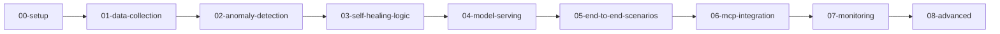
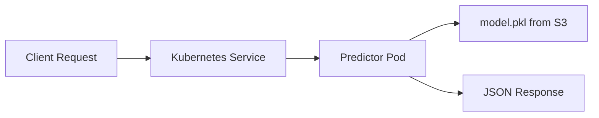

# Data Scientist Guide

**Version**: 1.0.0
**Last Updated**: 2026-09-29
**Audience**: Data scientists, ML engineers, AI researchers

---

## Table of Contents

1. [Introduction](#introduction)
2. [Jupyter Notebook Environment](#jupyter-notebook-environment)
3. [Available ML Notebooks](#available-ml-notebooks)
4. [Data Collection from Prometheus](#data-collection-from-prometheus)
5. [Model Training Workflows](#model-training-workflows)
6. [KServe Model Serving](#kserve-model-serving)
7. [Model Versioning and Storage](#model-versioning-and-storage)
8. [GPU Usage for Training](#gpu-usage-for-training)
9. [Experiment Tracking and Monitoring](#experiment-tracking-and-monitoring)
10. [Troubleshooting](#troubleshooting)
11. [Glossary](#glossary)

---

## Introduction

### What This Platform Provides

The OpenShift AI Ops Self-Healing Platform gives you a complete ML environment for building anomaly detection and predictive analytics models. The platform provides:

- **Jupyter notebooks** hosted on OpenShift AI
- **Prometheus metrics** as the primary data source
- **GPU nodes** for model training acceleration
- **KServe** for model serving as REST endpoints
- **S3 storage** for model artifact persistence
- **Tekton pipelines** for automated retraining

### Your Role as a Data Scientist

You are responsible for:

- Training and deploying ML models via KServe InferenceServices
- Collecting and preprocessing cluster metrics
- Evaluating model performance
- Maintaining model versions and updates

The platform provides the coordination engine and infrastructure. You maintain full control over your models.

The platform auto-creates the DataScienceCluster CR, which enables KServe, workbenches, and other RHOAI managed components. No manual DSC configuration is required.

### Document Scope

This guide covers:

- ✅ Jupyter notebook environment setup
- ✅ Available ML notebooks and algorithms
- ✅ Data collection and feature engineering
- ✅ Model training with CPU and GPU
- ✅ KServe model serving and deployment
- ✅ Model versioning and S3 storage
- ❌ Cluster provisioning (see [Platform Engineer Guide](platform-engineer-guide.md))
- ❌ Helm chart changes (see [Developer Guide](developer-guide.md))

---

## Jupyter Notebook Environment

### Access the Workbench

The platform deploys a Jupyter workbench as a StatefulSet in the `self-healing-platform` namespace.

**Option 1: Port-forward (recommended for development)**

```bash
oc port-forward self-healing-workbench-0 8888:8888 -n self-healing-platform
# Open http://localhost:8888 in your browser
```

**Option 2: OpenShift AI Console**

1. Open the OpenShift web console.
2. Navigate to **OpenShift AI > Data Science Projects > self-healing-platform**.
3. Click **Launch Notebook** on the workbench.

**Option 3: VS Code with Jupyter Extension**

1. Install the Jupyter extension in VS Code.
2. Configure the Jupyter server URL as `http://localhost:8888`.
3. Open `.ipynb` files directly in VS Code.

### Workbench Resources

Default resource allocation for the workbench:

| Resource | Request | Limit |
|----------|---------|-------|
| CPU | 1 core | 4 cores |
| Memory | 4 Gi | 8 Gi |
| GPU | Not allocated by default | Configure separately |

GPU is disabled on the workbench by default. GPU nodes may not have the CephFS driver required for RWX model storage. Use dedicated Tekton training jobs for GPU workloads instead.

### Persistent Storage Paths

| Path | Purpose |
|------|---------|
| `/opt/app-root/src/data/` | Input data |
| `/opt/app-root/src/data/processed/` | Processed datasets |
| `/opt/app-root/src/models/` | Trained model artifacts |
| `/opt/app-root/src/outputs/` | Notebook outputs and reports |

### Pre-Installed Libraries

The workbench image includes these Python packages:

| Package | Purpose |
|---------|---------|
| scikit-learn | Machine learning algorithms |
| pandas, numpy | Data manipulation |
| matplotlib, seaborn | Visualization |
| xgboost | Gradient boosting (with GPU support) |
| joblib | Model serialization |
| boto3 | AWS S3 interaction |
| prometheus-api-client | Prometheus queries |
| kserve | KServe client SDK |

---

## Available ML Notebooks

### Notebook Organization

Notebooks are organized into numbered directories by workflow stage:



### 00-setup: Platform Validation

| Notebook | Purpose |
|----------|---------|
| `00-platform-readiness-validation.ipynb` | Validates cluster connectivity, operators, GPU, storage |
| `environment-setup.ipynb` | Configures the Python environment |
| `01-kserve-model-onboarding.ipynb` | Validates KServe model deployment process |

**Run this first** to confirm your environment is ready.

### 01-data-collection: Metrics and Events

| Notebook | Purpose |
|----------|---------|
| `prometheus-metrics-collection.ipynb` | Collects CPU, memory, disk, and network metrics from Prometheus |
| `openshift-events-analysis.ipynb` | Analyzes Kubernetes events for anomaly correlation |
| `log-parsing-analysis.ipynb` | Parses and analyzes container logs |
| `feature-store-demo.ipynb` | Demonstrates feature engineering from raw metrics |
| `synthetic-anomaly-generation.ipynb` | Generates synthetic anomaly data for testing |

### 02-anomaly-detection: ML Models

| Notebook | Algorithm | GPU Required |
|----------|-----------|-------------|
| `01-isolation-forest-implementation.ipynb` | Isolation Forest | No |
| `02-time-series-anomaly-detection.ipynb` | Statistical methods | No |
| `03-lstm-based-prediction.ipynb` | LSTM neural network | Yes |
| `04-ensemble-anomaly-methods.ipynb` | Ensemble methods | No |
| `05-predictive-analytics-kserve.ipynb` | XGBoost time series | Yes (recommended) |

### 03-self-healing-logic: Integration

| Notebook | Purpose |
|----------|---------|
| `rule-based-remediation.ipynb` | Implements deterministic remediation rules |
| `ai-driven-decision-making.ipynb` | AI-driven decision workflows |
| `hybrid-healing-workflows.ipynb` | Combines deterministic and AI approaches |

### 04-model-serving: KServe Deployment

| Notebook | Purpose |
|----------|---------|
| `kserve-model-deployment.ipynb` | Deploys models as KServe InferenceServices |
| `model-versioning-mlops.ipynb` | Model versioning and lifecycle management |
| `inference-pipeline-setup.ipynb` | Configures inference pipelines |

### 05-08: Advanced Notebooks

| Directory | Topics |
|-----------|--------|
| `05-end-to-end-scenarios/` | Pod crash loop healing, network anomaly response, resource exhaustion |
| `06-mcp-lightspeed-integration/` | MCP server integration, OpenShift Lightspeed, LlamaStack |
| `07-monitoring-operations/` | Prometheus monitoring, model performance, healing success tracking |
| `08-advanced-scenarios/` | Predictive scaling, security incident response, cost optimization |

---

## Data Collection from Prometheus

### Connect to Prometheus

The platform connects to the built-in OpenShift Prometheus instance:

```python
from prometheus_api_client import PrometheusConnect

prom = PrometheusConnect(
    url="https://prometheus-k8s.openshift-monitoring.svc:9091",
    disable_ssl=True
)

# Verify connection
prom.check_prometheus_connection()
```

### Collect Infrastructure Metrics

**CPU usage per node**:

```python
cpu_data = prom.custom_query_range(
    query='instance:node_cpu_utilisation:rate5m',
    start_time=start,
    end_time=end,
    step='5m'
)
```

**Memory usage per node**:

```python
memory_data = prom.custom_query_range(
    query='instance:node_memory_utilisation:ratio',
    start_time=start,
    end_time=end,
    step='5m'
)
```

**Pod-level metrics**:

```python
pod_cpu = prom.custom_query_range(
    query='sum(rate(container_cpu_usage_seconds_total{namespace="self-healing-platform"}[5m])) by (pod)',
    start_time=start,
    end_time=end,
    step='5m'
)
```

### Build a Training Dataset

Combine multiple metrics into a single DataFrame:

```python
import pandas as pd
import numpy as np

# Collect 7 days of metrics
metrics = {
    'cpu_usage': collect_cpu_metrics(days=7),
    'memory_usage': collect_memory_metrics(days=7),
    'disk_usage': collect_disk_metrics(days=7),
    'network_in': collect_network_in_metrics(days=7),
    'network_out': collect_network_out_metrics(days=7)
}

df = pd.DataFrame(metrics)
df['timestamp'] = pd.date_range(start='2026-09-22', periods=len(df), freq='5min')

# Save for reproducibility
df.to_parquet('/opt/app-root/src/data/processed/training_data.parquet')
```

### Generate Synthetic Data for Testing

When live cluster metrics are unavailable, use the synthetic data generator:

```python
from src.models.anomaly_detector import generate_sample_data
from src.models.predictive_analytics import generate_sample_timeseries_data

# Anomaly detection data (1000 samples, 5% anomalies)
anomaly_data = generate_sample_data(n_samples=1000)

# Time series data with seasonality
timeseries_data = generate_sample_timeseries_data(n_samples=2000)
```

---

## Model Training Workflows

### Anomaly Detector (Isolation Forest)

The anomaly detector uses Isolation Forest for unsupervised anomaly detection on infrastructure metrics.

**Training workflow**:

```python
from src.models.anomaly_detector import AnomalyDetector

# Initialize
detector = AnomalyDetector(contamination=0.1, random_state=42)

# Train
results = detector.train(training_data)
print(f"Anomalies detected: {results['anomalies_detected']}")
print(f"Anomaly rate: {results['anomaly_rate']:.2%}")

# Save as KServe-compatible pipeline
detector.save_model('/mnt/models/anomaly-detector/model.pkl')
```

**Key parameters**:

| Parameter | Default | Description |
|-----------|---------|-------------|
| `contamination` | 0.1 | Expected proportion of anomalies (0.0 to 0.5) |
| `n_estimators` | 100 | Number of trees in the forest |
| `random_state` | 42 | Seed for reproducibility |

**Feature engineering** includes:

- Rolling mean and standard deviation (window=5)
- Hour of day and day of week extraction
- NaN filling with zeros

### Predictive Analytics (XGBoost)

The predictive analytics model uses XGBoost for multi-step time series forecasting.

**Training workflow**:

```python
from src.models.predictive_analytics import PredictiveAnalytics

# Initialize
predictor = PredictiveAnalytics(
    forecast_horizon=12,
    lookback_window=24,
    use_gpu=True
)

# Train
results = predictor.train(training_data)
for metric, scores in results['metrics'].items():
    print(f"{metric}: MAE={scores['mae']:.4f}, R2={scores['r2']:.4f}")

# Save (KServe-compatible)
predictor.save_models('/mnt/models', kserve_compatible=True)
```

**Key parameters**:

| Parameter | Default | Description |
|-----------|---------|-------------|
| `forecast_horizon` | 12 | Number of time steps to predict ahead |
| `lookback_window` | 24 | Number of historical time steps for input |
| `use_gpu` | True | Use GPU acceleration when available |

**Target metrics**:

- `cpu_usage`
- `memory_usage`
- `disk_usage`
- `network_in`
- `network_out`

**Feature engineering** includes:

- Time-based features (hour, day of week, business hours, weekend)
- Lag features (1, 2, 3, 6, 12, 24 steps back)
- Rolling statistics (mean, std, max, min over windows of 3, 6, 12, 24)
- Trend features (3-step and 6-step differencing, percent change)

### Automated Training with Tekton

Tekton pipelines automate model training on a schedule:

**Start training manually**:

```bash
# Anomaly Detector (CPU-based)
tkn pipeline start model-training-pipeline \
  -p model-name=anomaly-detector \
  -p notebook-path=notebooks/02-anomaly-detection/01-isolation-forest-implementation.ipynb \
  -p data-source=prometheus \
  -p training-hours=168 \
  -p inference-service-name=anomaly-detector \
  -p health-check-enabled=true \
  -p git-url=https://github.com/YOUR-USERNAME/openshift-aiops-platform.git \
  -p git-ref=main \
  -n self-healing-platform --showlog

# Predictive Analytics (GPU-based)
tkn pipeline start model-training-pipeline-gpu \
  -p model-name=predictive-analytics \
  -p notebook-path=notebooks/02-anomaly-detection/05-predictive-analytics-kserve.ipynb \
  -p data-source=prometheus \
  -p training-hours=720 \
  -p inference-service-name=predictive-analytics \
  -p health-check-enabled=true \
  -p git-url=https://github.com/YOUR-USERNAME/openshift-aiops-platform.git \
  -p git-ref=main \
  -n self-healing-platform --showlog
```

**Scheduled training** runs automatically:

- Anomaly Detector: Every Sunday at 2:00 AM UTC
- Predictive Analytics: Every Sunday at 3:00 AM UTC

---

## KServe Model Serving

### How KServe Works

KServe serves your models as REST endpoints through InferenceService resources:



### Model API Contract

All models must implement the KServe v1 prediction API:

**Request**:

```bash
curl -X POST \
  http://anomaly-detector-stable.self-healing-platform.svc:8080/v1/models/anomaly-detector:predict \
  -H "Content-Type: application/json" \
  -d '{"instances": [[0.5, 1.2, 0.8, 100.0, 80.0]]}'
```

**Response**:

```json
{
  "predictions": [1]
}
```

Values of `1` indicate normal behavior. Values of `-1` indicate an anomaly.

### Check Model Status

```bash
# List all InferenceServices
oc get inferenceservices -n self-healing-platform

# Check a specific model
oc describe inferenceservice anomaly-detector -n self-healing-platform

# View predictor pod logs
oc logs -n self-healing-platform \
  -l serving.kserve.io/inferenceservice=anomaly-detector \
  -c kserve-container --tail=100
```

### Save Models in KServe-Compatible Format

KServe requires models in a specific format. Save sklearn models as single Pipeline files:

**Anomaly Detector**:

```python
from sklearn.pipeline import Pipeline
from sklearn.preprocessing import StandardScaler
from sklearn.ensemble import IsolationForest
import joblib

pipeline = Pipeline([
    ('scaler', StandardScaler()),
    ('model', IsolationForest(contamination=0.1, n_estimators=100))
])
pipeline.fit(X_train)
joblib.dump(pipeline, '/mnt/models/anomaly-detector/model.pkl')
```

**Predictive Analytics**:

Use `notebooks/02-anomaly-detection/05-predictive-analytics-kserve.ipynb`, which saves a standard sklearn Pipeline that KServe can deserialize without custom modules.

Do not use the deprecated `kserve_wrapper.py` module. The wrapper class cannot be deserialized in the KServe container environment.

### Deploy a New InferenceService

Register models in `values-hub.yaml`:

```yaml
models:
  - name: my-model
    cpu: "1"
    memory: "1Gi"
    cpuLimit: "2"
    memoryLimit: "4Gi"
    syncWave: "2"
    gpuTrained: false
```

The Helm chart creates the InferenceService automatically. ArgoCD syncs it to the cluster.

**Reference**: [ADR-004: KServe for Model Serving](../adrs/004-kserve-model-serving.md), [ADR-039: User-Deployed KServe Models](../adrs/039-user-deployed-kserve-models.md)

---

## Model Versioning and Storage

### Storage Architecture

Model artifacts are stored in S3-compatible object storage:

| Backend | Used On | Endpoint |
|---------|---------|----------|
| AWS S3 (native) | ROSA clusters | `https://s3.amazonaws.com` |
| NooBaa S3 | Non-ROSA, SNO | `https://s3.openshift-storage.svc.cluster.local` |

### S3 Bucket Structure

```
model-storage/
├── anomaly-detector/
│   └── model.pkl          # Sklearn Pipeline (scaler + Isolation Forest)
├── predictive-analytics/
│   └── model.pkl          # Sklearn Pipeline (scaler + XGBoost ensemble)
└── my-custom-model/
    └── model.pkl          # Your custom model
```

Each InferenceService maps to one directory in the bucket. The directory name must match the model name.

### Upload Models to S3

**From a notebook**:

```python
import boto3

s3 = boto3.client(
    's3',
    endpoint_url=os.environ.get('S3_ENDPOINT', 'https://s3.amazonaws.com'),
    aws_access_key_id=os.environ['AWS_ACCESS_KEY_ID'],
    aws_secret_access_key=os.environ['AWS_SECRET_ACCESS_KEY'],
    region_name='us-east-1'
)

s3.upload_file(
    '/mnt/models/anomaly-detector/model.pkl',
    'model-storage',
    'anomaly-detector/model.pkl'
)
```

**From the command line**:

```bash
aws s3 cp /tmp/model.pkl s3://model-storage/anomaly-detector/model.pkl
```

### Version Models

Use S3 object versioning to track model versions:

```bash
# Enable versioning on the bucket
aws s3api put-bucket-versioning \
  --bucket model-storage \
  --versioning-configuration Status=Enabled

# List versions
aws s3api list-object-versions --bucket model-storage \
  --prefix anomaly-detector/model.pkl

# Download a specific version
aws s3api get-object --bucket model-storage \
  --key anomaly-detector/model.pkl \
  --version-id <version-id> /tmp/model-v1.pkl
```

### Roll Back a Model

To restore a previous model version:

1. Download the previous version from S3.
2. Upload it as the current version.
3. Restart the predictor pods:

```bash
oc delete pods -n self-healing-platform \
  -l serving.kserve.io/inferenceservice=anomaly-detector
```

KServe recreates the predictor pod and loads the updated model.

---

## GPU Usage for Training

### GPU Availability

Check GPU nodes on your cluster:

```bash
# List GPU nodes
oc get nodes -l nvidia.com/gpu.present=true

# Check GPU allocation
oc describe node <gpu-node-name> | grep -A 10 nvidia.com/gpu
```

### GPU-Accelerated Training

The predictive analytics model supports GPU training through XGBoost:

```python
from src.models.predictive_analytics import PredictiveAnalytics

# GPU training (automatic detection)
predictor = PredictiveAnalytics(use_gpu=True)

# The model logs the training method:
# "XGBoost with GPU acceleration enabled" (GPU available)
# "XGBoost CPU histogram method (fast)" (CPU fallback)
# "sklearn RandomForest (slower)" (XGBoost not installed)
```

### GPU Training via Tekton

For production training, use the GPU-enabled Tekton pipeline:

```bash
tkn pipeline start model-training-pipeline-gpu \
  -p model-name=predictive-analytics \
  -p notebook-path=notebooks/02-anomaly-detection/05-predictive-analytics-kserve.ipynb \
  -n self-healing-platform --showlog
```

The GPU pipeline:

- Schedules the training pod on GPU-labeled nodes
- Adds GPU tolerations (`nvidia.com/gpu=True:NoSchedule`)
- Requests one NVIDIA GPU resource

### GPU Node Tolerations

GPU nodes have the taint `nvidia.com/gpu=True:NoSchedule`. The platform configures tolerations automatically:

```yaml
nodeConfig:
  gpu:
    enabled: true
    tolerations:
      - key: nvidia.com/gpu
        operator: Equal
        value: "True"
        effect: NoSchedule
```

### Performance Comparison

| Method | Algorithm | Training Time (1000 samples) |
|--------|-----------|------------------------------|
| GPU | XGBoost `gpu_hist` | Fastest |
| CPU | XGBoost `hist` | Fast |
| CPU | RandomForest (fallback) | Slowest |

**Reference**: [ADR-057: Topology-Aware GPU Scheduling](../adrs/057-topology-aware-gpu-scheduling-and-storage.md)

---

## Experiment Tracking and Monitoring

### Monitor Model Performance

The notebook `07-monitoring-operations/model-performance-monitoring.ipynb` tracks:

- Prediction accuracy over time
- Feature drift detection
- Anomaly score distributions
- Model inference latency

### Prometheus Metrics

The Coordination Engine exposes model-related metrics at `/metrics`:

| Metric | Type | Description |
|--------|------|-------------|
| `anomaly_detection_requests_total` | Counter | Total inference requests |
| `anomaly_detection_latency_seconds` | Histogram | Inference latency |
| `anomaly_score` | Gauge | Latest anomaly score |
| `remediation_actions_total` | Counter | Remediation actions taken |

### Grafana Dashboards

The platform deploys Grafana dashboards for:

- Model serving health (request rate, latency, error rate)
- Anomaly detection trends
- Cluster resource usage
- Healing success rates

Access dashboards in the OpenShift console under **Observe > Dashboards**.

### Compare Model Versions

Track results across training runs using the notebook validation system:

```python
# In your training notebook, log key metrics
training_results = {
    'model_version': '2.0',
    'training_date': pd.Timestamp.now().isoformat(),
    'contamination': 0.1,
    'n_estimators': 100,
    'training_samples': len(X_train),
    'anomaly_rate': float(anomaly_rate),
    'features_used': len(feature_names)
}

# Save results alongside the model
import json
with open('/mnt/models/anomaly-detector/training_results.json', 'w') as f:
    json.dump(training_results, f, indent=2)
```

### Healing Success Tracking

The notebook `07-monitoring-operations/healing-success-tracking.ipynb` monitors:

- Remediation success rate
- Mean time to resolution (MTTR)
- False positive rate
- Human override frequency

---

## Troubleshooting

### GPU Not Available in Notebooks

**Symptoms**: `nvidia-smi` command not found, PyTorch cannot detect GPU.

**Cause**: The workbench does not request GPU resources by default.

**Fix**: Use Tekton GPU pipelines for training instead of the workbench. GPU nodes may lack the CephFS driver required for RWX model storage.

```bash
# Verify GPU operator status
oc get csv -n openshift-operators | grep gpu-operator

# Check GPU node labels
oc get nodes -l nvidia.com/gpu.present=true
```

### Model Training Pipeline Fails

**Symptoms**: Tekton PipelineRun shows "Failed".

**Fix**:

```bash
# View pipeline logs
tkn pipelinerun logs <run-name> -n self-healing-platform -f

# Check if S3 credentials exist
oc get secret model-storage-config -n self-healing-platform

# Re-run prerequisites if credentials are missing
make operator-deploy-prereqs
```

### InferenceService Not Ready

**Symptoms**: `oc get inferenceservices` shows `READY=False`.

**Fix**:

```bash
# Check predictor pod events
oc describe inferenceservice anomaly-detector -n self-healing-platform

# View container logs
oc logs -n self-healing-platform \
  -l serving.kserve.io/inferenceservice=anomaly-detector \
  -c kserve-container --tail=100

# Common cause: model.pkl not found in S3
# Upload the model and restart pods
oc delete pods -n self-healing-platform \
  -l serving.kserve.io/inferenceservice=anomaly-detector
```

### Kernel Crashes During Training

**Symptoms**: Jupyter kernel dies when running memory-intensive operations.

**Fix**:

```python
import gc

# Clear memory between operations
gc.collect()

# Use chunking for large datasets
for chunk in pd.read_parquet('large_file.parquet', chunksize=10000):
    process_chunk(chunk)
    gc.collect()
```

Check workbench memory limits:

```bash
oc get notebook self-healing-workbench -n self-healing-platform -o yaml | grep -A 5 memory
```

### S3 Upload Fails

**Symptoms**: `boto3` returns AccessDenied or ConnectionError.

**Fix**:

```bash
# Check the model storage secret
oc get secret model-storage-config -n self-healing-platform -o yaml

# Verify S3 endpoint is reachable from the cluster
oc exec -n self-healing-platform self-healing-workbench-0 -- \
  curl -s https://s3.amazonaws.com
```

For more issues, see the [Troubleshooting Guide](../guides/TROUBLESHOOTING-GUIDE.md).

---

## Glossary

| Term | Definition |
|------|------------|
| Contamination | Expected proportion of anomalies in the training data (Isolation Forest parameter) |
| Feature Engineering | Creating new input features from raw data to improve model accuracy |
| Forecast Horizon | Number of future time steps the predictive model predicts |
| Inference | Using a trained model to make predictions on new data |
| InferenceService | KServe custom resource that deploys a model as a REST endpoint |
| Isolation Forest | Unsupervised anomaly detection algorithm based on random forests |
| KServe | Kubernetes-native framework for serving ML models |
| Lookback Window | Number of historical time steps used as model input |
| LSTM | Long Short-Term Memory, a recurrent neural network architecture |
| NooBaa | S3-compatible object storage provided by OpenShift Data Foundation |
| Predictor | The component of a KServe InferenceService that runs inference |
| StandardScaler | Preprocessing step that normalizes features to zero mean and unit variance |
| XGBoost | Gradient boosting library for supervised learning, supports GPU acceleration |
