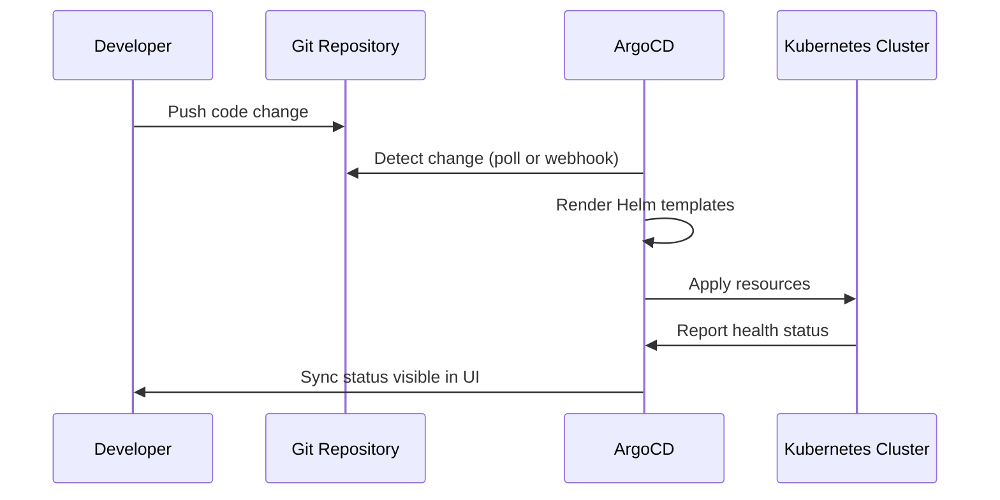

# Developer Guide

**Version**: 1.0.0
**Last Updated**: 2026-09-29
**Audience**: Software developers, DevOps engineers, contributors

---

## Table of Contents

1. [Introduction](#introduction)
2. [Development Environment Setup](#development-environment-setup)
3. [Working with the Coordination Engine](#working-with-the-coordination-engine)
4. [Building and Deploying Custom Models](#building-and-deploying-custom-models)
5. [Tekton Pipeline Development](#tekton-pipeline-development)
6. [Helm Chart Customization](#helm-chart-customization)
7. [GitOps Workflow with ArgoCD](#gitops-workflow-with-argocd)
8. [Testing and CI/CD](#testing-and-cicd)
9. [Contributing Guidelines](#contributing-guidelines)
10. [Troubleshooting](#troubleshooting)
11. [Glossary](#glossary)

---

## Introduction

### What You Will Build

As a developer on this platform, you work with:

- **Coordination Engine**: A Go-based service that orchestrates self-healing actions
- **ML Models**: Python-based anomaly detection and predictive analytics models
- **Tekton Pipelines**: CI/CD pipelines for validation and model training
- **Helm Charts**: Kubernetes resource templates for deployment
- **GitOps Workflows**: ArgoCD-driven deployments from Git

### Document Scope

This guide covers:

- ✅ Development environment setup
- ✅ Coordination Engine development
- ✅ Custom model building and deployment
- ✅ Tekton pipeline authoring
- ✅ Helm chart customization
- ✅ Testing, CI/CD, and contribution workflow
- ❌ Cluster provisioning (see [Platform Engineer Guide](platform-engineer-guide.md))
- ❌ ML algorithm selection (see [Data Scientist Guide](data-scientist-guide.md))

---

## Development Environment Setup

### Prerequisites

Install these tools on your workstation:

| Tool | Version | Purpose |
|------|---------|---------|
| `oc` | 4.20+ | OpenShift CLI |
| `kubectl` | 1.31+ | Kubernetes CLI |
| `helm` | 3.16+ | Kubernetes package manager |
| `git` | 2.x | Version control |
| `make` | 4.x | Build automation |
| `podman` | 4.x | Container runtime |
| `tkn` | 0.38+ | Tekton CLI |
| `yq` | 4.44+ | YAML processor |
| `rosa` | Latest | ROSA cluster management (installed by prerequisites script) |
| `python3` | 3.11+ | Python runtime |
| `go` | 1.21+ | Go runtime (for coordination engine) |

**RHEL 9/10 automated setup**:

```bash
./scripts/install-prerequisites-rhel.sh
source ~/.bashrc
```

### Fork and Clone

1. Fork the repository at [github.com/KubeHeal/openshift-aiops-platform](https://github.com/KubeHeal/openshift-aiops-platform).
2. Clone your fork:

```bash
git clone https://github.com/YOUR-USERNAME/openshift-aiops-platform.git
cd openshift-aiops-platform
```

3. Create values files:

```bash
cp values-global.yaml.example values-global.yaml
cp values-hub.yaml.example values-hub.yaml
cp values-secret.yaml.example values-secret.yaml
```

4. Update `repoURL` in both files to point to your fork.

### Install Pre-Commit Hooks

The repository uses pre-commit hooks for code quality:

```bash
pip install pre-commit
pre-commit install
pre-commit install --hook-type pre-push
```

Active hooks include:

- `detect-secrets`: Scans for hardcoded secrets and API keys
- `check-added-large-files`: Prevents committing files larger than 500KB
- `check-merge-conflict`: Detects unresolved merge conflicts
- `trailing-whitespace`: Removes trailing whitespace
- `end-of-file-fixer`: Ensures files end with a newline

### Quick Setup: Direct Helm Install (Tier 3)

For fast local development, skip the VP Operator and install the chart directly:

```bash
helm install self-healing-platform charts/hub/ \
  --namespace self-healing-platform \
  --create-namespace \
  -f values-hub.yaml
```

This path deploys all chart resources without ArgoCD. It is ideal for iterating on Helm templates and testing changes quickly.

For the full GitOps workflow (Tier 2), continue with the Execution Environment setup below.

### Get the Execution Environment

The Ansible execution environment contains all dependencies for deployment playbooks:

```bash
# Option A: Pull pre-built image (recommended)
podman pull quay.io/takinosh/openshift-aiops-platform-ee:latest
podman tag quay.io/takinosh/openshift-aiops-platform-ee:latest \
  openshift-aiops-platform-ee:latest

# Option B: Build locally (requires ANSIBLE_HUB_TOKEN)
export ANSIBLE_HUB_TOKEN='your-token-here'
podman login registry.redhat.io
make token
make build-ee
```

### Project Structure

```
openshift-aiops-platform/
├── ansible/                    # Ansible roles and playbooks
│   ├── roles/                  # 8 production-ready roles
│   └── playbooks/              # Deployment, validation, cleanup
├── charts/hub/                 # Main Helm chart
│   ├── Chart.yaml              # Chart metadata
│   ├── values.yaml             # Default values
│   └── templates/              # Kubernetes resource templates
├── docs/adrs/                  # Architectural Decision Records
├── k8s/                        # Kubernetes manifests
├── notebooks/                  # Jupyter notebooks (ML workflows)
├── scripts/                    # Automation scripts
├── src/models/                 # ML model source code
├── tekton/                     # CI/CD pipelines
│   ├── pipelines/              # Pipeline definitions
│   ├── tasks/                  # Reusable tasks
│   └── triggers/               # Event-driven triggers
├── tests/                      # Test suites
├── Makefile                    # Custom targets
├── Makefile-common             # Validated Patterns common targets
├── values-global.yaml.example  # Global config template
└── values-hub.yaml.example     # Hub config template
```

---

## Working with the Coordination Engine

### Overview

The Coordination Engine is a Go-based service that orchestrates the hybrid self-healing approach. It lives in a separate repository:

- **Repository**: [github.com/KubeHeal/openshift-coordination-engine](https://github.com/KubeHeal/openshift-coordination-engine)
- **Language**: Go 1.21+
- **Deployment**: Managed by this platform's Helm chart

The engine receives anomaly alerts, routes them to the deterministic or AI layer, and executes remediation actions.

### API Endpoints

| Endpoint | Method | Purpose |
|----------|--------|---------|
| `/health` | GET | Health check |
| `/api/v1/anomalies` | POST | Submit anomaly for processing |
| `/api/v1/anomalies/<id>` | GET | Get anomaly status |
| `/api/v1/remediate` | POST | Trigger remediation action |
| `/api/v1/status` | GET | Get engine status |
| `/metrics` | GET | Prometheus metrics |

### Test the Coordination Engine Locally

```bash
# Check pod status
oc get pods -n self-healing-platform -l app.kubernetes.io/component=coordination-engine

# View logs
oc logs -n self-healing-platform -l app.kubernetes.io/component=coordination-engine --tail=100

# Test health endpoint
oc exec -n self-healing-platform deployment/self-healing-coordination-engine -- \
  curl -s http://localhost:8080/health
```

### Configuration

The Coordination Engine configuration is managed in `values-hub.yaml`:

```yaml
coordinationEngine:
  enabled: true
  replicas: 1
  image:
    repository: quay.io/takinosh/openshift-coordination-engine
    tag: ""  # Auto-derived from cluster.version
  logLevel: info
  kserve:
    enabled: true
    namespace: self-healing-platform
    predictorPort: 8080
    anomalyDetectorService: anomaly-detector-stable
    predictiveAnalyticsService: predictive-analytics-stable
    timeout: "120s"
  prometheus:
    enabled: true
    url: "https://prometheus-k8s.openshift-monitoring.svc:9091"
```

### Feature Engineering Configuration

The Coordination Engine can build engineered features from Prometheus metrics before calling models:

```yaml
coordinationEngine:
  featureEngineering:
    enabled: false    # Set true for production models with full features
    lookbackHours: 24
    expectedFeatureCount: 5  # 5 for simple models, 3264 for full feature engineering
```

When `enabled: true`, the engine builds 3264 features (24 hours x 136 feature types) from Prometheus data. This configuration must match the model training notebook.

### Alert Webhooks

Configure external notification channels for critical anomalies:

```yaml
coordinationEngine:
  alertWebhooks:
    slackWebhookUrl: ""
    pagerdutyRoutingKey: ""
    alertmanagerUrl: ""
```

**Reference**: [ADR-038: Go Coordination Engine Migration](../adrs/038-go-coordination-engine-migration.md)

---

## Building and Deploying Custom Models

### Model Architecture

The platform serves two default models via KServe:

| Model | Algorithm | Purpose | Training |
|-------|-----------|---------|----------|
| anomaly-detector | Isolation Forest | Detects anomalous infrastructure metrics | CPU-based |
| predictive-analytics | XGBoost / RandomForest | Forecasts resource usage | GPU-based |

### Source Code

Model source code is in `src/models/`:

| File | Description |
|------|-------------|
| `anomaly_detector.py` | Isolation Forest anomaly detection |
| `predictive_analytics.py` | Time series forecasting with XGBoost |
| `kserve_wrapper.py` | KServe-compatible wrapper (deprecated) |
| `model_server.py` | Model serving utilities |
| `train_predictive_analytics.py` | Training script |

### KServe Model API Contract

All models served on the platform must implement the KServe v1 prediction API:

**Request format**:

```json
POST /v1/models/<model-name>:predict
Content-Type: application/json

{
  "instances": [
    [0.5, 1.2, 0.8, 100.0, 80.0]
  ]
}
```

**Response format**:

```json
{
  "predictions": [1]
}
```

### Deploy a Custom Model

1. Train and save the model as a sklearn Pipeline:

```python
from sklearn.pipeline import Pipeline
from sklearn.preprocessing import StandardScaler
from sklearn.ensemble import IsolationForest
import joblib

pipeline = Pipeline([
    ('scaler', StandardScaler()),
    ('model', IsolationForest(contamination=0.1, n_estimators=100))
])

pipeline.fit(X_train)
joblib.dump(pipeline, '/mnt/models/my-model/model.pkl')
```

2. Upload the model to S3:

```bash
aws s3 cp /mnt/models/my-model/model.pkl \
  s3://your-bucket/my-model/model.pkl
```

3. Register the model in `values-hub.yaml`:

```yaml
models:
  - name: my-custom-model
    cpu: "1"
    memory: "1Gi"
    cpuLimit: "2"
    memoryLimit: "4Gi"
    syncWave: "2"
    gpuTrained: false
```

4. Push the change to your fork. ArgoCD creates the InferenceService automatically.

5. Verify the deployment:

```bash
oc get inferenceservices -n self-healing-platform
```

**Reference**: [User Model Deployment Guide](../guides/USER-MODEL-DEPLOYMENT-GUIDE.md), [ADR-039: User-Deployed KServe Models](../adrs/039-user-deployed-kserve-models.md)

---

## Tekton Pipeline Development

### Pipeline Architecture

The platform includes these Tekton pipelines:

| Pipeline | Purpose |
|----------|---------|
| `deployment-validation-pipeline` | Post-deployment health checks (26 checks) |
| `model-training-pipeline` | CPU-based model training (anomaly detector) |
| `model-training-pipeline-gpu` | GPU-based model training (predictive analytics) |
| `model-serving-validation-pipeline` | Model serving endpoint validation |
| `platform-readiness-validation-pipeline` | Cluster prerequisite validation |
| `s3-configuration-pipeline` | S3 bucket setup and configuration |

### Reusable Tasks

Tasks are in `tekton/tasks/`:

| Task | Purpose |
|------|---------|
| `validate-prerequisites` | Check cluster prerequisites |
| `validate-operators` | Verify operator installations |
| `validate-storage` | Check storage classes and PVCs |
| `validate-model-serving` | Test InferenceService endpoints |
| `validate-coordination-engine` | Health check the coordination engine |
| `validate-monitoring` | Verify Prometheus and alerting |
| `validate-s3-connectivity` | Test S3 bucket access |
| `upload-placeholder-models` | Upload initial model artifacts |
| `reconcile-inferenceservices` | Restart InferenceService predictors |
| `generate-validation-report` | Create a validation summary |
| `cleanup-validation-resources` | Remove temporary resources |

### Run a Pipeline

```bash
# Start the deployment validation pipeline
tkn pipeline start deployment-validation-pipeline --showlog

# Start model training
tkn pipeline start model-training-pipeline \
  -p model-name=anomaly-detector \
  -p notebook-path=notebooks/02-anomaly-detection/01-isolation-forest-implementation.ipynb \
  -p data-source=prometheus \
  -p training-hours=168 \
  -p inference-service-name=anomaly-detector \
  -p health-check-enabled=true \
  -p git-url=https://github.com/YOUR-USERNAME/openshift-aiops-platform.git \
  -p git-ref=main \
  -n self-healing-platform --showlog

# List pipeline runs
tkn pipelinerun list -n self-healing-platform

# View logs for a specific run
tkn pipelinerun logs <run-name> -n self-healing-platform -f
```

### Create a Custom Task

1. Define the task YAML in `tekton/tasks/`:

```yaml
apiVersion: tekton.dev/v1beta1
kind: Task
metadata:
  name: my-custom-check
  namespace: self-healing-platform
spec:
  params:
    - name: namespace
      type: string
      default: self-healing-platform
  steps:
    - name: run-check
      image: registry.redhat.io/openshift4/ose-cli:latest
      script: |
        #!/bin/bash
        echo "Running custom validation..."
        oc get pods -n $(params.namespace)
```

2. Reference the task in a pipeline definition.
3. Add the task YAML to the Helm chart templates or apply it directly.

### Automated Training CronJobs

The platform configures scheduled model training:

```yaml
tekton:
  modelTraining:
    anomalyDetector:
      schedule: "0 2 * * 0"     # Every Sunday at 2:00 AM UTC
      dataSource: "prometheus"
    predictiveAnalytics:
      schedule: "0 3 * * 0"     # Every Sunday at 3:00 AM UTC
      dataSource: "prometheus"
```

### Event-Driven Triggers

Triggers in `tekton/triggers/` enable webhook-driven pipeline execution:

| Trigger | Event Source |
|---------|-------------|
| `deployment-validation-trigger` | Manual or post-deployment |
| `manual-validation-trigger` | Manual execution |
| `github-gitea-webhook-eventlistener` | Git push events |

**Reference**: [ADR-053: Tekton Pipelines for Model Training](../adrs/053-tekton-model-training-pipelines.md)

---

## Helm Chart Customization

### Chart Structure

The main Helm chart is in `charts/hub/`:

```
charts/hub/
├── Chart.yaml                          # Chart metadata
├── values.yaml                         # Default values
└── templates/
    ├── namespace.yaml                  # Namespace creation
    ├── rbac.yaml                       # RBAC resources
    ├── serviceaccount.yaml             # Service accounts
    ├── configmap.yaml                  # Configuration
    ├── storage.yaml                    # PVCs
    ├── coordination-engine-deployment.yaml  # Coordination Engine
    ├── mcp-server-deployment.yaml      # MCP Server
    ├── model-serving.yaml              # KServe InferenceServices
    ├── model-serving-services.yaml     # Stable ClusterIP services
    ├── ai-ml-workbench.yaml            # Jupyter Workbench
    ├── tekton-pipelines.yaml           # Tekton pipeline definitions
    ├── notebook-validation-jobs.yaml   # Notebook validation CRs
    ├── externalsecrets.yaml            # External Secrets
    ├── monitoring.yaml                 # ServiceMonitors
    ├── grafana-dashboards.yaml         # Grafana dashboard ConfigMaps
    └── ...                             # Additional templates
```

### Values Configuration Hierarchy

Values are merged in this order (later overrides earlier):

1. `charts/hub/values.yaml` -- Chart defaults
2. `values-hub.yaml` -- Your cluster-specific overrides
3. `values-global.yaml` -- Global pattern settings

### Common Customizations

**Change the cluster topology**:

```yaml
# values-hub.yaml
cluster:
  topology: "sno"    # or "ha"
  version: "4.22"
```

**Disable a component**:

```yaml
# values-hub.yaml
mcpServer:
  enabled: false

coordinationEngine:
  enabled: false
```

**Add a new model**:

```yaml
# values-hub.yaml
models:
  - name: anomaly-detector
    cpu: "1"
    memory: "1Gi"
    cpuLimit: "4"
    memoryLimit: "8Gi"
    syncWave: "2"
    gpuTrained: false
  - name: my-new-model
    cpu: "500m"
    memory: "512Mi"
    cpuLimit: "1"
    memoryLimit: "2Gi"
    syncWave: "3"
    gpuTrained: false
```

**Change the object store backend**:

```yaml
# values-hub.yaml
objectStore:
  backend: "noobaa"   # or "aws-s3"
```

### CRD Lookup Gates

All Helm templates now use CRD lookup gates. Each template checks whether its CRD exists before creating resources:

```yaml
{{ if lookup "apiextensions.k8s.io/v1" "CustomResourceDefinition" "" "..." }}
  # Create the resource only when the CRD is present
{{ end }}
```

Templates skip resource creation when their CRD is absent. This enables graceful degradation across installation paths. The chart works with both the VP Operator path and the standalone kubeheal-operator where not all CRDs may be present.

The following 11 templates have CRD gates: monitoring, NooBaa, notebook-validation, Tekton, and Prometheus templates.

### RBAC Namespace Portability

RBAC templates now use `{{ .Release.Namespace }}` instead of a hardcoded namespace. This allows deploying the chart to custom namespaces without modification.

### Validate Chart Changes

```bash
# Lint the chart
helm lint charts/hub/

# Template the chart to see rendered YAML
helm template self-healing-platform charts/hub/ \
  -f values-hub.yaml \
  --debug
```

---

## GitOps Workflow with ArgoCD

### How It Works



### Development Workflow

1. Make changes to Helm templates or values.
2. Commit and push to your fork:

```bash
git add <changed-files>
git commit -s -m "feat(charts): add new model configuration"
pre-commit run --all-files
git push origin main
```

3. ArgoCD detects the change and syncs automatically.

4. Monitor the sync:

```bash
oc get applications -n self-healing-platform-hub
make argo-healthcheck
```

### Sync Waves

The platform deploys resources in ordered sync waves:

| Wave | Resources |
|------|-----------|
| -10 | Namespaces, ServiceAccounts |
| -5 | RBAC, ConfigMaps, Secrets |
| 0 | Operators, Storage |
| 1 | Coordination Engine, MCP Server |
| 2 | InferenceServices (model serving) |
| 3-10 | Notebook validation jobs (by tier) |

### Manual Sync

If automatic sync is not enabled or you need to force a sync:

```bash
# Hard refresh
oc annotate application self-healing-platform -n self-healing-platform-hub \
  argocd.argoproj.io/refresh=hard --overwrite

# Check sync status
oc get applications -n self-healing-platform-hub
```

### Sync Chart to Operator Repository

Use `scripts/sync-operator-chart.sh` to copy `charts/hub/` to the kubeheal-operator repository. Run this script after chart changes to keep both repositories in sync.

**Reference**: [ADR-042: ArgoCD Deployment Lessons Learned](../adrs/042-argocd-deployment-lessons-learned.md)

---

## Testing and CI/CD

### Pre-Commit Checks

Run pre-commit hooks before every push:

```bash
pre-commit run --all-files
```

### Helm Validation

```bash
# Lint all charts
helm lint charts/hub/

# Template and review output
helm template self-healing-platform charts/hub/ -f values-hub.yaml
```

### Notebook Validation

Execute notebooks to verify they run without errors:

```bash
cd notebooks
jupyter nbconvert --to notebook --execute \
  00-setup/00-platform-readiness-validation.ipynb
```

### End-to-End Deployment Test

```bash
make test-deploy-complete-pattern
```

### Tekton Validation Pipeline

After deployment, run the post-deployment validation:

```bash
tkn pipeline start deployment-validation-pipeline --showlog
```

### GitHub Actions CI

The repository uses GitHub Actions for continuous integration:

| Workflow | Trigger | Checks |
|----------|---------|--------|
| Helm Chart Validation | Push, PR | Lints and validates all Helm charts |
| CI/CD Pipeline | Push, PR | Python tests, notebook validation, security scans |
| Pre-commit Hooks | Push, PR | YAML linting, whitespace, secrets detection |

### Run Tests Locally

```bash
# Test execution environment
make test-ee

# Run Python unit tests
cd src/models && python -m pytest

# Run full linter suite
make super-linter
```

---

## Contributing Guidelines

### Commit Messages

Use conventional commit format:

```
<type>(<scope>): <description>
```

| Type | Use for |
|------|---------|
| `feat` | New features |
| `fix` | Bug fixes |
| `docs` | Documentation changes |
| `chore` | Maintenance tasks |
| `refactor` | Code restructuring |
| `test` | Test additions or changes |

Examples:

```
feat(notebooks): add LSTM anomaly detection model
fix(kserve): resolve model loading race condition
docs(adr): add ADR-060 for new storage backend
chore(ci): update GitHub Actions to v4
```

### Sign Your Commits

All commits require a Developer Certificate of Origin (DCO) sign-off:

```bash
git commit -s -m "feat: add new feature"
```

### Pull Request Process

1. Create a feature branch:

```bash
git checkout -b feature/your-feature-name
```

2. Make and test your changes.
3. Run pre-commit hooks:

```bash
pre-commit run --all-files
```

4. Push and create a pull request.
5. Fill in the PR template with description, motivation, testing, and checklist.

### Code Style

| Language | Standard | Tool |
|----------|----------|------|
| Python | PEP 8 | Black formatter, isort |
| YAML | 2-space indent | yamllint |
| Go | gofmt | Built-in formatter |
| Markdown | CommonMark | markdownlint |

### ADR Updates

When you make an architectural change, create or update an ADR:

1. Copy the template:

```bash
cp docs/adrs/template.md docs/adrs/XXX-your-decision.md
```

2. Fill in the Context, Decision, and Consequences sections.
3. Update the index in `docs/adrs/README.md`.

**Reference**: [ADR-002: Hybrid Self-Healing Approach](../adrs/002-hybrid-self-healing-approach.md)

---

## Troubleshooting

### Values Files Not Found

**Symptoms**: `make` commands fail with `values-global.yaml: No such file or directory`.

**Fix**:

```bash
cp values-global.yaml.example values-global.yaml
cp values-hub.yaml.example values-hub.yaml
cp values-secret.yaml.example values-secret.yaml
```

Update `repoURL` in both files to your fork URL.


### Pre-Commit Hook Failures

**Symptoms**: `detect-secrets` reports false positives.

**Fix**:

```bash
# Add inline comment to ignore a specific line
# pragma: allowlist secret

# Or update the baseline
detect-secrets scan --baseline .secrets.baseline
```

### Helm Template Errors

**Symptoms**: `helm template` fails with rendering errors.

**Fix**:

```bash
# Debug with verbose output
helm template self-healing-platform charts/hub/ -f values-hub.yaml --debug

# Check for YAML syntax errors
yamllint charts/hub/templates/
```

### Tekton Pipeline Fails

**Symptoms**: PipelineRun shows "Failed" status.

**Fix**:

```bash
# View logs for the failed run
tkn pipelinerun logs <run-name> -n self-healing-platform -f

# Check task-level failures
tkn taskrun list -n self-healing-platform

# Re-run the pipeline
tkn pipeline start <pipeline-name> --showlog
```

For more issues, see the [Troubleshooting Guide](../guides/TROUBLESHOOTING-GUIDE.md).

---

## Glossary

| Term | Definition |
|------|------------|
| ADR | Architectural Decision Record, documents design choices |
| ArgoCD | GitOps continuous delivery tool for Kubernetes |
| DCO | Developer Certificate of Origin, commit sign-off requirement |
| EE | Execution Environment, container image with Ansible dependencies |
| GitOps | Managing infrastructure through Git as the source of truth |
| Helm | Kubernetes package manager using templated YAML |
| InferenceService | KServe resource for deploying ML models as services |
| KServe | Kubernetes-native model serving framework |
| MCP | Model Context Protocol for OpenShift Lightspeed |
| Sync Wave | ArgoCD ordering mechanism for resource deployment |
| Tekton | Kubernetes-native CI/CD pipeline framework |
| VP | Validated Patterns, Red Hat GitOps deployment framework |
