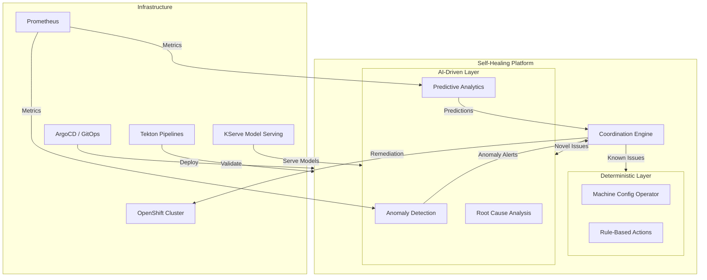

# OpenShift AI Ops Self-Healing Platform -- User Guides

**Version**: 1.0.0
**Last Updated**: 2026-09-29

---

## Welcome

The OpenShift AI Ops Self-Healing Platform combines deterministic automation with machine learning to detect and remediate cluster issues automatically. These guides help you work with the platform based on your role.

## Choose Your Guide

### [Platform Engineer Guide](platform-engineer-guide.md)

**Audience**: Infrastructure engineers, cluster administrators, SREs

**What you will learn**:

- Platform architecture and component overview
- Cluster provisioning on ROSA, SNO, and HA environments
- Storage configuration with ODF, MCG, and AWS S3
- Operator lifecycle management (GPU, Pipelines, GitOps, OpenShift AI)
- Monitoring, alerting, and observability setup
- Scaling, resource management, and node configuration
- Security, RBAC, and secrets management
- Backup and disaster recovery procedures

---

### [Developer Guide](developer-guide.md)

**Audience**: Software developers, DevOps engineers, contributors

**What you will learn**:

- Development environment setup and prerequisites
- Working with the Coordination Engine (Go-based service)
- Building and deploying custom ML models with KServe
- Tekton pipeline development and CI/CD workflows
- Helm chart customization and values configuration
- GitOps workflow with ArgoCD
- Testing strategies and pre-commit hooks
- Contributing guidelines and code standards

---

### [Data Scientist Guide](data-scientist-guide.md)

**Audience**: Data scientists, ML engineers, AI researchers

**What you will learn**:

- Jupyter notebook environment setup on OpenShift AI
- Available ML notebooks (Isolation Forest, LSTM, predictive analytics)
- Data collection from Prometheus and cluster metrics
- Model training workflows with CPU and GPU acceleration
- KServe model serving and deployment
- Model versioning and S3 storage
- GPU configuration and usage for training
- Experiment tracking and model performance monitoring

---

## Additional Resources

| Resource | Description |
|----------|-------------|
| [Complete Deployment Guide](../how-to/complete-deployment-guide.md) | Step-by-step deployment instructions |
| [Troubleshooting Guide](../guides/TROUBLESHOOTING-GUIDE.md) | Common issues and solutions |
| [Architectural Decision Records](../adrs/README.md) | Design decisions and rationale (58+ ADRs) |
| [ROSA Deployment Guide](../how-to/deploy-on-rosa.md) | ROSA-specific deployment instructions |
| [SNO Deployment Guide](../how-to/deploy-on-sno.md) | Single Node OpenShift deployment |
| [User Model Deployment Guide](../guides/USER-MODEL-DEPLOYMENT-GUIDE.md) | Deploy custom ML models via KServe |

## Platform Overview

## Support

- **GitHub Issues**: [github.com/KubeHeal/openshift-aiops-platform/issues](https://github.com/KubeHeal/openshift-aiops-platform/issues)
- **Discussions**: [github.com/KubeHeal/openshift-aiops-platform/discussions](https://github.com/KubeHeal/openshift-aiops-platform/discussions)
- **Documentation Site**: [kubeheal.github.io/openshift-aiops-platform](https://kubeheal.github.io/openshift-aiops-platform/)
