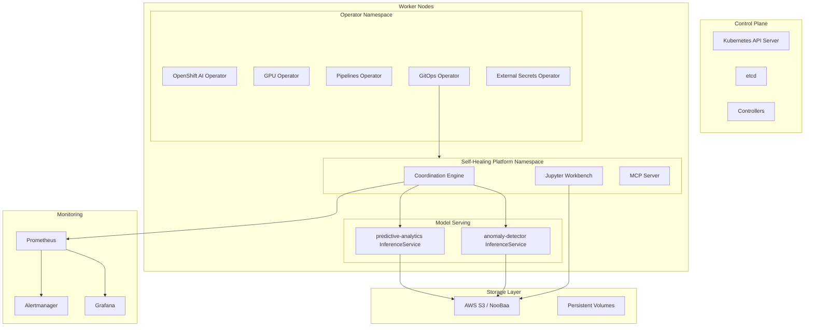
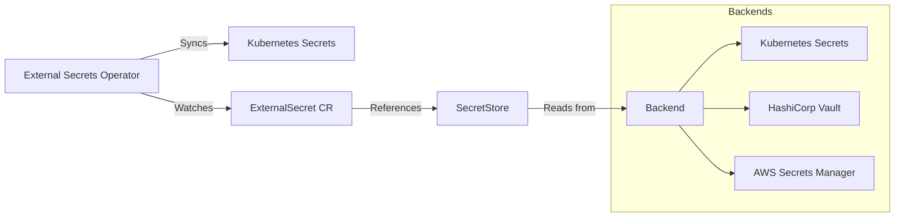

# Platform Engineer Guide

**Version**: 1.0.0
**Last Updated**: 2026-09-29
**Audience**: Infrastructure engineers, cluster administrators, SREs

---

## Table of Contents

1. [Introduction](#introduction)
2. [Platform Architecture](#platform-architecture)
3. [Cluster Provisioning](#cluster-provisioning)
4. [Storage Configuration](#storage-configuration)
5. [Operator Management](#operator-management)
6. [Monitoring and Observability](#monitoring-and-observability)
7. [Scaling and Resource Management](#scaling-and-resource-management)
8. [Security and RBAC](#security-and-rbac)
9. [Backup and Disaster Recovery](#backup-and-disaster-recovery)
10. [Troubleshooting](#troubleshooting)
11. [Glossary](#glossary)

---

## Introduction

### What is the Self-Healing Platform?

The OpenShift AI Ops Self-Healing Platform is a production-ready AIOps solution. It combines deterministic automation with AI-driven analysis to detect and remediate cluster issues automatically.

### Your Role as a Platform Engineer

As a platform engineer, you are responsible for:

- Provisioning and configuring OpenShift clusters
- Installing and managing platform operators
- Configuring storage, networking, and security
- Monitoring cluster health and platform performance
- Scaling resources based on workload demands
- Managing secrets and credentials
- Performing backup and recovery operations

### Document Scope

This guide covers:

- ✅ Cluster provisioning on ROSA, SNO, and HA environments
- ✅ Storage configuration (ODF, MCG, AWS S3)
- ✅ Operator lifecycle management
- ✅ Monitoring, alerting, and observability
- ✅ Security, RBAC, and secrets management
- ❌ ML model development (see [Data Scientist Guide](data-scientist-guide.md))
- ❌ Application code changes (see [Developer Guide](developer-guide.md))

---

## Platform Architecture

### Component Overview

The platform consists of these core components:

| Component | Version | Purpose |
|-----------|---------|---------|
| Red Hat OpenShift AI | 2.22.2 | ML platform for model training and serving |
| KServe | 1.36.1 | Model serving infrastructure |
| Coordination Engine | Go-based | Orchestrates deterministic and AI-driven actions |
| Tekton Pipelines | 1.17.2 | CI/CD automation and validation |
| OpenShift GitOps (ArgoCD) | 1.15.4 | GitOps-based deployment |
| GPU Operator | 24.9.2 | NVIDIA GPU management |
| External Secrets Operator | Latest | Automated secrets management |
| MCP Server | Go-based | Model Context Protocol for Lightspeed integration |

### Architecture Diagram



### Deployment Topology Options

| Topology | Nodes | Storage | Use Case |
|----------|-------|---------|----------|
| ROSA Classic HA | 3+ workers (managed) | AWS S3 (default) | Production |
| ROSA Single-Worker | 1 worker (managed) | AWS S3 (default) | Development, testing |
| IPI HA | 3+ workers (self-managed) | ODF or AWS S3 | Production |
| SNO | 1 node (all roles) | MCG-only ODF | Edge, development |

**Reference**: [ADR-055: Multi-Cluster Topology Support](../adrs/055-openshift-420-multi-cluster-topology-support.md)

---

## Cluster Provisioning

### Prerequisites

Install the required CLI tools on your workstation:

| Tool | Purpose |
|------|---------|
| `rosa` | ROSA cluster and machine pool management |
| `oc` | OpenShift CLI |
| `aws` | AWS CLI for S3 bucket management |
| `helm` | Kubernetes package manager (3.12+) |
| `ansible-navigator` | Ansible execution environment runner |
| `yq` | YAML processor |
| `tkn` | Tekton CLI |

**RHEL 9/10 automated setup**:

```bash
./scripts/install-prerequisites-rhel.sh
source ~/.bashrc
```

This script installs all required tools. It is idempotent and safe to run multiple times.

### Provision a ROSA Cluster

ROSA (Red Hat OpenShift Service on AWS) is the primary deployment target.

#### Automated Provisioning (Recommended)

Use the provisioning script to create a complete ROSA cluster:

```bash
# Full HA cluster with GPU machine pool and S3 bucket
./scripts/create-rosa-cluster.sh

# Single-worker cluster for development
./scripts/create-rosa-cluster.sh --replicas 1 --no-gpu --cluster-name aiops-dev

# Custom region with larger GPU
./scripts/create-rosa-cluster.sh --region us-west-2 --gpu-instance-type g5.4xlarge

# Preview commands without executing
./scripts/create-rosa-cluster.sh --dry-run
```

The script performs these steps automatically:

1. Validates prerequisites (`rosa`, `aws`, `oc` CLIs)
2. Creates a ROSA Classic HA cluster with STS (3x m5.2xlarge default)
3. Waits for the cluster to reach "ready" state (35-45 minutes)
4. Creates a cluster-admin user
5. Adds a GPU machine pool (g5.2xlarge default)
6. Creates an S3 bucket for model storage
7. Logs into the cluster with `oc`

#### Manual Provisioning

If you prefer step-by-step control:

```bash
# Create the cluster
rosa create cluster --cluster-name=aiops-platform \
  --sts --mode=auto \
  --region=us-east-1 \
  --compute-machine-type=m5.2xlarge \
  --replicas=3

# Wait for ready state (~40 minutes)
rosa describe cluster --cluster=aiops-platform

# Create admin user
rosa create admin --cluster=aiops-platform

# Log in
oc login <api-url> --username cluster-admin --password <password>
```

#### Add a GPU Machine Pool

GPU nodes are required for training the predictive analytics model:

```bash
rosa create machinepool --cluster=aiops-platform \
  --name=gpu-pool \
  --instance-type=g5.2xlarge \
  --replicas=1

# Verify GPU nodes
oc get nodes -l nvidia.com/gpu.present=true
```

**Reference**: [ROSA Deployment Guide](../how-to/deploy-on-rosa.md)

### Provision an SNO Cluster

Single Node OpenShift (SNO) is suitable for edge deployments and development:

1. Install OpenShift on a single node using the standard installer.
2. Verify the topology:

```bash
make show-cluster-info
# Output should show: Topology: sno
```

3. Update `values-hub.yaml` before deployment:

```yaml
cluster:
  topology: "sno"

storage:
  modelStorage:
    storageClass: "gp3-csi"
```

**Reference**: [SNO Deployment Guide](../how-to/deploy-on-sno.md), [ADR-056: Standalone MCG on SNO](../adrs/056-standalone-mcg-on-sno.md)

### Verify Cluster Topology

After provisioning, confirm the cluster configuration:

```bash
make show-cluster-info
```

Expected output for an HA cluster:

```
Cluster Information:
  Topology: ha
  OpenShift Version: 4.22
  Platform: AWS
  ODF Channel: stable-4.22
```

---

## Storage Configuration

### Storage Architecture

The platform uses different storage backends based on the cluster topology:

| Storage Type | HA Cluster | SNO Cluster | ROSA |
|--------------|-----------|-------------|------|
| Block (RWO) | gp3-csi | gp3-csi | gp3-csi |
| File (RWX) | ocs-storagecluster-cephfs | Not available | Not needed |
| Object (S3) | AWS S3 or NooBaa | NooBaa (MCG-only) | AWS S3 (default) |
| GPU-compatible | gp3-csi | gp3-csi | gp3-csi |

### Configure AWS S3 (ROSA Default)

For ROSA clusters, native AWS S3 is the default object storage backend:

1. Create an S3 bucket (if not created by the provisioning script):

```bash
aws s3api create-bucket \
  --bucket aiops-model-storage-$(date +%s) \
  --region us-east-1
```

2. Configure the bucket in `values-hub.yaml`:

```yaml
objectStore:
  enabled: true
  backend: "aws-s3"
  aws:
    region: "us-east-1"
    bucketName: "your-bucket-name"
```

3. Create the credentials secret:

```bash
oc create secret generic aws-s3-credentials-source \
  --from-literal=AWS_ACCESS_KEY_ID=<key> \
  --from-literal=AWS_SECRET_ACCESS_KEY=<secret> \
  -n self-healing-platform
```

### Configure ODF (Non-ROSA Clusters)

For non-ROSA HA clusters, OpenShift Data Foundation provides storage:

```bash
# Run the cluster infrastructure configuration script
make configure-cluster

# This script performs:
# - Installs ODF operator
# - Creates StorageCluster
# - Waits for Ceph daemons (OSD, MON, MGR)
# - Scales MachineSets if needed
```

The process takes 10-15 minutes on HA clusters.

To skip ODF installation when storage already exists:

```bash
./scripts/configure-cluster-infrastructure.sh --skip-odf
```

### Configure MCG-Only Storage (SNO)

On SNO clusters, the platform installs MCG-only ODF (NooBaa S3 without Ceph):

```bash
make configure-cluster
# On SNO, this:
# - Skips MachineSet scaling
# - Installs ODF operator in MCG-only mode
# - Creates MCG-only StorageCluster with gp3-csi backing
# - Waits for NooBaa to become Ready
```

### Storage PVC Configuration

The platform creates three types of persistent storage:

| PVC | Size | Storage Class | Purpose |
|-----|------|---------------|---------|
| Workbench Data | 20Gi | gp3-csi (RWO) | Jupyter notebook persistent storage |
| Model Storage | 10Gi | Auto-detected | Shared between notebooks and KServe |
| GPU Model Storage | 10Gi | gp3-csi (RWO) | GPU-compatible training storage (HA only) |

Verify PVC status after deployment:

```bash
oc get pvc -n self-healing-platform
```

**Reference**: [ADR-035: Storage Strategy](../adrs/035-storage-strategy.md), [ADR-041: Model Storage and Versioning](../adrs/041-model-storage-and-versioning-strategy.md)

---

## Operator Management

### Required Operators

The platform depends on these operators:

| Operator | Namespace | Channel | Purpose |
|----------|-----------|---------|---------|
| Red Hat OpenShift AI | redhat-ods-operator | stable | ML platform |
| OpenShift GitOps | openshift-gitops-operator | latest | ArgoCD for GitOps |
| OpenShift Pipelines | openshift-pipelines-operator | latest | Tekton CI/CD |
| NVIDIA GPU Operator | nvidia-gpu-operator | stable | GPU management |
| External Secrets Operator | openshift-operators | stable | Secrets management |
| OpenShift Data Foundation | openshift-storage | stable-4.x | Storage (non-ROSA) |

### Install the Platform

The Validated Patterns Operator manages the full deployment lifecycle:

1. Fork the repository on GitHub.
2. Clone your fork:

```bash
git clone https://github.com/YOUR-USERNAME/openshift-aiops-platform.git
cd openshift-aiops-platform
```

3. Create values files:

```bash
cp values-global.yaml.example values-global.yaml
cp values-hub.yaml.example values-hub.yaml
```

4. Update `repoURL` in both files to point to your fork.

5. Deploy the platform:

```bash
./pattern.sh make install
```

6. Wait for ArgoCD to converge:

```bash
oc get applications.argoproj.io -n self-healing-platform-hub
# Target state: SYNC STATUS=Synced, HEALTH STATUS=Healthy
```

### Validate the Deployment

Run the ArgoCD health check:

```bash
make argo-healthcheck
```

Run the Tekton validation pipeline:

```bash
tkn pipeline start deployment-validation-pipeline --showlog
```

This pipeline runs 26 validation checks across:

- Prerequisites (cluster, tools, RBAC, namespace)
- Operators (GitOps, AI, KServe, GPU, ODF)
- Storage (classes, PVCs, ODF, S3)
- Model Serving (InferenceServices, endpoints, pods)
- Coordination Engine (deployment, health, API)
- Monitoring (Prometheus, alerts, Grafana)

### Check Operator Status

```bash
# List all installed operators
oc get csv -n openshift-operators

# Check a specific operator
oc get csv -n openshift-operators | grep gpu-operator

# View operator events
oc get events -n openshift-operators --sort-by='.lastTimestamp' | tail -20
```

### Upgrade Operators

ArgoCD manages operator subscriptions through the Helm chart. To upgrade an operator version:

1. Update the version in `charts/hub/values.yaml` or `values-hub.yaml`.
2. Push the change to your fork.
3. ArgoCD detects the change and syncs the update.

**Reference**: [ADR-019: Validated Patterns Framework Adoption](../adrs/019-validated-patterns-framework-adoption.md)

---

## Monitoring and Observability

### Prometheus Integration

The platform integrates with the built-in OpenShift Prometheus stack:

- **Prometheus URL**: `https://prometheus-k8s.openshift-monitoring.svc:9091`
- **Scrape interval**: 30 seconds (configurable)
- **Retention**: 30 days (configurable)

Verify Prometheus connectivity:

```bash
# Check Prometheus pods
oc get pods -n openshift-monitoring | grep prometheus

# Test from within the cluster
oc exec -n self-healing-platform deployment/self-healing-coordination-engine -- \
  curl -sk https://prometheus-k8s.openshift-monitoring.svc:9091/api/v1/status/config
```

### Service Monitors

The platform exposes metrics from these components:

| Component | Metrics Port | Endpoint |
|-----------|-------------|----------|
| Coordination Engine | 8080 | `/metrics` |
| MCP Server | 8080 | `/metrics` |

Configure service monitors in `values-hub.yaml`:

```yaml
monitoring:
  enabled: true
  serviceMonitors:
    - coordination-engine
    - mcp-server
    - self-healing-platform
```

### Alerting Rules

The platform includes optional alerting rules:

```yaml
alerts:
  enabled: true
  cpuThrottleThreshold: 0.25
  anomalyScoreThreshold: 0.8
```

When enabled, these PrometheusRules alert on:

- High CPU throttling across platform pods
- Elevated anomaly scores from the ML models

### Grafana Dashboards

The Helm chart deploys Grafana dashboards automatically. View them in the OpenShift console under **Observe > Dashboards**.

### Check Platform Health

Quick health checks for all components:

```bash
# Coordination Engine health
oc exec -n self-healing-platform deployment/self-healing-coordination-engine -- \
  curl -s http://localhost:8080/health

# MCP Server health (if enabled)
oc exec -n self-healing-platform deployment/mcp-server -- \
  curl -s http://localhost:8080/health

# Model serving status
oc get inferenceservices -n self-healing-platform

# All platform pods
oc get pods -n self-healing-platform
```

---

## Scaling and Resource Management

### Node Configuration

The platform supports dedicated node pools for different workloads:

| Node Type | Taint | Workload |
|-----------|-------|----------|
| Worker | None | General platform workloads |
| GPU | `nvidia.com/gpu=True:NoSchedule` | ML model training |
| Storage | `node.ocs.openshift.io/storage=true:NoSchedule` | ODF storage daemons |

### GPU Node Management

On ROSA, manage GPU nodes through machine pools:

```bash
# Add GPU nodes
rosa create machinepool --cluster=aiops-platform \
  --name=gpu-pool --instance-type=g5.2xlarge --replicas=1

# Scale GPU pool
rosa edit machinepool --cluster=aiops-platform \
  --name=gpu-pool --replicas=2

# Remove GPU pool
rosa delete machinepool --cluster=aiops-platform --name=gpu-pool
```

On IPI clusters, manage GPU nodes through MachineSets:

```bash
# Scale MachineSets
oc scale machineset <gpu-machineset-name> --replicas=2 -n openshift-machine-api
```

### Resource Requests and Limits

Default resource allocation for platform components:

| Component | CPU Request | Memory Request | CPU Limit | Memory Limit |
|-----------|------------|----------------|-----------|-------------|
| Coordination Engine | 200m | 256Mi | 500m | 512Mi |
| MCP Server | 100m | 128Mi | 500m | 256Mi |
| Jupyter Workbench | 1 | 4Gi | 4 | 8Gi |
| Anomaly Detector | 1 | 1Gi | 4 | 8Gi |
| Predictive Analytics | 1 | 2Gi | 2 | 6Gi |

Override these values in `values-hub.yaml`:

```yaml
coordinationEngine:
  resources:
    requests:
      memory: "512Mi"
      cpu: "500m"
    limits:
      memory: "1Gi"
      cpu: "1"
```

### Workbench Scaling

The Jupyter workbench is a StatefulSet with one replica. To adjust its resources:

```yaml
workbench:
  resources:
    requests:
      cpu: 2
      memory: 8Gi
    limits:
      cpu: 8
      memory: 16Gi
```

---

## Security and RBAC

### RBAC Architecture

The platform uses a hybrid RBAC model ([ADR-030](../adrs/030-hybrid-management-model-namespaced-argocd.md)):

- **Cluster-scoped resources**: Deployed by Ansible prerequisites (not ArgoCD)
- **Namespace-scoped resources**: Deployed by ArgoCD through Helm charts

This approach works because namespaced ArgoCD cannot manage cluster-scoped resources.

### Service Accounts

| Service Account | Namespace | Purpose |
|----------------|-----------|---------|
| `self-healing-operator` | self-healing-platform | Platform workloads |
| `pipeline` | self-healing-platform | Tekton pipeline execution |
| `external-secrets-sa` | self-healing-platform | External Secrets Operator |
| `hub-gitops-argocd-application-controller` | self-healing-platform-hub | ArgoCD controller |

### Deploy Prerequisites (RBAC)

Run the Ansible prerequisites to create cluster-scoped RBAC:

```bash
make operator-deploy-prereqs
```

This step creates:

- Namespaces (`self-healing-platform`, `self-healing-platform-hub`)
- ServiceAccounts, Roles, and ClusterRoles
- ClusterRoleBinding for ArgoCD controller (cluster-admin)
- Secrets for External Secrets Operator

### Network Policies

The platform enables network policies by default:

```yaml
security:
  networkPolicies: true
```

### Pod Security

All platform pods run with restricted security contexts:

```yaml
security:
  securityContext:
    runAsNonRoot: true
    runAsUser: 1000
    fsGroup: 1000
```

### Secrets Management

The platform uses the External Secrets Operator for automated secrets management.

**Architecture**:



Configure the secrets backend in `values-hub.yaml`:

```yaml
secrets:
  backend: external-secrets
  externalSecrets:
    enabled: true
    secretStore:
      name: kubernetes-secret-store
      kind: SecretStore
    refreshInterval: 1h
```

For details on creating source secrets for optional features, see the [README Installation section](../../README.md).

**Reference**: [ADR-026: Secrets Management Automation](../adrs/026-secrets-management-automation.md)

---

## Backup and Disaster Recovery

### What to Back Up

| Resource | Location | Backup Method |
|----------|----------|---------------|
| Platform configuration | Git repository (your fork) | Git version control |
| ML model artifacts | S3 bucket | AWS S3 versioning or bucket replication |
| Cluster state | etcd | OpenShift etcd backup |
| Persistent volumes | PVCs | CSI snapshot or Velero |
| Secrets | External Secrets backend | Backend-native backup |

### Git-Based Recovery

Because the platform uses GitOps, the Git repository is the source of truth for all configuration. To recover a deployment:

1. Provision a new cluster (see [Cluster Provisioning](#cluster-provisioning)).
2. Clone your fork with the existing configuration.
3. Run the standard deployment workflow:

```bash
oc login <new-cluster-api-url>
./pattern.sh make install
```

ArgoCD reconciles the cluster state to match the Git repository.

### Model Artifact Recovery

Model artifacts are stored in S3. Enable S3 versioning for recovery:

```bash
aws s3api put-bucket-versioning \
  --bucket your-model-storage-bucket \
  --versioning-configuration Status=Enabled
```

To restore a previous model version:

```bash
aws s3api list-object-versions --bucket your-bucket --prefix anomaly-detector/
aws s3api get-object --bucket your-bucket --key anomaly-detector/model.pkl \
  --version-id <version-id> /tmp/model.pkl
```

### etcd Backup

Follow the standard OpenShift etcd backup procedure:

```bash
# SSH to a control plane node (IPI clusters)
oc debug node/<control-plane-node>
chroot /host
/usr/local/bin/cluster-backup.sh /home/core/assets/backup
```

On ROSA, etcd backups are managed by AWS. Contact Red Hat support for recovery.

### PVC Snapshots

Use CSI volume snapshots for PVC-level backup:

```bash
# Create a VolumeSnapshot
cat <<EOF | oc apply -f -
apiVersion: snapshot.storage.k8s.io/v1
kind: VolumeSnapshot
metadata:
  name: workbench-data-snapshot
  namespace: self-healing-platform
spec:
  volumeSnapshotClassName: csi-aws-vsc
  source:
    persistentVolumeClaimName: self-healing-workbench-data
EOF

# Verify snapshot
oc get volumesnapshot -n self-healing-platform
```

---

## Troubleshooting

### Operators Failing with "TooManyOperatorGroups"

**Symptoms**: Multiple operators fail in the `openshift-operators` namespace.

**Fix**:

```bash
oc delete operatorgroup jupyter-validator-operatorgroup -n openshift-operators
# Wait 30-60 seconds for operators to reconcile
oc get csv -n openshift-operators --watch
```

### ArgoCD Application Not Syncing

**Symptoms**: Application shows `syncStatus: Unknown` or `ComparisonError`.

**Fix**:

```bash
# Verify ArgoCD controller has cluster-admin
oc get clusterrolebinding | grep hub-gitops-argocd-application-controller

# If missing, re-run prerequisites
make operator-deploy-prereqs

# Force refresh
oc annotate application self-healing-platform -n self-healing-platform-hub \
  argocd.argoproj.io/refresh=hard --overwrite
```

### ROSA MachineSet Scaling Fails

**Symptoms**: `make configure-cluster` reports "No worker MachineSets found" on ROSA.

**Cause**: ROSA uses Machine Pools, not MachineSets.

**Fix**:

```bash
# The platform auto-detects ROSA and skips MachineSet scaling
# If auto-detection fails, use rosa CLI directly:
rosa create machinepool --cluster=<name> \
  --name=workers --instance-type=m5.2xlarge --replicas=3
```

### Storage Classes Not Found

**Symptoms**: PVCs remain in Pending state.

**Fix**:

```bash
# List available storage classes
oc get storageclass

# For SNO, verify gp3-csi exists
oc get storageclass gp3-csi

# For HA, verify CephFS is available
oc get storageclass ocs-storagecluster-cephfs
```

For the full troubleshooting guide, see [Troubleshooting Guide](../guides/TROUBLESHOOTING-GUIDE.md).

---

## Glossary

| Term | Definition |
|------|------------|
| ArgoCD | GitOps continuous delivery tool for Kubernetes |
| CSI | Container Storage Interface, a standard for storage plugins |
| ESO | External Secrets Operator, syncs secrets from external backends |
| HA | HighlyAvailable cluster topology with 3+ nodes |
| InferenceService | KServe custom resource for deploying ML models |
| KServe | Kubernetes-native model serving framework |
| MCG | Multi-Cloud Gateway (NooBaa), provides S3-compatible object storage |
| MCP | Model Context Protocol for OpenShift Lightspeed integration |
| ODF | OpenShift Data Foundation, enterprise storage solution |
| ROSA | Red Hat OpenShift Service on AWS |
| RHOAI | Red Hat OpenShift AI, the ML platform |
| SNO | Single Node OpenShift, all roles on one node |
| VP | Validated Patterns, Red Hat framework for GitOps deployments |
